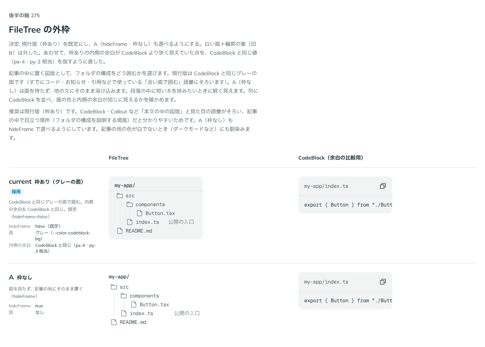

# 0269. FileTree の外枠は、CodeBlock と同じグレーの面が既定

- ステータス: Accepted
- 日付: 2026-09-23
- ラウンド: 後半 軸 275

## 背景

記事の中に置くフォルダの構成の図として、FileTree をどう囲むかを決めました。

## 候補

比較は、決めた時点のコミット `9944d66` の比較のストーリー（`design/stories/axis-275-file-tree-frame.stories.tsx`）です。列に FileTree と CodeBlock を並べ、面の色と内側の余白が同じに見えるかを確かめました。

| 案     | 内容                                                                                                             |
| ------ | ---------------------------------------------------------------------------------------------------------------- |
| 現行版 | 枠あり（グレーの面）。CodeBlock と同じグレーの面で囲む。内側の余白も CodeBlock と同じ。既定（`hideFrame=false`） |
| A      | 枠なし（`hideFrame=true`）。面を持たず、記事の地にそのまま置く                                                   |

## 決定

**現行版（枠あり）を既定にし、A（`hideFrame`・枠なし）も選べるようにします。白い面＋輪郭の案（旧 B）は外しました。**

あわせて、枠ありの内側の余白が CodeBlock より狭く見えていた点を、CodeBlock と同じ値（`px-4`・`py-3` 相当）を指すように直しました。

## 理由

ユーザーの返事の原文です。

> 275: 現行で、Aも選べるようにしたいです。余白が CodeBlock と比べると少ないため、調整したいです。

CodeBlock・Callout など「本文の中の図版」と見た目の語彙がそろい、記事の中で目立つ場所（フォルダの構成を説明する場面）だと分かりやすいため、枠ありを既定にしました。A（枠なし）は、段落の中に短い木を挟みたいときや、記事の地の色が白でないとき（ダークモードなど）にも馴染むため選べるようにしました。

## 却下した案と理由

- **白い面＋輪郭の案（旧 B）**: 選ばれませんでした。CodeBlock・Callout と塗りの語彙がそろいません

## 影響

- `src/components/file-tree/FileTree.tsx`: `hideFrame` props を公開し、既定は `false`（枠あり）にしました
- `design/tokens.css`: `--file-tree-frame-bg`・`--file-tree-frame-border-width`・`--file-tree-frame-border-color`・`--file-tree-frame-px`・`--file-tree-frame-py` を追加しました（`px`・`py` は CodeBlock と同じ計算式）
- 比較のストーリー `design/stories/axis-275-file-tree-frame.stories.tsx` は消しました

## 原則への反映

反映なし。原則19（読みものは読みやすさを先にする）・原則1（記事の中のものはページと同じレイヤーで影を付けない）の範囲内です。

## 比較画像

決めた時点のコミットは `9944d66` です。`git checkout 9944d66 && pnpm storybook` で、比較のストーリー（`Design Review/275 FileTree の外枠`）を決めたときの部品のまま開けます。
