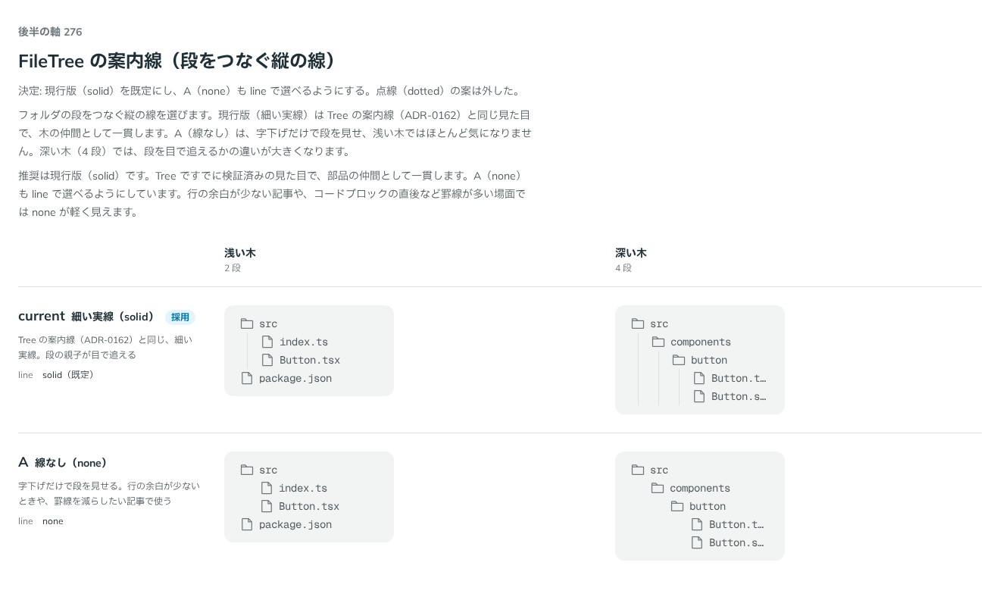

# 0270. FileTree の案内線は細い実線が既定

- ステータス: Accepted
- 日付: 2026-09-23
- ラウンド: 後半 軸 276

## 背景

フォルダの段をつなぐ縦の線（案内線）を決めました。`line` props で選べます。Steps の `line` と同じ語彙です。

## 候補

比較は、決めた時点のコミット `9944d66` の比較のストーリー（`design/stories/axis-276-file-tree-line.stories.tsx`）です。列は浅い木（2 段）・深い木（4 段）です。

| 案     | 内容                                                                                       |
| ------ | ------------------------------------------------------------------------------------------ |
| 現行版 | 細い実線（solid）。Tree の案内線（ADR-0162）と同じ、細い実線。段の親子が目で追える         |
| A      | 線なし（none）。字下げだけで段を見せる。行の余白が少ないときや、罫線を減らしたい記事で使う |

## 決定

**現行版（solid）を既定にし、A（none）も `line` で選べるようにします。点線（dotted）の案は外しました。**

## 理由

ユーザーの返事の原文です。

> 276: デフォルト現行で、B も選べるようにしたいです。

現行版（細い実線）は Tree の案内線（ADR-0162）と同じ見た目で、木の仲間として一貫します。none は、字下げだけで段を見せ、浅い木ではほとんど気になりません。深い木（4 段）では段を目で追えるかの違いが大きくなるため、選べる形で残しました。点線（dotted）の案は、実線・線なしの 2 つで十分見分けが付くため外しました。

## 却下した案と理由

- **点線（dotted）**: 選ばれませんでした。実線・線なしの 2 つで段の見分けは十分付きます

## 影響

- `src/components/file-tree/FileTree.tsx`: `line` props（`FileTreeLine`。`'solid' | 'none'`）を公開し、既定は `solid` にしました
- `design/tokens.css`: `--file-tree-line-style`・`--file-tree-guide-width`・`--file-tree-guide-color` を追加しました
- `src/index.ts`: `FileTreeLine` を公開しました
- 比較のストーリー `design/stories/axis-276-file-tree-line.stories.tsx` は消しました

## 原則への反映

反映なし。原則19（読みものは読みやすさを先にする）と、Tree の案内線（ADR-0162）で決めた見た目をそのまま踏襲しています。

## 比較画像

決めた時点のコミットは `9944d66` です。`git checkout 9944d66 && pnpm storybook` で、比較のストーリー（`Design Review/276 FileTree の案内線`）を決めたときの部品のまま開けます。
