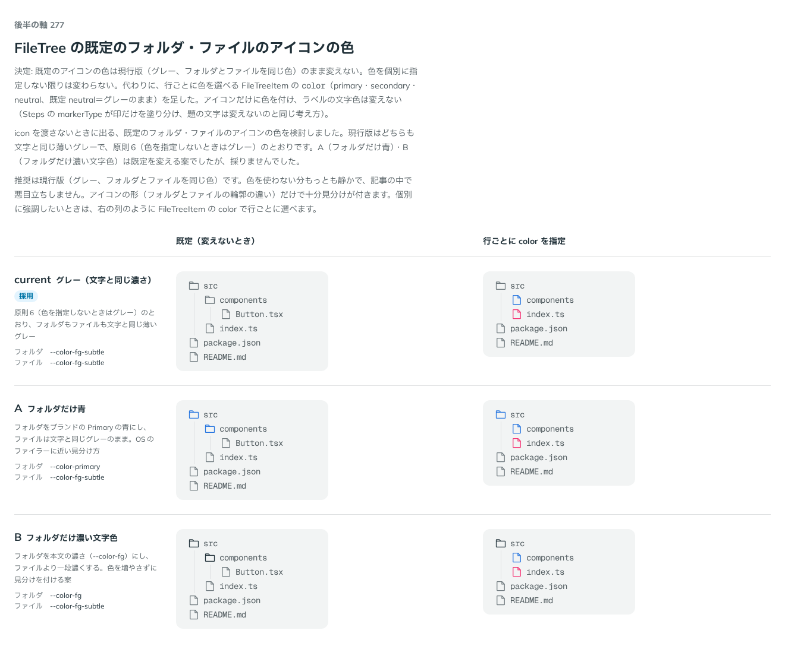

# 0271. FileTree の既定アイコンの色はグレーのまま（行ごとに color で選べる）

- ステータス: Accepted
- 日付: 2026-09-23
- ラウンド: 後半 軸 277

## 背景

`icon` を渡さないときに出る、既定のフォルダ・ファイルのアイコンの色を決めました。props にはしていないので、当初は `tokens.css` の上書きだけで比較しました。

## 候補

比較は、決めた時点のコミット `9944d66` の比較のストーリー（`design/stories/axis-277-file-tree-icon-color.stories.tsx`）です。列は「既定（変えないとき）」「行ごとに `color` を指定」です。

| 案     | 内容                                                                                                            |
| ------ | --------------------------------------------------------------------------------------------------------------- |
| 現行版 | グレー（文字と同じ濃さ）。原則6（色を指定しないときはグレー）のとおり、フォルダもファイルも `--color-fg-subtle` |
| A      | フォルダだけ青（`--color-primary`）。ファイルは文字と同じグレーのまま。OS のファイラーに近い見分け方            |
| B      | フォルダだけ濃い文字色（`--color-fg`）。ファイルより一段濃くする。色を増やさずに見分けを付ける案                |

## 決定

**既定のアイコンの色は現行版（グレー、フォルダとファイルを同じ色）のまま変えません。色を個別に指定しない限りは変わりません。**

代わりに、行ごとに色を選べる `FileTreeItem` の `color`（primary・secondary・neutral、既定 neutral＝グレーのまま）を足しました。アイコンだけに色を付け、ラベルの文字色は変えません（Steps の `markerType` が印だけを塗り分け、題の文字は変えないのと同じ考え方）。

## 理由

ユーザーの返事の原文です。

> 277: 色を個別に指定しない限りは変更しない、としたいです。アイテムごとに色やアイコンを変えられるようにしたいですね。

現行版（グレー、フォルダとファイルを同じ色）は、色を使わない分もっとも静かで、記事の中で悪目立ちしません。アイコンの形（フォルダとファイルの輪郭の違い）だけで十分見分けが付きます。個別に強調したいときは、`FileTreeItem` の `color` で行ごとに選べます。

## 却下した案と理由

- **A（フォルダだけ青）**: 選ばれませんでした。既定を変えると、記事の中で目立ちすぎます
- **B（フォルダだけ濃い文字色）**: 選ばれませんでした。同じ理由で、既定は変えないことにしました

## 影響

- `src/components/file-tree/FileTree.tsx`: `FileTreeItem` に `color`（primary・secondary・neutral、既定 neutral）を足しました。渡した `icon`（アイコンを差し替えた行）の色は `--file-tree-icon-color` で別に持ちます
- `design/tokens.css`: `--file-tree-icon-folder-color`・`--file-tree-icon-file-color`・`--file-tree-icon-color` を追加しました
- 比較のストーリー `design/stories/axis-277-file-tree-icon-color.stories.tsx` は消しました

## 原則への反映

反映なし。原則6（色は役割で持つ）の「色を指定しないとき、色を持つ部品はすべてグレーです」の範囲内です。

## 比較画像

決めた時点のコミットは `9944d66` です。`git checkout 9944d66 && pnpm storybook` で、比較のストーリー（`Design Review/277 FileTree の既定アイコンの色`）を決めたときの部品のまま開けます。
