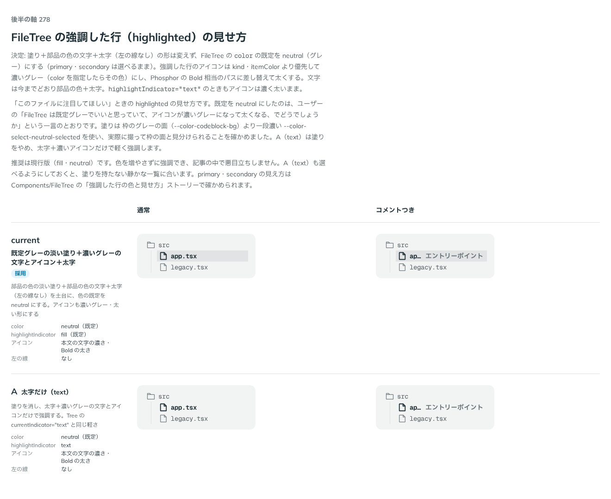

# 0272. FileTree の強調した行は、淡い塗り＋部品の色の文字＋太字（text だけも選べる）

- ステータス: Accepted
- 日付: 2026-09-23
- ラウンド: 後半 軸 278

## 背景

「このファイルに注目してほしい」ときの `highlighted` の見せ方を決めました。

## 候補

比較は、決めた時点のコミット `9944d66` の比較のストーリー（`design/stories/axis-278-file-tree-highlight.stories.tsx`）です。列は通常・コメントつきです。

| 案     | 内容                                                                                                                       |
| ------ | -------------------------------------------------------------------------------------------------------------------------- |
| 現行版 | 既定グレーの淡い塗り＋濃いグレーの文字とアイコン＋太字（左の線なし）。色の既定を neutral にする                            |
| A      | 太字だけ（text）。塗りを消し、太字＋濃いグレーの文字とアイコンだけで強調する。Tree の `currentIndicator="text"` と同じ軽さ |

## 決定

**塗り＋部品の色の文字＋太字（左の線なし）の形は変えず、FileTree の `color` の既定を neutral（グレー）にします（primary・secondary は選べるまま）。**

強調した行のアイコンは `kind`・`itemColor` より優先して濃いグレー（`color` を指定したらその色）にし、Phosphor の Bold 相当のパスに差し替えて太くします。文字は今までどおり部品の色＋太字。`highlightIndicator="text"` のときもアイコンは濃く太いままです。

あわせて、強調した行のコメント（`comment`）がラベルの右にくっついて見えた点を直し、行の右に 8px の余白（`--file-tree-row-pe`）を足しました。

## 理由

ユーザーの返事の原文です。

> 278: 現行とBを合わせて、パーツ色の淡い塗り＋パーツ色の文字＋太字でいいかなと思いました。太字だけも選べるようにしたいですね。

（2 回目のやり取りより）

> FileTree は既定グレーでいいと思っていて、アイコンが濃いグレーになって太くなる、でどうでしょうか

（3 回目のやり取りより）

> FileTree: ハイライトがついているとき、エントリーポイント などのテキストがハイライトの右にくっついているのが気になります。少し余白をあけてほしいです。→ 行の右に 8px（--file-tree-row-pe）

既定を neutral にしたのは、色を増やさずに強調でき、記事の中で悪目立ちしないためです。塗りは枠のグレーの面（`--color-codeblock-bg`）より一段濃い `--color-select-neutral-selected` を使い、実際に撮って枠の面と見分けられることを確かめました。A（text）は塗りをやめ、太字＋濃いアイコンだけで軽く強調するため、塗りを持たない静かな一覧に合う形として選べるようにしました。

## 却下した案と理由

なし（現行版・A のどちらも採用しました）。

## 影響

- `src/components/file-tree/FileTree.tsx`: `color`（primary・secondary・neutral、既定 neutral）・`highlightIndicator`（fill・text、既定 fill）を公開しました。強調した行のアイコンは `kind`・`itemColor` より優先して `--file-tree-highlight-fg` を使い、太い形のアイコンに差し替えました
- `design/tokens.css`: `--file-tree-highlight-bg`・`--file-tree-highlight-fg`・`--file-tree-highlight-weight` と、行の右の余白 `--file-tree-row-pe` を追加しました
- `src/index.ts`: `FileTreeHighlightIndicator`（型名は実装に合わせる）を公開しました
- 比較のストーリー `design/stories/axis-278-file-tree-highlight.stories.tsx` は消しました

## 原則への反映

反映なし。原則6（色は役割で持つ）の「選んだものは部品の色の濃い塗り」の範囲内です。

## 比較画像

決めた時点のコミットは `9944d66` です。`git checkout 9944d66 && pnpm storybook` で、比較のストーリー（`Design Review/278 FileTree の強調した行`）を決めたときの部品のまま開けます。
