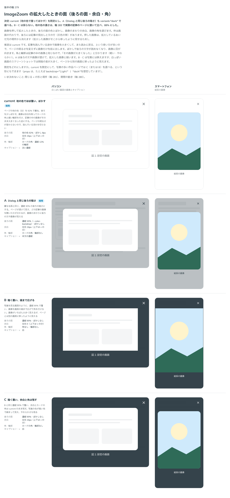

# 0273. ImageZoom の拡大した面は、地の色で覆ってぼかす

- ステータス: Accepted
- 日付: 2026-09-23
- ラウンド: 後半 軸 279

## 背景

画像を押して拡大したときの、後ろの面の色とぼかし、画像のまわりの余白、画像の角を決めました。押した画像は、拡大しているあいだ元の場所から消えます（拡大した画像がそこから移ったように見せるため）。

## 候補

比較は、決めた時点のコミット `9944d66` の比較のストーリー（`design/stories/axis-279-image-zoom-surface.stories.tsx`）です。列はパソコン・スマートフォンです。

| 案     | 内容                                                                                                      |
| ------ | --------------------------------------------------------------------------------------------------------- |
| 現行版 | 地の色（白）を 92% で重ね、少しぼかす。画像は余白を取ってカードの角と細い輪郭。ページの明るさが変わらない |
| A      | Dialog と同じ、濃紺 30% の後ろの暗さ。ページが透けて見え、どの記事の画像を開いたかが分かる                |
| B      | 濃紺 90% で覆い、画像を画面の端まで広げて角を付けない。画像がいちばん大きく見える                         |
| C      | B と同じ濃紺 90% で覆い、余白とカードの角は現行版のまま残す                                               |

## 決定

**現行版（地の色で覆ってぼかす）を既定にし、A（Dialog と同じ後ろの暗さ）も `variant="dark"` で選べるようにします。B・C は採りません。地の色の濃さは、[ADR-0277](./0277-image-zoom-backdrop-strength.md) で実際の記事のページに置いて比べ、88% にしました。**

## 理由

ユーザーの返事の原文です。

> 279: 現行をデフォルト、Aも選べるようにしたいです。地の色のパーセンテージは実際のページに取り込んで比較したいです。

記事を読んでいる途中で画像を大きくして、また読みに戻る、という使い方が多いので、ページの明るさを変えずに画像だけを前に出す現行版を既定にしました。ぼかしで後ろの文字が読めなくなり、画像に目が向きます。角と輪郭は記事の中の画像と同じなので、「その画像が大きくなった」と分かります。A は、どの記事の画像を開いたかがページの透けで分かる案として、`variant="dark"` で選べるようにしました。B・C は、写真には映えますが、白っぽい画面のスクリーンショットでは明暗の差が大きく、ページから別の画面に移ったように見えるため採りませんでした。

## 却下した案と理由

- **B（暗く覆い、端まで広げる）**: 選ばれませんでした。ページから別の画面に移ったように見えます
- **C（暗く覆い、余白と角は残す）**: 選ばれませんでした。B と同じ理由に加え、A（Dialog と同じ暗さ）と役割が近く、両方を残す理由が薄いためです

## 影響

- `src/components/image-zoom/ImageZoom.tsx`・`ImageZoomViewer.tsx`: `variant`（`'light' | 'dark'`、既定 `light`）を公開しました
- `design/tokens.css`: `--image-zoom-backdrop`・`--image-zoom-backdrop-blur`・`--image-zoom-padding-x`・`--image-zoom-padding-y`・`--image-zoom-radius`・`--image-zoom-outline`・`--image-zoom-caption-color`・`--image-zoom-close-fg`・`--image-zoom-focus-ring`（light）と、`--image-zoom-dark-*`（dark）を追加しました
- 濃さの最終値は [ADR-0277](./0277-image-zoom-backdrop-strength.md)、dark の値は [ADR-0278](./0278-image-zoom-dark.md) で別に決めました
- 比較のストーリー `design/stories/axis-279-image-zoom-surface.stories.tsx` は消しました

## 原則への反映

反映なし。原則1（影はレイヤーの離れを表す）の重なる面の考え方の範囲内です。`light`・`dark` という props の名前は、ダークモードの設計のときに再考が必要というやり取りがあり、backlog に足しました。

## 比較画像

決めた時点のコミットは `9944d66` です。`git checkout 9944d66 && pnpm storybook` で、比較のストーリー（`Design Review/279 ImageZoom の拡大したときの面`）を決めたときの部品のまま開けます。
