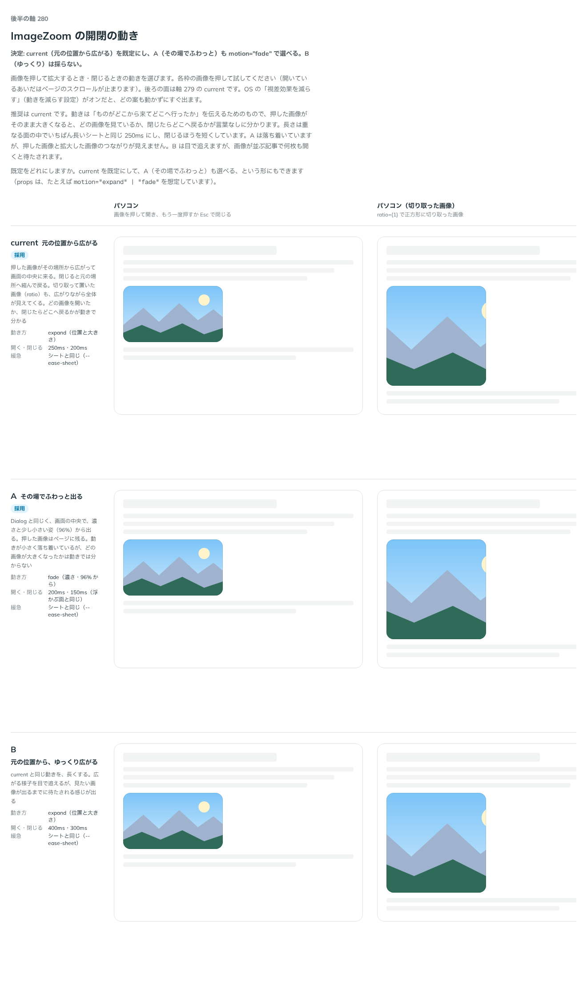

# 0274. ImageZoom の開閉は、元の位置から広がる（その場でふわっと出るのも選べる）

- ステータス: Accepted
- 日付: 2026-09-23
- ラウンド: 後半 軸 280

## 背景

画像を押して拡大するとき・閉じるときの動きを決めました。OS の「視差効果を減らす」（動きを減らす設定）がオンだと、どの案も動かずにすぐ出ます。

## 候補

比較は、決めた時点のコミット `9944d66` の比較のストーリー（`design/stories/axis-280-image-zoom-motion.stories.tsx`）です。列はパソコン・パソコン（切り取った画像）・スマートフォンです。

| 案     | 内容                                                                                                                    |
| ------ | ----------------------------------------------------------------------------------------------------------------------- |
| 現行版 | 元の位置から広がる（`motion="expand"`）。押した画像がその場所から広がって画面の中央に来る。開く 250ms・閉じる 200ms     |
| A      | その場でふわっと出る（`motion="fade"`）。Dialog と同じく、画面の中央で、濃さと少し小さい姿（96%）から出る。200ms・150ms |
| B      | 元の位置から、ゆっくり広がる。現行版と同じ動きを、開く 400ms・閉じる 300ms に長くする                                   |

## 決定

**現行版（元の位置から広がる）を既定にし、A（その場でふわっと）も `motion="fade"` で選べるようにします。B（ゆっくり）は採りません。**

## 理由

ユーザーの返事の原文です。

> 280: 現行をデフォルト、Aも選べるようにしたいです。

動きは「ものがどこから来てどこへ行ったか」を伝えるためのもので、押した画像がそのまま大きくなると、どの画像を見ているか、閉じたらどこへ戻るかが言葉なしに分かるため、現行版（expand）を既定にしました。長さは重なる面の中でいちばん長いシートと同じ 250ms にし、閉じるほうを短くしています。A（fade）は落ち着いていて、押した画像と拡大した画像のつながりを求めない場面向けに選べるようにしました。B は目で追えますが、画像が並ぶ記事で何枚も開くと待たされるため採りませんでした。

## 却下した案と理由

- **B（ゆっくり広がる）**: 選ばれませんでした。画像が並ぶ記事で何枚も開くと、待たされる感じが出ます

## 影響

- `src/components/image-zoom/ImageZoom.tsx`・`zoom-motion.ts`: `motion`（`'expand' | 'fade'`、既定 `expand`）を公開しました
- `design/tokens.css`: `--image-zoom-motion`・`--image-zoom-duration-in`・`--image-zoom-duration-out`・`--image-zoom-ease`・`--image-zoom-fade-scale` を追加しました
- 比較のストーリー `design/stories/axis-280-image-zoom-motion.stories.tsx` は消しました

## 原則への反映

反映なし。原則14（動きは手応えと待ちを伝える）の「重なる面は、出てくる元の側から短く滑って出ます。閉じるときは、開くときより短くします」の範囲内です。

## 比較画像

決めた時点のコミットは `9944d66` です。`git checkout 9944d66 && pnpm storybook` で、比較のストーリー（`Design Review/280 ImageZoom の開閉の動き`）を決めたときの部品のまま開けます。
