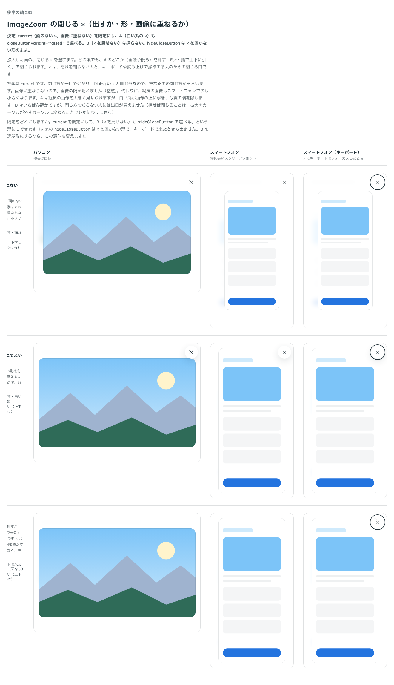

# 0275. ImageZoom の閉じる × は、面のない × を画像に重ねない

- ステータス: Accepted
- 日付: 2026-09-23
- ラウンド: 後半 軸 281

## 背景

拡大した面の、閉じる × を決めました。どの案でも、面のどこか（画像や後ろ）を押す・Esc・指で上下に引く、で閉じられます。× は、それを知らない人と、キーボードや読み上げで操作する人のための閉じる口です。

## 候補

比較は、決めた時点のコミット `9944d66` の比較のストーリー（`design/stories/axis-281-image-zoom-close.stories.tsx`）です。列はパソコン・スマートフォン・スマートフォン（キーボード）です。

| 案     | 内容                                                                                            |
| ------ | ----------------------------------------------------------------------------------------------- |
| 現行版 | 面のない ×、画像に重ねない。Dialog の右上の × と同じ。画像は × の分だけ上下を空けて置く         |
| A      | 白い丸の ×、画像に重ねてよい。× に白い丸の面と影を付け、画像の上に重なっても見えるようにする    |
| B      | × を見せない。画面には × を出さず、面を押すか Esc で閉じる（キーボードで来たときだけ × が出る） |

## 決定

**現行版（面のない ×、画像に重ねない）を既定にし、A（白い丸の ×）も `closeButtonVariant="raised"` で選べるようにします。B（× を見せない）は採りません。`hideCloseButton` は × を置かない形のまま変えません。**

## 理由

ユーザーの返事の原文です。

> 281: 現行をデフォルト、Aも選べるようにしたいです。

閉じ方が一目で分かり、Dialog の × と同じ形なので、重なる面の閉じ方がそろいます。画像に重ならないので、画像の隅が隠れません（整然）。代わりに、縦長の画像はスマートフォンで少し小さくなります。A（白い丸の ×）は縦長の画像を大きく見せたい場面向けに、`closeButtonVariant="raised"` で選べるようにしました。B（× を見せない）は、閉じ方を知らない人には出口が見えないため採りませんでした。

## 却下した案と理由

- **B（× を見せない）**: 選ばれませんでした。押せば閉じることが、拡大のカーソルが外すカーソルに変わることでしか伝わらず、出口が見えません

## 影響

- `src/components/image-zoom/ImageZoomViewer.tsx`: `closeButtonVariant`（`'flat' | 'raised'`、既定 `flat`）を公開しました。`hideCloseButton` は既存のまま（× を置かない形。キーボードで来たときも出ません）
- `design/tokens.css`: `--image-zoom-close-opacity`・`--image-zoom-close-bg`・`--image-zoom-close-fg`・`--image-zoom-close-shadow`・`--image-zoom-close-space`・`--image-zoom-close-inset` を追加しました
- `src/index.ts`: `ImageZoomCloseButtonVariant` を公開しました
- 比較のストーリー `design/stories/axis-281-image-zoom-close.stories.tsx` は消しました

## 原則への反映

反映なし。原則15（読み上げは見た目の順、フォーカスは次に触るものへ）の「重なる面には、名前が要ります」「フォーカスは、次に触るものへ移します」の範囲内です。

## 比較画像

決めた時点のコミットは `9944d66` です。`git checkout 9944d66 && pnpm storybook` で、比較のストーリー（`Design Review/281 ImageZoom の閉じる ×`）を決めたときの部品のまま開けます。
