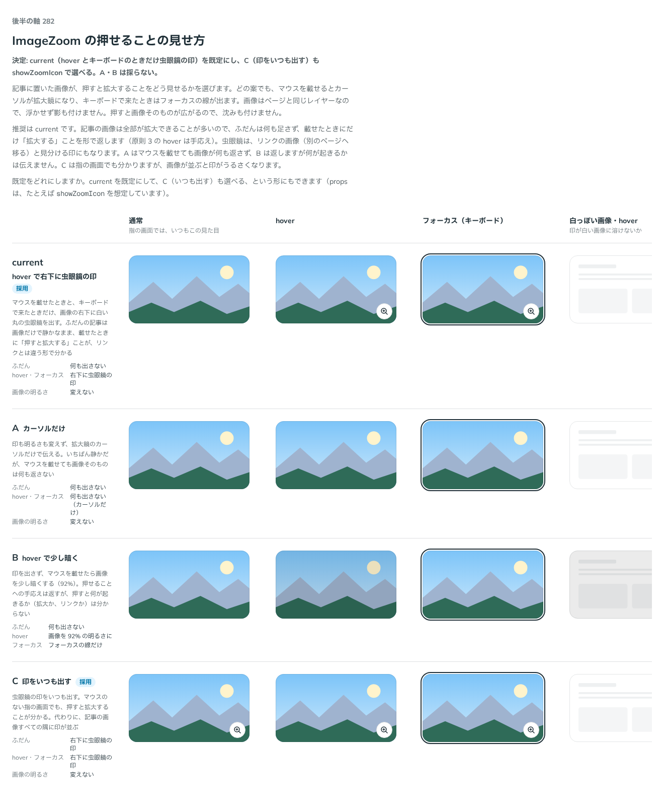

# 0276. ImageZoom の押せることの見せ方は、hover とキーボードのときだけ印を出す

- ステータス: Accepted
- 日付: 2026-09-23
- ラウンド: 後半 軸 282

## 背景

記事に置いた画像が、押すと拡大することをどう見せるかを決めました。どの案でも、マウスを載せるとカーソルが拡大鏡になり、キーボードで来たときはフォーカスの線が出ます。画像はページと同じレイヤーなので、浮かせず影も付けません。押すと画像そのものが広がるので、沈みも付けません。

## 候補

比較は、決めた時点のコミット `9944d66` の比較のストーリー（`design/stories/axis-282-image-zoom-cue.stories.tsx`）です。列は通常・hover・フォーカス（キーボード）・白っぽい画像・hover です。

| 案     | 内容                                                                                                       |
| ------ | ---------------------------------------------------------------------------------------------------------- |
| 現行版 | hover で右下に虫眼鏡の印。マウスを載せたときと、キーボードで来たときだけ、画像の右下に白い丸の虫眼鏡を出す |
| A      | カーソルだけ。印も明るさも変えず、拡大鏡のカーソルだけで伝える                                             |
| B      | hover で少し暗く。印を出さず、マウスを載せたら画像を少し暗くする（92%）                                    |
| C      | 印をいつも出す。虫眼鏡の印をいつも出す。マウスのない指の画面でも、押すと拡大することが分かる               |

## 決定

**現行版（hover とキーボードのときだけ虫眼鏡の印）を既定にし、C（印をいつも出す）も `showZoomIcon` で選べるようにします。A・B は採りません。**

## 理由

ユーザーの返事の原文です。

> 282: 現行をデフォルト、Cも選べるようにしたいです。

記事の画像は全部が拡大できることが多いので、ふだんは何も足さず、載せたときにだけ「拡大する」ことを形で返します（原則3の hover は手応え）。虫眼鏡は、リンクの画像（別のページへ移る）と見分ける印にもなります。C は指の画面でも分かるため、`showZoomIcon` で選べるようにしました。A（カーソルだけ）はマウスを載せても画像が何も返さず、B（少し暗く）は手応えは返しますが何が起きるかが伝わらないため採りませんでした。

## 却下した案と理由

- **A（カーソルだけ）**: 選ばれませんでした。マウスを載せても画像そのものが何も返しません
- **B（hover で少し暗く）**: 選ばれませんでした。手応えは返りますが、押すと何が起きるか（拡大か、リンクか）が伝わりません

## 影響

- `src/components/image-zoom/ImageZoom.tsx`: `showZoomIcon`（既定 `false`）を公開しました
- `design/tokens.css`: `--image-zoom-cue-opacity`・`--image-zoom-cue-hover-opacity`・`--image-zoom-cue-size`・`--image-zoom-cue-inset`・`--image-zoom-hover-brightness` を追加しました
- 比較のストーリー `design/stories/axis-282-image-zoom-cue.stories.tsx` は消しました

## 原則への反映

反映なし。原則3（hover は手応え、押すと沈む）の範囲内です。

## 比較画像

決めた時点のコミットは `9944d66` です。`git checkout 9944d66 && pnpm storybook` で、比較のストーリー（`Design Review/282 ImageZoom の押せることの見せ方`）を決めたときの部品のまま開けます。
