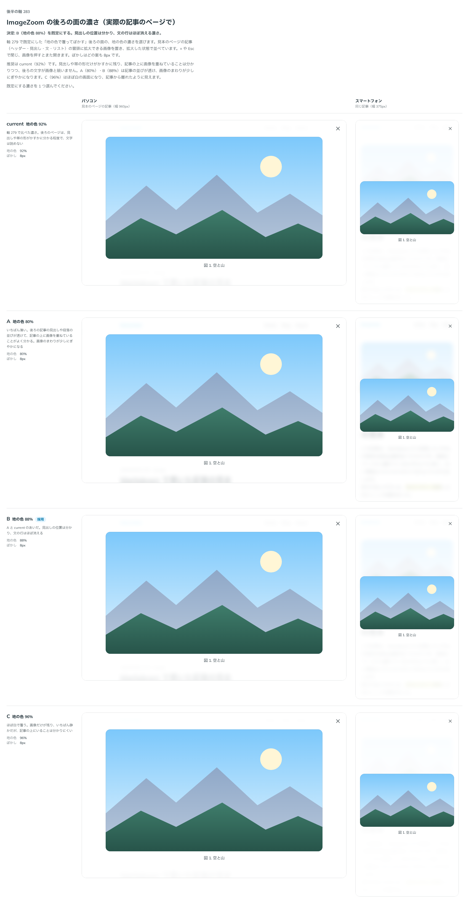

# 0277. ImageZoom の後ろの面の濃さは、地の色 88%

- ステータス: Accepted
- 日付: 2026-09-23
- ラウンド: 後半 軸 283（2 回目のやり取り）

## 背景

[ADR-0273](./0273-image-zoom-surface.md) で既定にした「地の色で覆ってぼかす」後ろの面（`variant="light"`）の、地の色の濃さを、実際の記事のページで比べて決めました。ぼかしは全案 8px のままです。

## 候補

比較は、決めた時点のコミット `9944d66` の比較のストーリー（`design/stories/axis-283-image-zoom-backdrop-strength.stories.tsx`）です。見本のページの記事（ヘッダー・見出し・文・リスト）の冒頭に拡大できる画像を置き、拡大した状態で並べました。列はパソコン（幅 960px）・スマートフォン（幅 375px）です。

| 案            | 内容                                                                                             |
| ------------- | ------------------------------------------------------------------------------------------------ |
| 現行版（92%） | 軸 279 で比べた濃さ。後ろのページは、見出しや帯の形がかすかに分かる程度で、文字は読めない        |
| A（80%）      | いちばん薄い。後ろの記事の見出しや段落の並びが透けて、記事の上に画像を重ねていることがよく分かる |
| B（88%）      | A と現行版のあいだ。見出しの位置は分かり、文の行はほぼ消える                                     |
| C（96%）      | ほぼ白で覆う。画像だけが残り、いちばん静かだが、記事の上にいることは分かりにくい                 |

## 決定

**B（地の色 88%）を既定にします。見出しの位置は分かり、文の行はほぼ消える濃さです。**

## 理由

ユーザーの返事の原文です。

> 283: B でお願いします（88%）

軸 279 では現行版（92%）を推奨していましたが、実際の記事のページに置いて比べると、見出しの位置が分かる程度に後ろが透ける 88% のほうが、記事の上に画像を重ねていることが伝わりやすいと判断しました。A（80%）は画像のまわりが少しにぎやかになり、C（96%）はほぼ白の画面になって記事から離れたように見えます。

## 却下した案と理由

- **A（80%）**: 選ばれませんでした。記事の並びが透けすぎて、画像のまわりがにぎやかになります
- **C（96%）**: 選ばれませんでした。ほぼ白の画面になり、記事から離れたように見えます

## 影響

- `design/tokens.css`: `--image-zoom-backdrop: color-mix(in oklab, var(--color-bg) 88%, transparent)` にしました
- 比較のストーリー `design/stories/axis-283-image-zoom-backdrop-strength.stories.tsx` は消しました

## 原則への反映

反映なし。[ADR-0273](./0273-image-zoom-surface.md) で決めた考え方の中で、値だけを実際のページで確かめ直しました。

## 比較画像

決めた時点のコミットは `9944d66` です。`git checkout 9944d66 && pnpm storybook` で、比較のストーリー（`Design Review/283 ImageZoom の後ろの面の濃さ`）を決めたときの部品のまま開けます。
