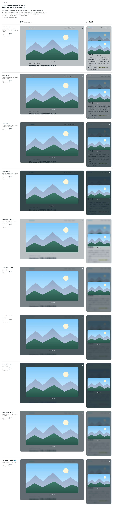

# 0278. ImageZoom の dark は、濃紺 70%・ぼかし 8px・白い文字

- ステータス: Accepted
- 日付: 2026-09-23
- ラウンド: 後半 軸 284（3 回目のやり取り）

## 背景

`variant="dark"`（[ADR-0273](./0273-image-zoom-surface.md) で選べるようにした、Dialog と同じ後ろの暗さ）の、濃さと、キャプション・閉じる × の色を、実際の記事のページで比べて決めました。3 回目のやり取りで「dark の裏にぼかしは入っているか」という確認があり、入っていなかったため、この軸でぼかしの行を足しました。

## 候補

比較は、決めた時点のコミット `9944d66` の比較のストーリー（`design/stories/axis-284-image-zoom-dark.stories.tsx`）です。見本のページの記事に拡大できる画像を置き、拡大した状態で並べました。列はパソコン・スマートフォンです。候補は 10 案（現行〜I）で、地の濃さ・ぼかしの有無・文字の色（黒・白）を組み合わせました。

| 案            | 内容                                            | コントラスト |
| ------------- | ----------------------------------------------- | ------------ |
| 現行版（30%） | Dialog と同じ後ろの暗さ。ぼかしなし・黒い文字   | 7.6          |
| A（60%）      | ぼかしなし・白い文字                            | 3.9          |
| B（80%）      | ぼかしなし・白い文字                            | 7.3          |
| C（90%）      | ぼかしなし・白い文字                            | 10.1         |
| D（30%）      | ぼかしあり（8px）・黒い文字                     | 7.6          |
| E（60%）      | ぼかしあり（8px）・白い文字                     | 3.9          |
| F（80%）      | ぼかしあり（8px）・白い文字                     | 7.3          |
| G（90%）      | ぼかしあり（8px）・白い文字                     | 10.1         |
| H（65%）      | ぼかしあり（8px）・白い文字。E を少し濃くする   | 4.5          |
| I（70%）      | ぼかしあり（8px）・白い文字。E をさらに濃くする | 5.3          |

## 決定

**I（濃紺 70%・ぼかし 8px・白い文字）を既定にします。白い文字のコントラストが 4.5 を超える濃さにしました。**

## 理由

ユーザーの返事の原文です（3 回目のやり取り）。

> dark の裏ってぼかし入ってますか？ → 入っていなかった。284 にぼかしの行を足す
> この中だと E が好みですね。（濃紺 60%・ぼかし 8px・白い文字。白文字のコントラスト 3.9）
> 70% の見た目ってどんな感じですか？ → H(65%)・I(70%) を足す → 「I でいきましょう」（濃紺 70%・ぼかし 8px・白。コントラスト 5.3）

E（60%・ぼかしあり・白い文字）が好みでしたが、白い文字のコントラストが 3.9 で基準（4.5）に届いていなかったため、濃さを上げた H（65%・4.5）・I（70%・5.3）を追加で比べ、I に決めました。白い地には黒い文字、暗い地には白い文字にする、という原則2の考え方に沿っています。

## 却下した案と理由

- **現行版（30%・黒い文字）**: 選ばれませんでした。ぼかしがなく、後ろの文字が読めてしまいます
- **A〜D、F、G**: 選ばれませんでした。E に寄せた比較の途中で外れた濃さです
- **E（60%）**: 選ばれませんでした。好みではありましたが、白い文字のコントラストが基準に届きませんでした
- **H（65%）**: 選ばれませんでした。I（70%）のほうがコントラストに余裕があります

## 影響

- `design/tokens.css`: `--image-zoom-dark-backdrop: rgb(from var(--color-shadow) r g b / 0.7)`・`--image-zoom-dark-backdrop-blur: calc(var(--spacing) * 2)`・`--image-zoom-dark-caption-color: var(--palette-white)`・`--image-zoom-dark-close-fg: var(--palette-white)` にしました
- 比較のストーリー `design/stories/axis-284-image-zoom-dark.stories.tsx` は消しました

## 原則への反映

反映なし。原則2（フォーカスとエラーは枠線で表す）の「濃い面の上では、濃い線が見えません。そこでは線を、その面の文字の色にします」という考え方の中に収まります。`variant="light" | "dark"` という props の名前は、ダークモードの設計のときに再考が必要というやり取りがあり、backlog に足しました。

## 比較画像

決めた時点のコミットは `9944d66` です。`git checkout 9944d66 && pnpm storybook` で、比較のストーリー（`Design Review/284 ImageZoom の dark の濃さ・ぼかし・文字の色`）を決めたときの部品のまま開けます。
