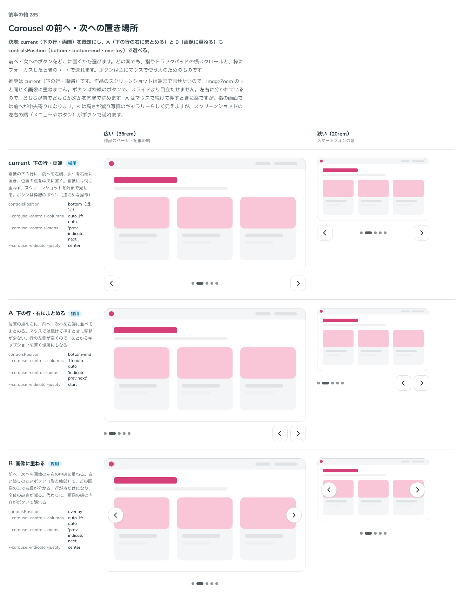

# 0283. Carousel の前へ・次へは、下の行・両端を既定にする

- ステータス: Accepted
- 日付: 2026-09-23
- ラウンド: 後半 軸 285

## 背景

Carousel の前へ・次へのボタンをどこに置くかを決めました。指やトラックパッドの横スクロールと、枠にフォーカスしたときの ←→ はどの案でも使えるので、ボタンは主にマウスで使う人のためのものです。

## 候補

比較は、決めた時点のコミット `d58855f` の比較のストーリー（`design/stories/axis-285-carousel-controls.stories.tsx`）です。列は広い幅（36rem）・狭い幅（20rem）です。

| 案                        | 内容                                                                                                       |
| ------------------------- | ---------------------------------------------------------------------------------------------------------- |
| 下の行・両端（既定）      | 前へを左端、次へを右端、位置の点を中央に置く。画像には何も重ねず、隅まで見せる。枠線のボタン               |
| A（下の行・右にまとめる） | 位置の点を左に、前へ・次へを右端に並べてまとめる。マウスで続けて押すときに移動が少ない                     |
| B（画像に重ねる）         | 前へ・次へを画像の左右の中央に重ねる。白い塗りの丸いボタン（影と輪郭）。行が点だけになり、全体の高さが減る |

## 決定

**current（下の行・両端）を既定にし、A（下の行の右にまとめる）と B（画像に重ねる）も `controlsPosition`（`'bottom' | 'bottom-end' | 'overlay'`）で選べるようにします。**

## 理由

ユーザーの返事の原文です。

> 285: 現行デフォルト、AとBも選べるようにしたいです。

作品のスクリーンショットは端まで見せたいので、ImageZoom の × と同じく画像に重ねない案を既定にしました。ボタンは枠線のボタンで、スライドより目立たせません。左右に分かれているので、どちらが前でどちらが次かを向きで読めます。A はマウスで続けて押すときに楽ですが、指の画面では前へが中央寄りになります。B は高さが減り写真のギャラリーらしく見えますが、スクリーンショットの左右の端（メニューやボタン）がボタンで隠れるので、この 2 つは既定にせず、選べる形で残しました。

## 影響

- `src/components/carousel/Carousel.tsx`・`CarouselBase.tsx`: `controlsPosition`（`'bottom' | 'bottom-end' | 'overlay'`、既定 `'bottom'`）を公開しました
- `design/tokens.css`: `--carousel-controls-columns`・`--carousel-controls-areas`・`--carousel-indicator-justify`・`--carousel-overlay-inset` を追加しました
- props の名前は Gallery の `controlsPosition`（[ADR-0303](./0303-controls-position-prop-name.md)）とそろえました
- 比較のストーリー `design/stories/axis-285-carousel-controls.stories.tsx` は消しました

## 原則への反映

反映なし。原則1（影はレイヤーの離れを表す）の、浮いた押すものには薄い影・輪郭を付けるという考え方と、原則7（塗りか枠線か）の範囲内です。

## 比較画像

決めた時点のコミットは `d58855f` です。`git checkout d58855f && pnpm storybook` で、比較のストーリー（`Design Review/285 Carousel の前へ・次への置き場所`）を決めたときの部品のまま開けます。
