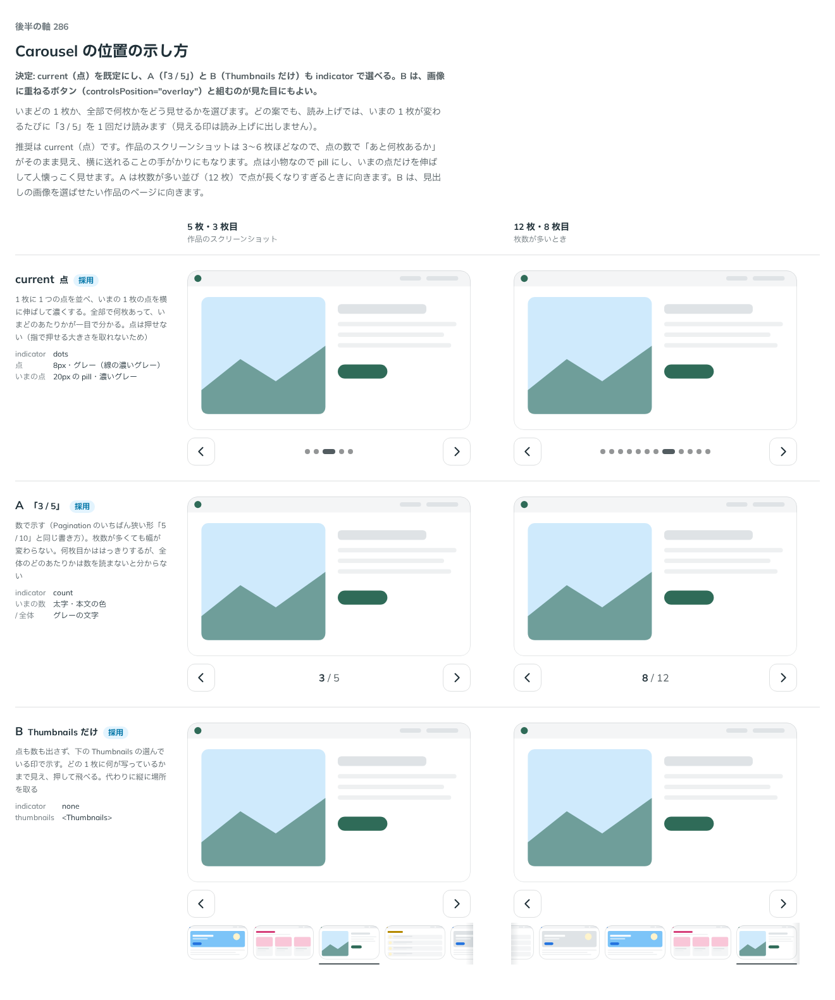

# 0284. Carousel の位置の示し方は、点を既定にする

- ステータス: Accepted
- 日付: 2026-09-23
- ラウンド: 後半 軸 286

## 背景

Carousel で、いまどの 1 枚か・全部で何枚かをどう見せるかを決めました。どの案でも、読み上げでは、いまの 1 枚が変わるたびに「3 / 5」を 1 回だけ読みます（見える印は読み上げに出しません）。

## 候補

比較は、決めた時点のコミット `d58855f` の比較のストーリー（`design/stories/axis-286-carousel-indicator.stories.tsx`）です。列は 5 枚・3 枚目（作品のスクリーンショット）、12 枚・8 枚目（枚数が多いとき）です。

| 案                   | 内容                                                                                        |
| -------------------- | ------------------------------------------------------------------------------------------- |
| 点（既定）           | 1 枚に 1 つの点を並べ、いまの 1 枚の点を横に伸ばして濃くする。点は押せない                  |
| A（「3 / 5」）       | 数で示す（Pagination のいちばん狭い形と同じ書き方）。枚数が多くても幅が変わらない           |
| B（Thumbnails だけ） | 点も数も出さず、下の Thumbnails の選んでいる印で示す。どの 1 枚に何が写っているかまで見える |

## 決定

**current（点）を既定にし、A（「3 / 5」）と B（Thumbnails だけ）も `indicator`（`'dots' | 'count' | 'none'`）で選べるようにします。B は、画像に重ねるボタン（`controlsPosition="overlay"`）と組むのが見た目にもよい組み合わせです。**

## 理由

ユーザーの返事の原文です。

> 286: 現行デフォルト、AとBも選べるようにしたいです。B については、画像の重なるボタンとの併用が見た目的にも良さそうですね。

作品のスクリーンショットは 3〜6 枚ほどなので、点の数で「あと何枚あるか」がそのまま見え、横に送れることの手がかりにもなります。点は小物なので pill にし、いまの点だけを伸ばして人懐っこく見せます。A は枚数が多い並び（12 枚）で点が長くなりすぎるときに向きます。B は、見出しの画像を選ばせたい作品のページに向き、画像に重ねるボタン（[ADR-0283](./0283-carousel-controls-position.md) の `overlay`）と組み合わせると、行の高さを取らずに済みます。

## 影響

- `src/components/carousel/Carousel.tsx`・`CarouselBase.tsx`: `indicator`（`'dots' | 'count' | 'none'`、既定は `thumbnails` があれば `'none'`、なければ `'dots'`）を公開しました
- `design/tokens.css`: `--carousel-dot-size`・`--carousel-dot-current-width`・`--carousel-dot-gap`・`--carousel-dot-color`・`--carousel-dot-current-color`・`--carousel-count-gap` を追加しました
- 点と数は `src/internal/position-indicator` に置き、Gallery（[ADR-0289](./0289-gallery-controls-position.md)）と共有しました
- 比較のストーリー `design/stories/axis-286-carousel-indicator.stories.tsx` は消しました

## 原則への反映

反映なし。点が押せないことは、原則17（押せる範囲は見た目の範囲）の「見えない広がりは付けません」の範囲内です。

## 比較画像

決めた時点のコミットは `d58855f` です。`git checkout d58855f && pnpm storybook` で、比較のストーリー（`Design Review/286 Carousel の位置の示し方`）を決めたときの部品のまま開けます。
