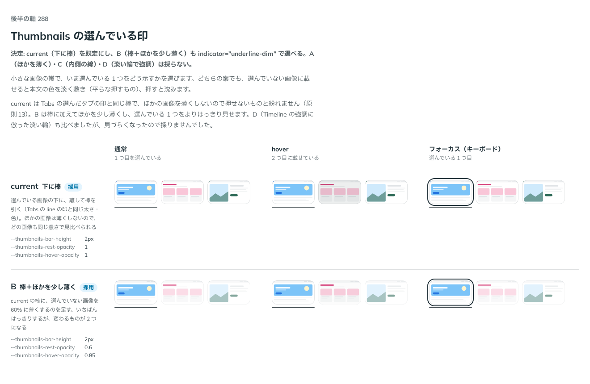

# 0286. Thumbnails の選んでいる印は、下の棒を既定にする

- ステータス: Accepted
- 日付: 2026-09-23
- ラウンド: 後半 軸 288

## 背景

Thumbnails で、選んでいる画像をどう示すかを決めました。この軸に入る前に、案 A（ほかを薄く）・C（内側の線）・D（淡い輪で強調）も検討していましたが、比較のストーリーに残す前に候補から外しています。

## 候補

比較は、決めた時点のコミット `d58855f` の比較のストーリー（`design/stories/axis-288-thumbnails-selected.stories.tsx`）です。

| 案                      | 内容                                                                                            |
| ----------------------- | ----------------------------------------------------------------------------------------------- |
| 下に棒（既定）          | 選んでいる画像の下に、離して棒を引く（Tabs の line の印と同じ太さ・色）。ほかの画像は薄くしない |
| B（棒＋ほかを少し薄く） | current の棒に、選んでいない画像を 60% に薄くするのを足す。いちばんはっきりする                 |

## 決定

**current（下に棒）を既定にし、B（棒＋ほかを少し薄く）も `indicator`（`'underline' | 'underline-dim'`）で選べるようにします。**

## 理由

ユーザーの返事の原文です（1 回目は Timeline の強調の話と混ざっていたので、追加の答えで確かめました）。

> 288: steps の emphasis のような強調した見た目も作ってみてもらえますか？
> 追加の答え — 288: Timeline の強調のこと（ADR-0210。淡い輪＋少し大きく）

2 回目の返事です。

> 288: デフォルト現行、Bも選択可能でよさそうです。Dはちょっと見づらくなってしまったので却下します。

current（下に棒）は、どの画像も同じ濃さで見比べられるので既定にしました。B は選んでいる 1 枚がいちばんはっきりするので、選べる形で残します。A（ほかを薄くするだけ）・C（内側の線）・D（淡い輪で強調。Timeline の強調と同じ形を試した案）は、Thumbnails の小さな画像では見づらくなったため採りませんでした。

## 却下した案と理由

- **A（ほかを薄くするだけ）**: 選ばれませんでした
- **C（内側の線）**: 選ばれませんでした
- **D（淡い輪で強調）**: 選ばれませんでした。Timeline の強調（[ADR-0210](./0210-timeline-emphasis.md)）と同じ形を試しましたが、小さな画像では見づらくなりました

## 影響

- `src/components/thumbnails/Thumbnails.tsx`: `indicator`（`'underline' | 'underline-dim'`、既定 `'underline'`）を公開しました
- `design/tokens.css`: `--thumbnails-bar-height`・`--thumbnails-bar-gap`・`--thumbnails-rest-opacity`・`--thumbnails-hover-opacity`・`--thumbnails-dim-rest-opacity`・`--thumbnails-dim-hover-opacity` を追加しました
- 比較のストーリー `design/stories/axis-288-thumbnails-selected.stories.tsx` は消しました

## 原則への反映

反映なし。原則6（色は役割で持つ）の「選んでいることを示す印は、部品の色に従います」の範囲内です。

## 比較画像

決めた時点のコミットは `d58855f` です。`git checkout d58855f && pnpm storybook` で、比較のストーリー（`Design Review/288 Thumbnails の選んでいる印`）を決めたときの部品のまま開けます。
