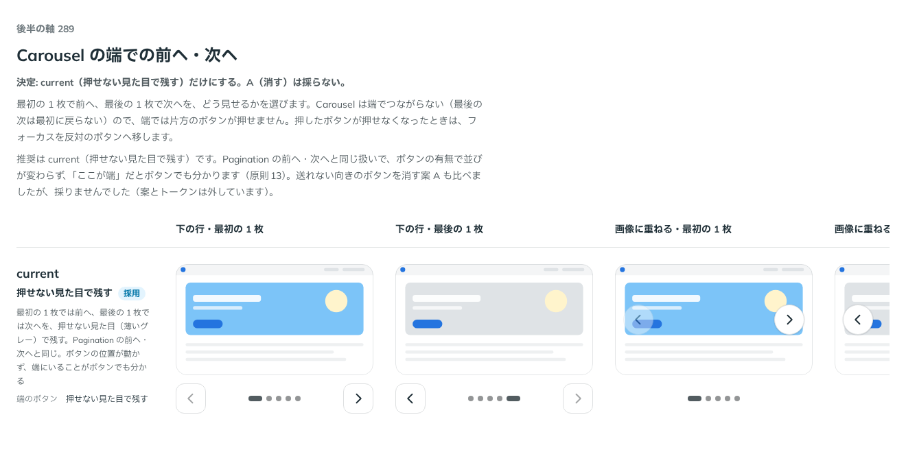

# 0287. Carousel の端では、前へ・次へを押せない見た目で残す

- ステータス: Accepted
- 日付: 2026-09-23
- ラウンド: 後半 軸 289

## 背景

Carousel は端でつながらない（loop しない）ので、最初の 1 枚での前へ、最後の 1 枚での次へをどう扱うかを決めました。この軸に入る前に、案 A（消す）も `--carousel-edge-button-visibility` というトークンで作っていましたが、比較のストーリーに残す前に候補から外しています。

## 候補

比較は、決めた時点のコミット `d58855f` の比較のストーリー（`design/stories/axis-289-carousel-edge-buttons.stories.tsx`）です。列は下の行・画像に重ねる（[ADR-0283](./0283-carousel-controls-position.md)）×最初の 1 枚・最後の 1 枚です。

| 案                                 | 内容                                                                       |
| ---------------------------------- | -------------------------------------------------------------------------- |
| 押せない見た目で残す（既定・唯一） | 端では、前へ・次へを Pagination の前へ・次へと同じく、押せない見た目で残す |

## 決定

**Carousel の端では、前へ・次へを押せない見た目（薄いグレー）で残します。ボタンの位置は動かず、端にいることがボタンでも分かります。**

## 理由

ユーザーの返事の原文です。

> 289: 現行のみでお願いします。

前に決めていた「消す」案（A）は、送っている途中でボタンの数が変わり、ほかのボタンの位置がずれるので、Pagination の前へ・次へ（[ADR-0177](./0177-pagination-current.md)）と同じ、押せない見た目で残す形にそろえました。押したボタンが押せなくなったときは、フォーカスを反対のボタンへ移し、フォーカスが外れてページの先頭に戻らないようにしています。

同じ考えは、Gallery の前後のボタンにも当てはめました（[ADR-0301](./0301-gallery-edge-buttons.md)）。

## 却下した案と理由

- **A（消す）**: 選ばれませんでした。ボタンの数が変わり、ほかのボタンの位置がずれます

## 影響

- `src/components/carousel/CarouselBase.tsx`: 端のボタンは `disabled` にし、原則13 の押せない見た目にしました。フォーカスは反対のボタンへ移します
- 比較のストーリー `design/stories/axis-289-carousel-edge-buttons.stories.tsx` は消しました

## 原則への反映

反映なし。原則13（押せないものは、浮かせず薄くする）の範囲内です。

## 比較画像

決めた時点のコミットは `d58855f` です。`git checkout d58855f && pnpm storybook` で、比較のストーリー（`Design Review/289 Carousel の端での前へ・次へ`）を決めたときの部品のまま開けます。
