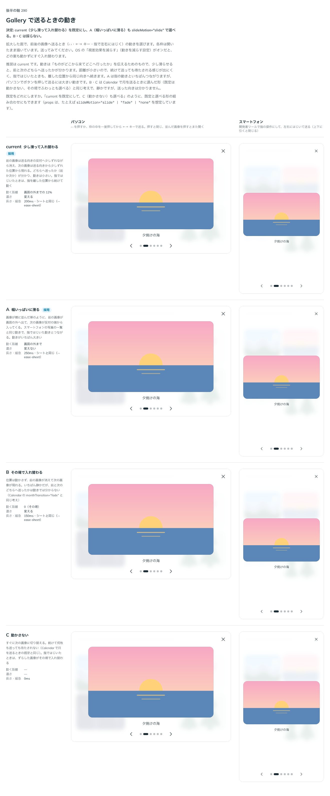

# 0288. Gallery で送るときの動きは、少し滑って入れ替わるを既定にする

- ステータス: Accepted
- 日付: 2026-09-23
- ラウンド: 後半 軸 290

## 背景

Gallery の拡大した面で、前後の画像へ送るとき（‹ ›・←→ キー・指で左右にはじく）の動きを決めました。OS の「視差効果を減らす」（動きを減らす設定）がオンだと、どの案も動かずにすぐ入れ替わります（[ADR-0308](./0308-video-reduced-motion-autoplay.md) と同じ考え方）。

## 候補

比較は、決めた時点のコミット `d58855f` の比較のストーリー（`design/stories/axis-290-gallery-slide-motion.stories.tsx`）です。列はパソコン・スマートフォンです。

| 案                           | 内容                                                                                         |
| ---------------------------- | -------------------------------------------------------------------------------------------- |
| 少し滑って入れ替わる（既定） | 前の画像は送る向きの反対へ少しずれながら消え、次の画像は送る向きから少しずれた位置から現れる |
| A（幅いっぱいに滑る）        | 前の画像が画面の外へ出て、次の画像が反対の端から入ってくる。動きがいちばん大きい             |
| B（その場で入れ替わる）      | 位置は動かさず、前の画像が消えて次の画像が現れる。前と次のどちらへ送ったかは分からない       |
| C（動かさない）              | すぐに次の画像に切り替える。続けて何枚も送っても待たされない                                 |

## 決定

**current（少し滑って入れ替わる）を既定にし、A（幅いっぱいに滑る）も `slideMotion="slide"` で選べるようにします。B・C は採りません。**

## 理由

ユーザーの返事の原文です。

> 290: 現行デフォルト、Aも選べるようにしたいです。

動きは「ものがどこから来てどこへ行ったか」を伝えるためのもので、少し滑らせると、前と次のどちらへ送ったかが分かります。距離が小さいので、続けて送っても待たされる感じが出にくく、指ではじいたときも、離した位置から同じ向きへ続きます。A は指の動きといちばんつながりますが、パソコンでボタンを押して送るには大きい動きなので、選べる形にしました。B・C は Calendar で月を送るときに選んだ形（既定は動かさない、その場でふわっとも選べる — [ADR-0142](./0142-calendar-month-motion.md)）と同じ考え方ですが、送った向きが分からず、Gallery では採りませんでした。

props の名前は `slideMotion`（`'shift' | 'slide'`）にしました。追加の答えの原文です。

> slideMotion でおっけーです

## 却下した案と理由

- **B（その場で入れ替わる）**: 選ばれませんでした。送った向きが動きでは分かりません
- **C（動かさない）**: 選ばれませんでした。同じ理由に加え、続きがあることを画像の動きで伝える機会を失います

## 影響

- `src/components/gallery/Gallery.tsx`: `slideMotion`（`'shift' | 'slide'`、既定 `'shift'`）を公開しました
- `design/tokens.css`: `--gallery-slide-distance`・`--gallery-slide-fade`・`--gallery-slide-duration`・`--gallery-slide-ease` を追加しました
- 比較のストーリー `design/stories/axis-290-gallery-slide-motion.stories.tsx` は消しました

## 原則への反映

反映なし。原則14（動きは手応えと待ちを伝える）の「重なる面は、出てくる元の側から短く滑って出ます」「ものがどこから来てどこへ行ったかを伝えます」の範囲内です。

## 比較画像

決めた時点のコミットは `d58855f` です。`git checkout d58855f && pnpm storybook` で、比較のストーリー（`Design Review/290 Gallery で送るときの動き`）を決めたときの部品のまま開けます。
