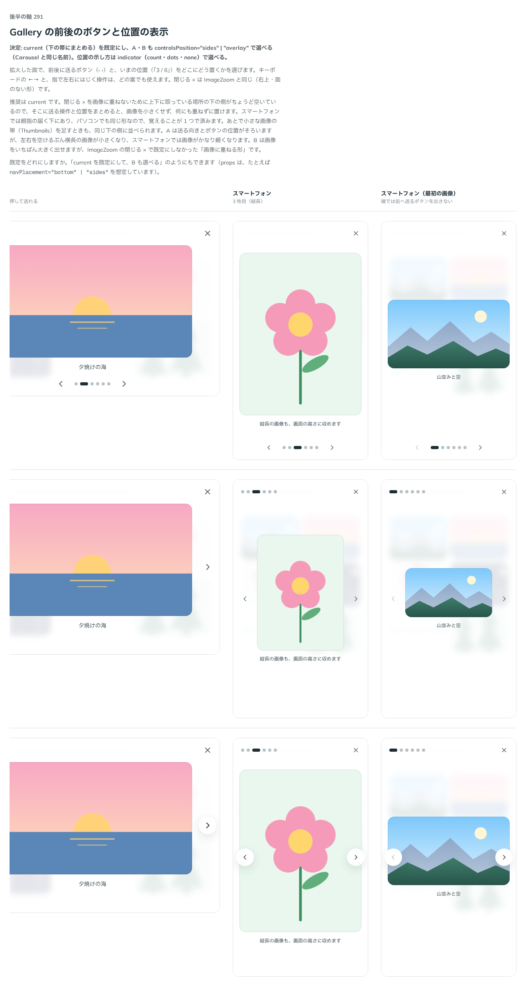

# 0289. Gallery の前後のボタンと位置の表示は、下の帯にまとめるのを既定にする

- ステータス: Accepted
- 日付: 2026-09-23
- ラウンド: 後半 軸 291

## 背景

Gallery の拡大した面で、前後に送るボタン（‹ ›）と、いまの位置（「3 / 6」）をどこにどう置くかを決めました。キーボードの ←→ と、指で左右にはじく操作は、どの案でも使えます。閉じる × は ImageZoom と同じ（右上・面のない形、[ADR-0275](./0275-image-zoom-close.md)）です。

## 候補

比較は、決めた時点のコミット `d58855f` の比較のストーリー（`design/stories/axis-291-gallery-nav.stories.tsx`）です。列はパソコン・スマートフォンです。

| 案                                | 内容                                                                                                     |
| --------------------------------- | -------------------------------------------------------------------------------------------------------- |
| 下の帯にまとめる（既定）          | 画像の下に「‹ 3 / 8 ›」を 1 列に並べる。閉じる × の分として上下に取っている場所の、下の側に置く          |
| A（左右の端・面のない形）         | ‹ を左の端、› を右の端の中央に置く。送る向きとボタンの位置がそろう。左右を空けるので画像は少し小さくなる |
| B（左右の端・画像に重ねる白い丸） | A と同じ置き場所で、ボタンに白い丸の面と影を付け、画像に重なってもよい形にする                           |

## 決定

**current（下の帯にまとめる）を既定にし、A・B も `controlsPosition`（`'bottom' | 'sides' | 'overlay'`。Carousel と同じ名前）で選べるようにします。位置の示し方は `indicator`（`'count' | 'dots' | 'none'`）で選べます。**

## 理由

ユーザーの返事の原文です。

> 291: 286 に準拠しつつ、デフォルトは現行、AとBも選べるようにしたいです。

閉じる × を画像に重ねないために上下に取っている場所の下の側がちょうど空いているので、そこに送る操作と位置をまとめると、画像を小さくせず、何にも重ねずに置けます。スマートフォンでは親指の届く下にあり、パソコンでも同じ形なので、覚えることが 1 つで済みます。A は送る向きとボタンの位置がそろいますが、左右を空けるぶん横長の画像が小さくなり、スマートフォンでは画像がかなり細くなります。B は画像をいちばん大きく出せますが、ImageZoom の閉じる × で既定にしなかった「画像に重ねる形」なので、この 2 つは選べる形で残しました。

「286 に準拠」とは [ADR-0284](./0284-carousel-indicator.md)（Carousel の位置の示し方）と同じ語彙（`'dots' | 'count' | 'none'`）にすることです。位置の示し方の既定は `dots` にそろえました（[ADR-0304](./0304-gallery-indicator-default.md)）。

## 影響

- `src/components/gallery/Gallery.tsx`・`GalleryControls.tsx`: `controlsPosition`（`'bottom' | 'sides' | 'overlay'`、既定 `'bottom'`）・`indicator`（`'dots' | 'count' | 'none'`）を公開しました
- `design/tokens.css`: `--gallery-nav-bar`・`--gallery-nav-space-x`・`--gallery-nav-raised`・`--gallery-nav-bg`・`--gallery-nav-shadow`・`--gallery-counter-width` を追加しました
- props の名前は Carousel の `controlsPosition`（[ADR-0303](./0303-controls-position-prop-name.md)）とそろえました
- 比較のストーリー `design/stories/axis-291-gallery-nav.stories.tsx` は消しました

## 原則への反映

反映なし。原則1（影はレイヤーの離れを表す）・原則16（重なる面は、指の動きで浮かべるかシートにする）の範囲内です。

## 比較画像

決めた時点のコミットは `d58855f` です。`git checkout d58855f && pnpm storybook` で、比較のストーリー（`Design Review/291 Gallery の前後のボタンと位置の表示`）を決めたときの部品のまま開けます。
