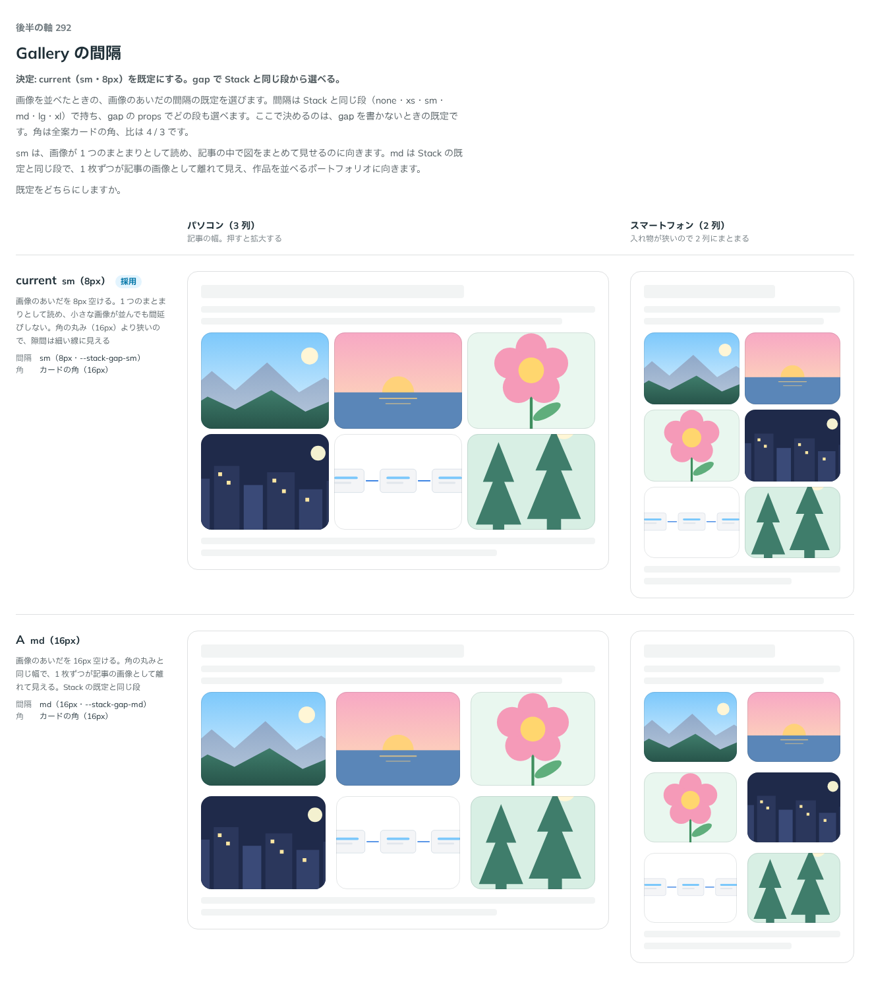

# 0290. Gallery の間隔は、sm（8px）を既定にする

- ステータス: Accepted
- 日付: 2026-09-23
- ラウンド: 後半 軸 292

## 背景

画像を並べたときの、画像のあいだの間隔の既定を決めました。間隔は Stack と同じ段（`--stack-gap-*`、[ADR-0212](./0212-stack-gap.md)）から選び、`gap` の props でほかの段も選べます。ここで決めたのは `gap` を書かないときの既定です。角は全案カードの角、比は 4 / 3（[ADR-0291](./0291-gallery-ratio.md)）です。

## 候補

比較は、決めた時点のコミット `d58855f` の比較のストーリー（`design/stories/axis-292-gallery-grid.stories.tsx`）です。列はパソコン（3 列）・スマートフォン（2 列）です。

| 案              | 内容                                                                                  |
| --------------- | ------------------------------------------------------------------------------------- |
| sm・8px（既定） | 画像のあいだを 8px 空ける。1 つのまとまりとして読め、小さな画像が並んでも間延びしない |
| A（md・16px）   | 画像のあいだを 16px 空ける。角の丸みと同じ幅。Stack の既定と同じ段                    |

## 決定

**既定は `gap="sm"`（8px）です。`gap` の props で、Stack と同じ段（none・xs・sm・md・lg・xl）のどれも選べます。**

## 理由

ユーザーの返事の原文です。1 回目は間隔の段と `gap` props の関係を確かめる質問でした。

> 292: 現行デフォルトで考えていますが、gap の段とはどう関連していますか？
> 追加の答え — 292: 段にそろえ、gap props で選べる（既定は sm/md を比べて決める）
> 2 回目 — 292: sm 既定でお願いします。

`gap` は Stack と同じ語彙で持ち、新しいトークンは足しません。sm は、画像が 1 つのまとまりとして読め、記事の中で図をまとめて見せるのに向きます。md（Stack の既定と同じ段）は、1 枚ずつが記事の画像として離れて見え、作品を並べるポートフォリオに向くので、`gap="md"` として選べる形で残します。

## 影響

- `src/components/gallery/Gallery.tsx`: `gap`（`'none' | 'xs' | 'sm' | 'md' | 'lg' | 'xl'`、既定 `'sm'`）を公開しました
- `design/tokens.css`: `--gallery-gap: var(--stack-gap-sm)` を追加しました
- 比較のストーリー `design/stories/axis-292-gallery-grid.stories.tsx` は消しました

## 原則への反映

反映なし。間隔の語彙を Stack（[ADR-0212](./0212-stack-gap.md)）から引き継いだだけの決定です。

## 比較画像

決めた時点のコミットは `d58855f` です。`git checkout d58855f && pnpm storybook` で、比較のストーリー（`Design Review/292 Gallery の間隔`）を決めたときの部品のまま開けます。
