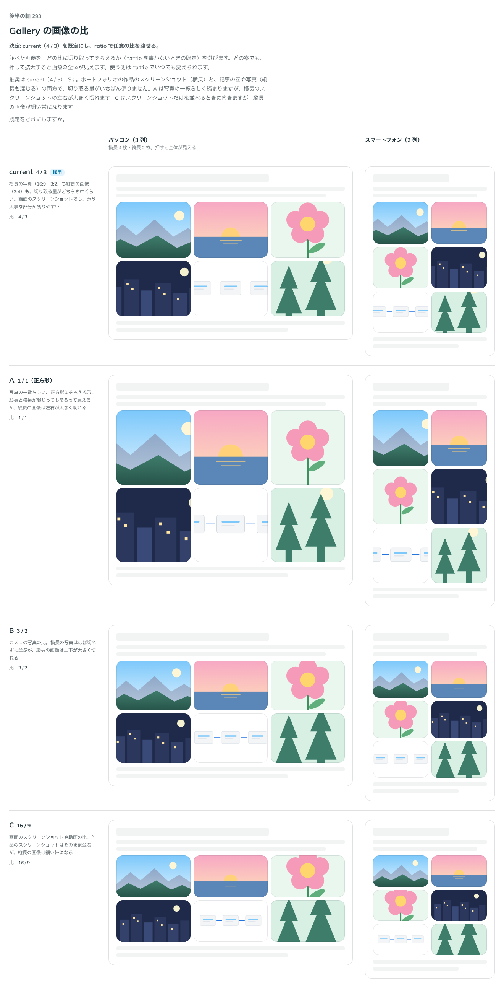

# 0291. Gallery の画像の比は、4 / 3 を既定にする

- ステータス: Accepted
- 日付: 2026-09-23
- ラウンド: 後半 軸 293

## 背景

並べた画像を、どの比に切り取ってそろえるか（`ratio` を書かないときの既定）を決めました。どの案でも、押して拡大すると画像の全体が見えます。使う側は `ratio` でいつでも変えられます。

## 候補

比較は、決めた時点のコミット `d58855f` の比較のストーリー（`design/stories/axis-293-gallery-ratio.stories.tsx`）です。列はパソコン（3 列、横長 4 枚・縦長 2 枚）・スマートフォン（2 列）です。

| 案                 | 内容                                                                             |
| ------------------ | -------------------------------------------------------------------------------- |
| 4 / 3（既定）      | 横長の写真（16:9・3:2）も縦長の画像（3:4）も、切り取る量がどちらも中くらい       |
| A（1 / 1・正方形） | 写真の一覧らしい、正方形にそろえる形。横長の画像は左右が大きく切れる             |
| B（3 / 2）         | カメラの写真の比。横長の写真はほぼ切れずに並ぶが、縦長の画像は上下が大きく切れる |
| C（16 / 9）        | 画面のスクリーンショットや動画の比。縦長の画像が細い帯になる                     |

## 決定

**既定は `ratio={4 / 3}` です。`ratio` の props で任意の比を渡せます。**

## 理由

ユーザーの返事の原文です。

> 293: デフォルト現行で、比率は任意で指定できるようにしたいです。

ポートフォリオの作品のスクリーンショット（横長）と、記事の図や写真（縦長も混じる）の両方で、切り取る量がいちばん偏らない 4 / 3 を既定にしました。A は写真の一覧らしく締まりますが、横長のスクリーンショットの左右が大きく切れます。C はスクリーンショットだけを並べるときに向きますが、縦長の画像が細い帯になります。`ratio` は最初から数値の props として作ってあるので、A・B・C はコードを分けずに渡すだけで選べます。

## 影響

- `src/components/gallery/Gallery.tsx`: `ratio`（既定 `4 / 3`）を公開しました
- `design/tokens.css`: `--gallery-ratio: 4 / 3` を追加しました
- 比較のストーリー `design/stories/axis-293-gallery-ratio.stories.tsx` は消しました

## 原則への反映

反映なし。原則20（部品は知らないことを決めない）の「既定を 1 つ決め、ほかの形は選べるようにする」の範囲内です。

## 比較画像

決めた時点のコミットは `d58855f` です。`git checkout d58855f && pnpm storybook` で、比較のストーリー（`Design Review/293 Gallery の画像の比`）を決めたときの部品のまま開けます。
