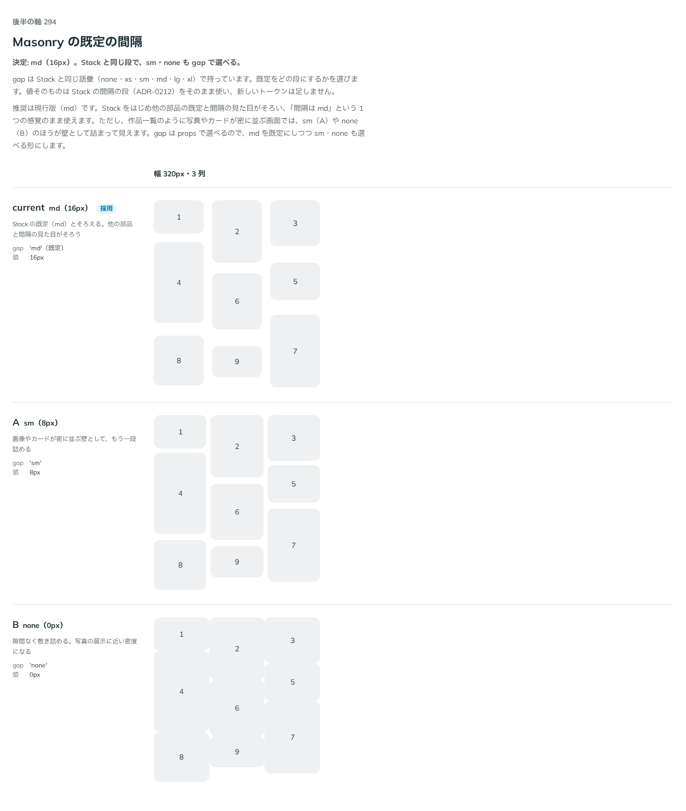

# 0292. Masonry の間隔は、md（16px）を既定にする

- ステータス: Accepted
- 日付: 2026-09-23
- ラウンド: 後半 軸 294

## 背景

Masonry の既定の間隔（`gap`）を決めました。`gap` は Stack と同じ語彙（none・xs・sm・md・lg・xl）で持ち、値そのものは Stack の間隔の段（[ADR-0212](./0212-stack-gap.md)）をそのまま使います。Masonry は密に並ぶ画像やカードが多いので、Stack の既定（md・16px）をそのまま使うか、もっと詰めた段（sm・8px）を既定にするかで迷いがありました。

## 候補

比較は、決めた時点のコミット `d58855f` の比較のストーリー（`design/stories/axis-294-masonry-gap.stories.tsx`）です。列は幅 320px・3 列です。

| 案               | 内容                                                         |
| ---------------- | ------------------------------------------------------------ |
| md・16px（既定） | Stack の既定（md）とそろえる。他の部品と間隔の見た目がそろう |
| A（sm・8px）     | 画像やカードが密に並ぶ壁として、もう一段詰める               |
| B（none・0px）   | 隙間なく敷き詰める。写真の展示に近い密度になる               |

## 決定

**既定は `gap="md"` です。`gap` の props で、Stack と同じ段のどれも選べます。**

## 理由

ユーザーの返事の原文です。

> 294: 既定は md でいいと思います。

md を既定にすると、Stack をはじめ他の部品の既定と間隔の見た目がそろい、「間隔は md」という 1 つの感覚のまま使えます。作品一覧のように写真やカードが密に並ぶ画面では、sm（A）や none（B）のほうが壁として詰まって見えるので、`gap` の props で選べる形にしました。

## 影響

- `src/components/masonry/Masonry.tsx`: `gap`（`'none' | 'xs' | 'sm' | 'md' | 'lg' | 'xl'`、既定 `'md'`）を公開しました
- `design/tokens.css`: `--masonry-gap` は `gap` の variants から作り、新しいトークンは足していません
- 比較のストーリー `design/stories/axis-294-masonry-gap.stories.tsx` は消しました

## 原則への反映

反映なし。間隔の語彙を Stack（[ADR-0212](./0212-stack-gap.md)）から引き継いだだけの決定です。

## 比較画像

決めた時点のコミットは `d58855f` です。`git checkout d58855f && pnpm storybook` で、比較のストーリー（`Design Review/294 Masonry の間隔`）を決めたときの部品のまま開けます。
