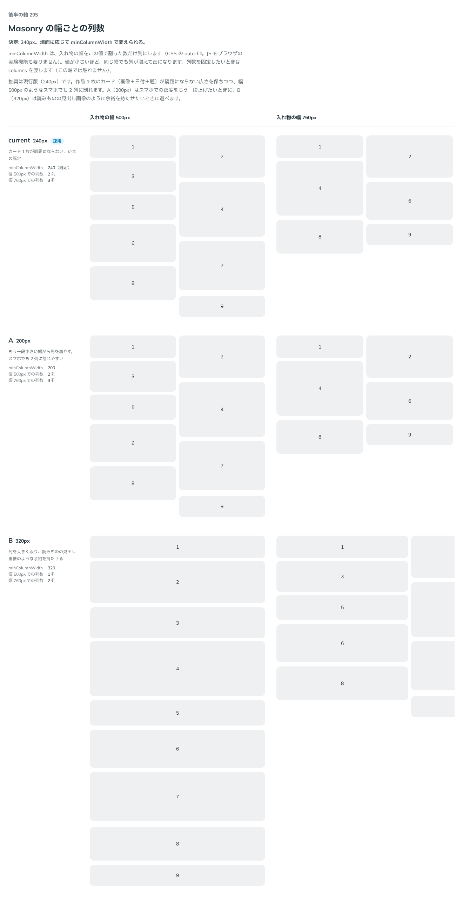

# 0293. Masonry の列の最小幅は、240px を既定にする

- ステータス: Accepted
- 日付: 2026-09-23
- ラウンド: 後半 軸 295

## 背景

Masonry の幅ごとの列数を決めました。`minColumnWidth`（列の最小の幅。CSS の `auto-fill`）の既定値をいくつにするかです。値が小さいほど、同じ入れ物の幅でも列が増えて密になります。`columns` を渡せば入れ物の幅によらず列数を固定できるので、ここで選んだのはあくまで `minColumnWidth` の既定値です。

## 候補

比較は、決めた時点のコミット `d58855f` の比較のストーリー（`design/stories/axis-295-masonry-column-width.stories.tsx`）です。列は入れ物の幅 500px・760px です。

| 案            | 内容                                                         |
| ------------- | ------------------------------------------------------------ |
| 240px（既定） | カード 1 枚が窮屈にならない。幅 500px で 2 列、760px で 3 列 |
| A（200px）    | もう一段小さい幅から列を増やす。スマホでも 2 列に割れやすい  |
| B（320px）    | 列を大きく取り、読みものの見出し画像のような余裕を持たせる   |

## 決定

**既定は `minColumnWidth={240}` です。場面に応じて `minColumnWidth` で変えられます。**

## 理由

ユーザーの返事の原文です。

> 295: 一旦240px既定でお願いします。

作品 1 枚のカード（画像＋日付＋題）が窮屈にならない広さを保ちつつ、幅 500px のようなスマホでも 2 列に割れる値として 240px を既定にしました。A（200px）はスマホでの密度をもう一段上げたいときに、B（320px）は読みものの見出し画像のように余裕を持たせたいときに、`minColumnWidth` を渡して選べます。列数を固定したいときは `columns` を渡します（この軸では扱っていません）。

## 影響

- `src/components/masonry/Masonry.tsx`: `minColumnWidth`（既定 `240`）・`columns` を公開しました
- `design/tokens.css`: `--masonry-column-width: calc(var(--spacing) * 60)`（240px）を追加しました
- 比較のストーリー `design/stories/axis-295-masonry-column-width.stories.tsx` は消しました

## 原則への反映

反映なし。原則11（文字の大きさは入力方式で切り替える）の「入れ物の幅で決まるもの」の考え方の範囲内です。

## 比較画像

決めた時点のコミットは `d58855f` です。`git checkout d58855f && pnpm storybook` で、比較のストーリー（`Design Review/295 Masonry の幅ごとの列数`）を決めたときの部品のまま開けます。
