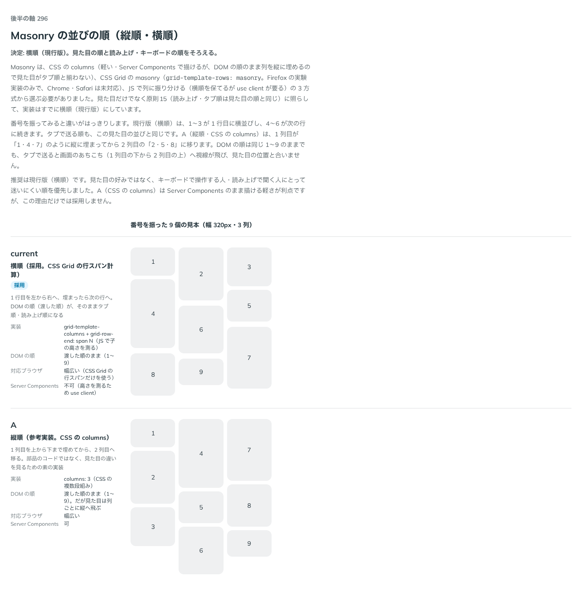

# 0294. Masonry は、横順（CSS Grid の行スパン計算）を採用する

- ステータス: Accepted
- 日付: 2026-09-23
- ラウンド: 後半 軸 296

## 背景

Masonry の並びの順（縦順・横順）を決めました。実装の方式そのものの比較なので、部品のトークンの上書きでは表せません（CSS の `columns` と CSS Grid は仕組みが別です）。Masonry を作りはじめる時点で、CSS の `columns`（軽い・Server Components のまま描けるが、DOM の順のまま列を縦に埋めるので見た目がタブ順と揃わない）、CSS Grid の `masonry`（`grid-template-rows: masonry`。Firefox の実験実装のみで、Chrome・Safari は未対応）、JS で列に振り分ける（横順を保てるが `use client` が要る）の 3 方式から選ぶ必要があり、見た目だけでなく原則15（読み上げ・タブ順は見た目の順と同じ）に照らして、実装はすでに横順にしていました。この比較は、選んだ理由を見て確かめるための記録です。

## 候補

比較は、決めた時点のコミット `d58855f` の比較のストーリー（`design/stories/axis-296-masonry-order.stories.tsx`）です。番号を振った 9 個の見本（幅 320px・3 列）です。

| 案                                    | 内容                                                                                             |
| ------------------------------------- | ------------------------------------------------------------------------------------------------ |
| 横順・採用（CSS Grid の行スパン計算） | 1 行目を左から右へ、埋まったら次の行へ。DOM の順（渡した順）が、そのままタブ順・読み上げ順になる |
| A（縦順・CSS の `columns`。参考実装） | 1 列目を上から下まで埋めてから、2 列目へ移る。DOM の順は同じでも、見た目は列ごとに縦へ飛ぶ       |

## 決定

**横順（現行版。CSS Grid の行スパン計算）を採用します。見た目の順と、読み上げ・キーボードの順をそろえます。**

## 理由

ユーザーの返事の原文です。

> 296: 現行版でお願いします。

番号を振ってみると違いがはっきりします。横順は、1〜3 が 1 行目に横並びし、4〜6 が次の行に続きます。タブで送る順も、この見た目の並びと同じです。A（縦順・CSS の `columns`）は、1 列目が「1・4・7」のように縦に埋まってから 2 列目の「2・5・8」に移ります。DOM の順は同じ 1〜9 のままでも、タブで送ると画面のあちこち（1 列目の下から 2 列目の上）へ視線が飛び、見た目の位置と合いません。見た目の好みではなく、キーボードで操作する人・読み上げで聞く人にとって迷いにくい順を優先しました。A（CSS の `columns`）は Server Components のまま描ける軽さが利点ですが、この理由だけでは採用しません。CSS Grid の `masonry`（B）は Chrome・Safari が未対応のため、候補から外しています。

## 却下した案と理由

- **A（縦順・CSS の `columns`）**: 選ばれませんでした。DOM の順とタブ順は同じでも、見た目の位置と合わない視線の移動が生まれます
- **B（CSS Grid の `masonry`）**: 検討しましたが、Chrome・Safari が未対応のため候補から外しました

## 影響

- `src/components/masonry/Masonry.tsx`: `grid-template-columns: repeat(auto-fill, minmax(...))` で列数を決め、子の高さを `ResizeObserver` で測って `grid-row-end: span N` を設定する方式にしました。マウント前は測っていないふつうのグリッドで描き、マウント後に隙間なく積む形に切り替えます（`'use client'` が要ります）
- 比較のストーリー `design/stories/axis-296-masonry-order.stories.tsx` は消しました

## 原則への反映

反映なし。原則15（読み上げは見た目の順、フォーカスは次に触るものへ）の「読み上げでは、見えているものと同じことを、同じ順で、一度だけ伝えます」の範囲内です。

## 比較画像

決めた時点のコミットは `d58855f` です。`git checkout d58855f && pnpm storybook` で、比較のストーリー（`Design Review/296 Masonry の並びの順`）を決めたときの部品のまま開けます。
