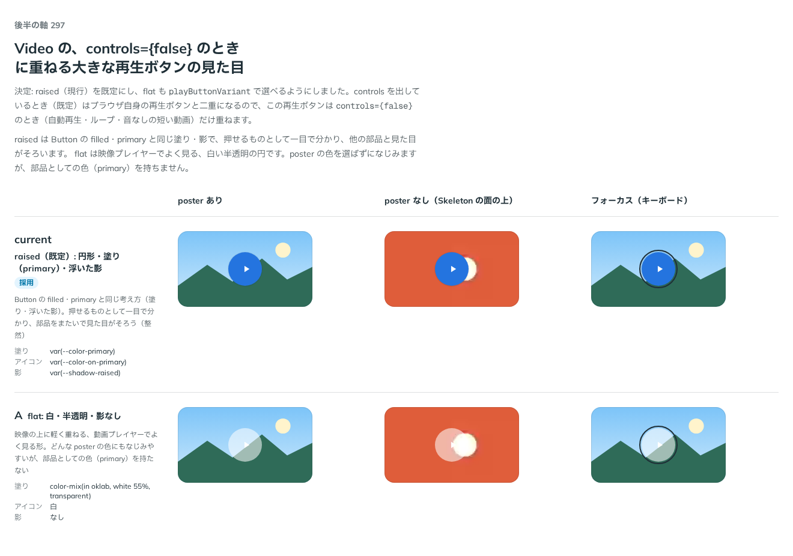

# 0295. Video の再生ボタンは、raised（円形・primary の塗り）を既定にする

- ステータス: Accepted
- 日付: 2026-09-23
- ラウンド: 後半 軸 297

## 背景

Video の、`controls={false}` のときに重ねる大きな再生ボタンの見た目を決めました。`controls` を出しているとき（既定）はブラウザ自身の再生ボタンと二重になるので、この再生ボタンは `controls={false}` のとき（自動再生・ループ・音なしの短い動画）だけ重ねます。

## 候補

比較は、決めた時点のコミット `d58855f` の比較のストーリー（`design/stories/axis-297-video-play-button.stories.tsx`）です。列は poster あり・poster なし（Skeleton の面の上）・フォーカス（キーボード）です。

| 案                                   | 内容                                                     |
| ------------------------------------ | -------------------------------------------------------- |
| raised（既定）: 円形・塗り・浮いた影 | Button の filled・primary と同じ考え方（塗り・浮いた影） |
| A（flat）: 白・半透明・影なし        | 映像の上に軽く重ねる、動画プレイヤーでよく見る形         |

## 決定

**raised（現行）を既定にし、A（flat）も `playButtonVariant` で選べるようにします。**

## 理由

ユーザーの返事の原文です。

> 297: デフォルト現行、Aも選べるようにしたいです。

raised は Button の filled・primary と同じ塗り・影で、押せるものとして一目で分かり、他の部品と見た目がそろいます。flat は映像プレイヤーでよく見る、白い半透明の円です。poster の色を選ばずになじみますが、部品としての色（primary）を持たないため、既定にはせず選べる形にしました。ImageZoom の閉じるボタンの `closeButtonVariant`（[ADR-0275](./0275-image-zoom-close.md)）と同じ作りで、部品の tv の variants で上書きします。

## 影響

- `src/components/video/Video.tsx`: `playButtonVariant`（`'raised' | 'flat'`、既定 `'raised'`）を公開しました
- `design/tokens.css`: `--video-play-size`・`--video-play-fill`・`--video-play-fg`・`--video-play-shadow`・`--video-play-icon-size`・`--video-play-hover-scale` を追加しました
- 比較のストーリー `design/stories/axis-297-video-play-button.stories.tsx` は消しました

## 原則への反映

反映なし。原則1（影はレイヤーの離れを表す）・原則7（塗りか枠線か）の範囲内です。

## 比較画像

決めた時点のコミットは `d58855f` です。`git checkout d58855f && pnpm storybook` で、比較のストーリー（`Design Review/297 Video の再生ボタン`）を決めたときの部品のまま開けます。
