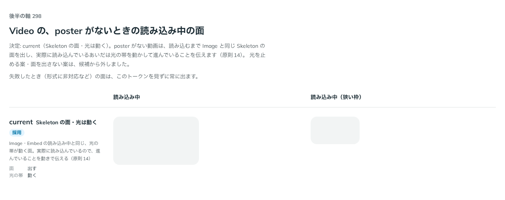

# 0296. Video の読み込み中の面は、光が動く Skeleton にする

- ステータス: Accepted
- 日付: 2026-09-23
- ラウンド: 後半 軸 298

## 背景

Video の、poster がないときの読み込み中の面（Skeleton と同じ塗り）の扱いを決めました。src を渡さず、ずっと読み込み中のままにして見た目を確かめています（poster があるときは、この面自体を出しません）。失敗したときの面（アイコン・文）はこの決定の対象外で、常に出します。

## 候補

この軸に入る前に、A（光を止める）・B（面を出さない）も検討していましたが、原則14（動きは手応えと待ちを伝える）に反するため、比較のストーリーに残す前に候補から外しています。比較は、決めた時点のコミット `d58855f` の比較のストーリー（`design/stories/axis-298-video-loading-face.stories.tsx`）です。列は読み込み中・読み込み中（狭い枠）です。

| 案                                    | 内容                                            |
| ------------------------------------- | ----------------------------------------------- |
| Skeleton の面・光は動く（既定・唯一） | Image・Embed の読み込み中と同じ、光の帯が動く面 |

## 決定

**読み込み中は、Image・Embed と同じ Skeleton の面を出し、光の帯を動かします。**

## 理由

ユーザーの返事の原文です。

> 298: 読み込み中なら動くスケルトンにする、という原則の通りでお願いします。

実際に読み込んでいるあいだは、進んでいることを動きで伝える（原則14）ので、光の帯を止めません。A（光を止める）は、待っていることが伝わらなくなるため、B（面を出さない）は、読み込めていないことが分からなくなるため、どちらも比較のストーリーに残す前に候補から外しました。

## 却下した案と理由

- **A（光を止める）**: 選ばれませんでした。実際に読み込んでいるのに、進んでいることが伝わりません（原則14）
- **B（面を出さない）**: 選ばれませんでした。読み込めていないことが分かりません

## 影響

- `src/components/video/Video.tsx`: poster がないときの読み込み中は Skeleton の面（`skeletonSurface`・`skeletonMotion.sweep`）を出します
- `design/tokens.css`: `--video-loading-opacity: 1`・`--video-loading-motion-play-state: running` を追加しました
- 比較のストーリー `design/stories/axis-298-video-loading-face.stories.tsx` は消しました

## 原則への反映

反映なし。原則14（動きは手応えと待ちを伝える）の「読み込み中の場所取りは、面を横切るやわらかく淡い光で、読み込んでいることを伝えます」の範囲内です。

## 比較画像

決めた時点のコミットは `d58855f` です。`git checkout d58855f && pnpm storybook` で、比較のストーリー（`Design Review/298 Video の読み込み中の面`）を決めたときの部品のまま開けます。
