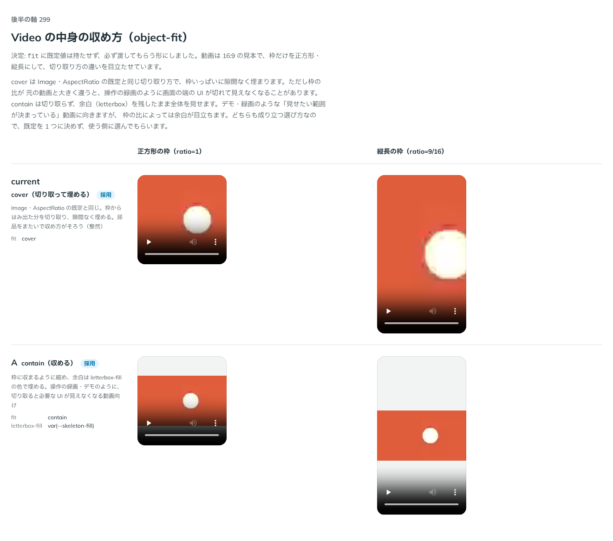

# 0297. Video の収め方（fit）は、既定値を持たせず必須にする

- ステータス: Accepted
- 日付: 2026-09-23
- ラウンド: 後半 軸 299

## 背景

Video の中身の収め方（`object-fit`）を決めました。動画は 16:9 の見本を、枠の比を正方形・縦長に変えて、切り取り方の違いを目立たせて比べています。

## 候補

比較は、決めた時点のコミット `d58855f` の比較のストーリー（`design/stories/axis-299-video-fit.stories.tsx`）です。列は正方形の枠（`ratio=1`）・縦長の枠（`ratio=9/16`）です。

| 案                        | 内容                                                                                   |
| ------------------------- | -------------------------------------------------------------------------------------- |
| cover（切り取って埋める） | Image・AspectRatio の既定と同じ。枠からはみ出た分を切り取り、隙間なく埋める            |
| A（contain・収める）      | 枠に収まるように縮め、余白は `letterbox-fill` の色で埋める。操作の録画のような動画向け |

## 決定

**`fit` に既定値は持たせず、必ず渡してもらう形にします（`'cover' | 'contain'`。渡さないと型エラー）。**

## 理由

ユーザーの返事の原文です。

> 299: デフォルトはなしで、いずれかを指定してもらう、としたいです。
> 追加の答え — 299: fit を必須にする

cover は Image・AspectRatio の既定と同じ切り取り方で、枠いっぱいに隙間なく埋まります。ただし枠の比が元の動画と大きく違うと、操作の録画のように画面の端の UI が切れて見えなくなることがあります。contain は切り取らず、余白（letterbox）を残したまま全体を見せます。デモ・録画のような「見せたい範囲が決まっている」動画に向きますが、枠の比によっては余白が目立ちます。どちらも成り立つ選び方なので、既定を 1 つに決めず、使う側に選んでもらう形にしました。

## 影響

- `src/components/video/Video.tsx`: `fit`（`'cover' | 'contain'`、必須。既定なし）を公開しました
- `design/tokens.css`: `--video-letterbox-fill: var(--skeleton-fill)`（contain の余白の色）を追加しました。`--video-fit` は削除しました
- 比較のストーリー `design/stories/axis-299-video-fit.stories.tsx` は消しました

## 原則への反映

反映なし。原則20（部品は知らないことを決めない）の「知らないことは決めず、使う側に渡します」の範囲内です。cover・contain のどちらも成り立つ場面があり、1 つの既定を決められないケースにあたります。

## 比較画像

決めた時点のコミットは `d58855f` です。`git checkout d58855f && pnpm storybook` で、比較のストーリー（`Design Review/299 Video の収め方`）を決めたときの部品のまま開けます。
