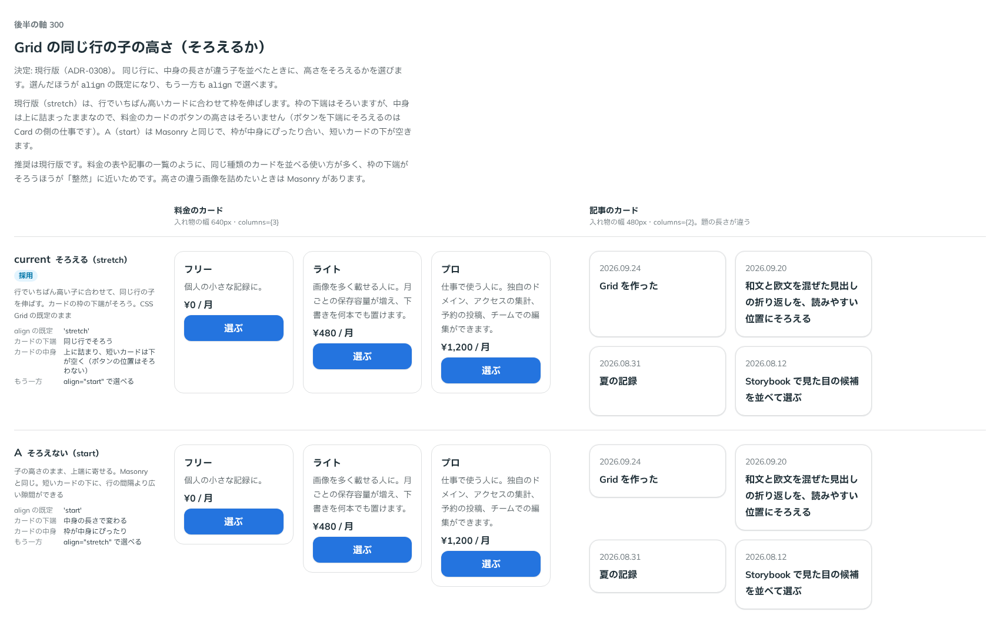

# 0308. Grid の同じ行の子は、高さをそろえる（align の既定は stretch）

- ステータス: Accepted
- 日付: 2026-09-24
- ラウンド: 後半 軸 300

## 背景

Grid で、中身の長さが違う子を同じ行に並べたとき、高さをそろえるかを決めました。料金のカードや記事の一覧のように、同じ種類のカードを並べる使い方が多いためです。どちらを既定にしても、もう一方は `align` で選べます。

## 候補

比較は、決めた時点のコミット `4cede12` の比較のストーリー（`design/stories/axis-300-grid-align.stories.tsx`）です。料金のカード（幅 640px・3 列）と記事のカード（幅 480px・2 列。題の長さが違う）を並べています。

| 案                    | 内容                                                                                         |
| --------------------- | -------------------------------------------------------------------------------------------- |
| stretch（現行・既定） | 行でいちばん高い子に合わせて伸ばす。カードの枠の下端がそろう。CSS Grid の既定のまま          |
| A（start）            | 子の高さのまま、上端に寄せる。Masonry と同じ。短いカードの下に、行の間隔より広い隙間ができる |

## 決定

**`align` の既定は `stretch` です。`start`・`center`・`end` も選べます。**

## 理由

ユーザーの返事の原文です。

> 300: 既定は現行版でお願いします。

同じ種類のカードを並べる使い方が多く、枠の下端がそろうほうが整って見えます。`stretch` にしても、カードの中身は上に詰まったままなので、ボタンの位置まではそろいません（そろえるなら Card の側の仕事で、backlog に残しています）。高さの違う画像を隙間なく詰めたいときは Masonry があります。

## 影響

- `src/components/grid/Grid.tsx`: `align`（`'start' | 'center' | 'end' | 'stretch'`、既定 `'stretch'`）を公開しました
- 比較のストーリー `design/stories/axis-300-grid-align.stories.tsx` は消しました

## 原則への反映

反映なし。

## 比較画像

決めた時点のコミットは `4cede12` です。`git checkout 4cede12 && pnpm storybook` で、比較のストーリー（`Design Review/300 Grid の子の高さ`）を決めたときの部品のまま開けます。
