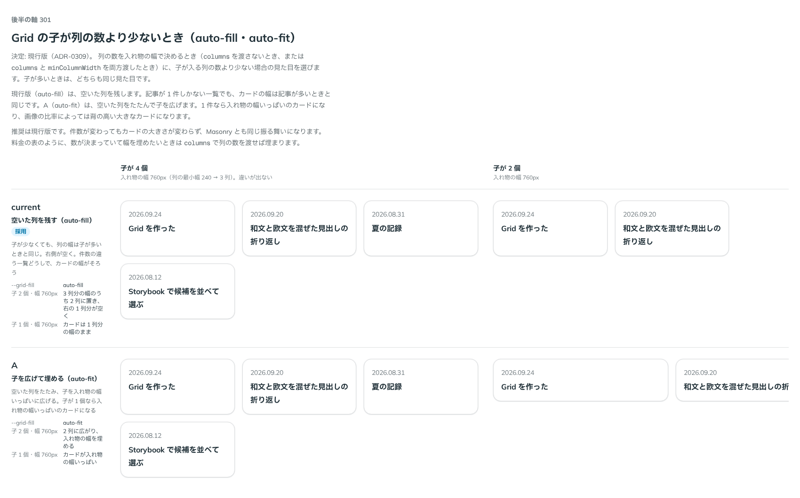

# 0309. Grid は、子が少ないとき空いた列を残す（auto-fill）

- ステータス: Accepted
- 日付: 2026-09-24
- ラウンド: 後半 軸 301

## 背景

Grid の列の数を入れ物の幅で決めるとき（`columns` を渡さないとき、または `columns` と `minColumnWidth` を両方渡したとき）に、子が入る列の数より少ない場合の見た目を決めました。子が多いときは、どちらも同じ見た目です。

## 候補

比較は、決めた時点のコミット `4cede12` の比較のストーリー（`design/stories/axis-301-grid-fill.stories.tsx`）です。入れ物の幅 760px で、子が 4 個・2 個・1 個の場合を並べています。

| 案                | 内容                                                                                     |
| ----------------- | ---------------------------------------------------------------------------------------- |
| auto-fill（現行） | 空いた列を残し、子の幅を列の幅のままにする。件数が変わっても、カードの大きさは変わらない |
| A（auto-fit）     | 空いた列をたたみ、子を広げて幅を埋める。1 件なら入れ物の幅いっぱいのカードになる         |

## 決定

**`auto-fill` です。空いた列を残し、子を伸ばしません。**

## 理由

ユーザーの返事の原文です。

> 301: 現行で。

記事が 1 件しかない一覧でも、カードの幅は記事が多いときと同じままです。Masonry も同じ振る舞いなので、並べる部品どうしで揃います。幅を埋めたいときは、`columns` を渡して列の数を固定します。

## 影響

- `src/components/grid/Grid.tsx`: 列の数を入れ物の幅で決めるときの式に `auto-fill` を直に書きました
- `design/tokens.css`: 比べるために足していた `--grid-fill` を消しました
- 比較のストーリー `design/stories/axis-301-grid-fill.stories.tsx` は消しました

## 原則への反映

反映なし。

## 比較画像

決めた時点のコミットは `4cede12` です。`git checkout 4cede12 && pnpm storybook` で、比較のストーリー（`Design Review/301 Grid の子が少ないとき`）を決めたときの部品のまま開けます。
