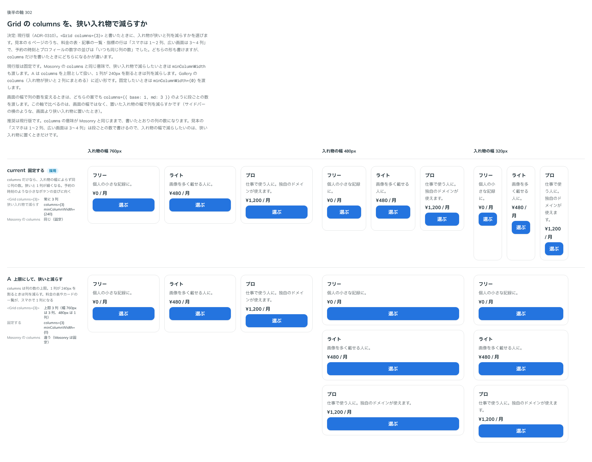

# 0310. Grid の columns だけを渡したら、列の数を固定する

- ステータス: Accepted
- 日付: 2026-09-24
- ラウンド: 後半 軸 302

## 背景

`<Grid columns={3}>` と書いたときに、入れ物が狭いと列を減らすかを決めました。見本の 6 ページのうち、料金の表・記事の一覧・指標の行は「スマホは 1〜2 列、広い画面は 3〜4 列」で、予約の時刻とプロフィールの数字の並びは「いつも同じ列の数」でした。どちらの形も書けますが、`columns` だけを書いたときにどちらになるかが違います。

## 候補

比較は、決めた時点のコミット `4cede12` の比較のストーリー（`design/stories/axis-302-grid-columns.stories.tsx`）です。入れ物の幅 760px・480px・320px に、3 枚の料金のカードを `columns={3}` で置いています。

| 案                    | 内容                                                                                                                         |
| --------------------- | ---------------------------------------------------------------------------------------------------------------------------- |
| 固定（現行）          | `columns` だけなら、入れ物の幅によらず同じ列の数。Masonry の `columns` と同じ意味。減らすときは `minColumnWidth` も渡す      |
| A（上限にして減らす） | `columns` を上限にして、1 列が 240px を割るときは列を減らす。Gallery の `columns` に近い。固定は `minColumnWidth={0}` で書く |

## 決定

**`columns` だけを渡したら、列の数を固定します（Masonry と同じ）。狭い入れ物で減らしたいときは `minColumnWidth` も渡します。両方渡したときは `columns` が上限です。**

## 理由

ユーザーの返事の原文です。

> 302: 現行で。

書いたとおりの列の数になるので、`columns` の意味が Masonry と同じままです。画面の幅で列の数を変えたいときは、段ごとの数を渡します（[ADR-0311](./0311-grid-columns-breakpoints.md)）。入れ物の幅で減らしたいのは、サイドバーの横のように、画面より狭い入れ物に置くときだけです。

## 影響

- `src/components/grid/Grid.tsx`: `columns` だけなら固定、`minColumnWidth` だけなら入れ物の幅で決める、両方なら `columns` を上限にして減らす、の 3 通りを公開しました
- 比較のストーリー `design/stories/axis-302-grid-columns.stories.tsx` は消しました

## 原則への反映

反映なし。

## 比較画像

決めた時点のコミットは `4cede12` です。`git checkout 4cede12 && pnpm storybook` で、比較のストーリー（`Design Review/302 Grid の columns を狭い入れ物で減らすか`）を決めたときの部品のまま開けます。
