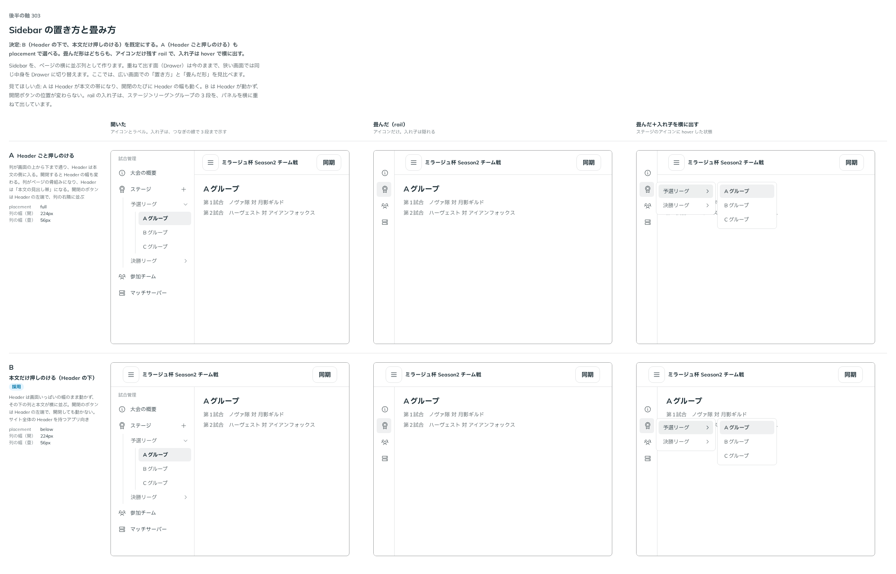

# 0313. Sidebar は、Header の下で本文だけを押しのける。畳むとアイコンだけ残す

- ステータス: Accepted
- 日付: 2026-09-24
- ラウンド: 後半 軸 303

## 背景

Sidebar は、ページの横に並ぶ列の部品として作ります（重ねて出す面の Drawer とは別物です）。想定した使い方は、ゲームの大会の試合管理画面です。ステージ＞リーグ＞グループの 3 段の入れ子があり、ハンバーガーで開閉します。列を Header との関係でどこに置くか、畳んだときに何を残すかを決めました。

## 候補

比較は、決めた時点のコミット `fceaea2` の比較のストーリー（`design/stories/axis-303-sidebar-placement.stories.tsx`）です。開いた状態・畳んだ状態（rail）・畳んだ列で入れ子を横に出した状態を並べています。

| 案        | 内容                                                  |
| --------- | ----------------------------------------------------- |
| A         | Header ごと押しのける。列が画面の上端から下端まで通る |
| B（既定） | Header は動かず、その下で本文だけ押しのける           |

## 決定

**`placement` の既定は `below`（B。Header の下で本文だけ押しのける）です。`full`（A。Header ごと押しのける）も選べます。畳むと、アイコンだけ残す rail になります（幅は部品のトークン。値は tokens.css）。rail の入れ子（ステージ＞リーグ＞グループ）は、hover で横にパネルを重ねて出します。パネルには、親の行の名前を見出し（グループ名）として出します。**

## 理由

ユーザーの返事の原文です。

> Header を押しのけるパターンと、Content のみを押しのける（Header の下に出てくる）パターンは両方欲しいかもですね。
> アイコンだけ残す実装パターンはめっちゃやりたいですね。
> 既定は B にしたいかもですね。
> rail の入れ子は hover の想定で OK です。
> ステージ＞リーグ＞Aグループ のようなイメージです

Header が動かないほうが、ページ全体の枠が安定します。Header ごと押しのける形は、管理画面のように列が主役のページに合うので選べるようにします。畳んだときに何も残さないと、開くまで行き先が分からなくなります。アイコンだけ残せば、畳んでも行き先を選べます。rail では入れ子を並べる幅がないので、横にパネルを重ねて出します。

## 影響

- `src/components/sidebar/`: `SidebarLayout` の `placement`（`'below' | 'full'`、既定 `'below'`）を公開します
- 幅は部品のトークン（`--sidebar-width`・`--sidebar-rail-width`）で持ちます。値は tokens.css にあり、実装のあとで余白と一緒に広げました（[ADR-0319](./0319-sidebar-padding-scroll.md)）
- 比較のストーリー `design/stories/axis-303-sidebar-placement.stories.tsx` は消しました

## 原則への反映

反映なし。

## 比較画像

決めた時点のコミットは `fceaea2` です。`git checkout fceaea2 && pnpm storybook` で、比較のストーリー（`Design Review/303 Sidebar の置き方と畳み方`）を決めたときの部品のまま開けます。
