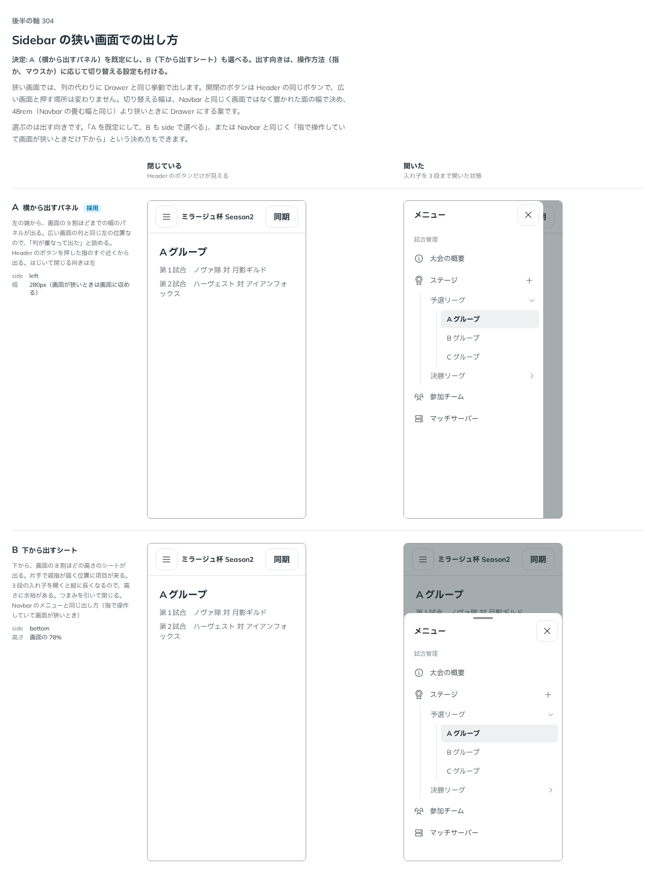

# 0314. Sidebar は、狭い画面では Drawer と同じ挙動に切り替わる

- ステータス: Accepted
- 日付: 2026-09-24
- ラウンド: 後半 軸 304

## 背景

ページの横に並ぶ列は、狭い画面では本文の幅を奪います。狭い画面での出し方を決めました。

## 候補

比較は、決めた時点のコミット `fceaea2` の比較のストーリー（`design/stories/axis-304-sidebar-narrow.stories.tsx`）です。閉じている状態と、入れ子を 3 段まで開いた状態を並べています。

| 案        | 内容                         |
| --------- | ---------------------------- |
| A（既定） | 左から出すパネル（幅 280px） |
| B         | 下から出すシート             |

## 決定

****狭い画面では列をやめ、Drawer と完全に同じ挙動（後ろを暗くする・外を押す／Esc／はじくで閉じる）にします。既定は A（左から出すパネル、幅 280px）で、B（下から出すシート）も選べます。指かマウスかという操作方法に応じて向きを切り替える設定も付けます（Navbar の `menuSide="auto"` と同じ考えです）。切り替える幅は、Navbar と同じく画面ではなく置かれた面の幅（48rem 未満）です。****

## 理由

ユーザーの返事の原文です。

> スマホの場合は完全に Drawer と同じ挙動になる、とかが必要そうですね。
> 304: Aデフォルト、Bも選べるようにしたいですね。操作方法別の設定も付けれると良さそうです。

狭い画面の列は、重ねて出す面と同じ役目になるので、閉じ方も含めて Drawer とそろえます。使う人が 2 通りの閉じ方を覚えずに済みます。切り替えを画面ではなく置かれた面の幅で決めるのは、Navbar と同じ考えです（原則 16）。

## 影響

- `src/components/sidebar/`: 狭い面では Drawer と同じ挙動で出します。向き（左のパネル・下のシート・操作方法で切り替え）を選べます。props の名前は実装で決めます
- 比較のストーリー `design/stories/axis-304-sidebar-narrow.stories.tsx` は消しました

## 原則への反映

原則 16 の「入れ物の幅で決まること」に、列も置かれた面が狭いと重なる面と同じ挙動に切り替わることを書き足しました。

## 比較画像

決めた時点のコミットは `fceaea2` です。`git checkout fceaea2 && pnpm storybook` で、比較のストーリー（`Design Review/304 Sidebar の狭い画面`）を決めたときの部品のまま開けます。
