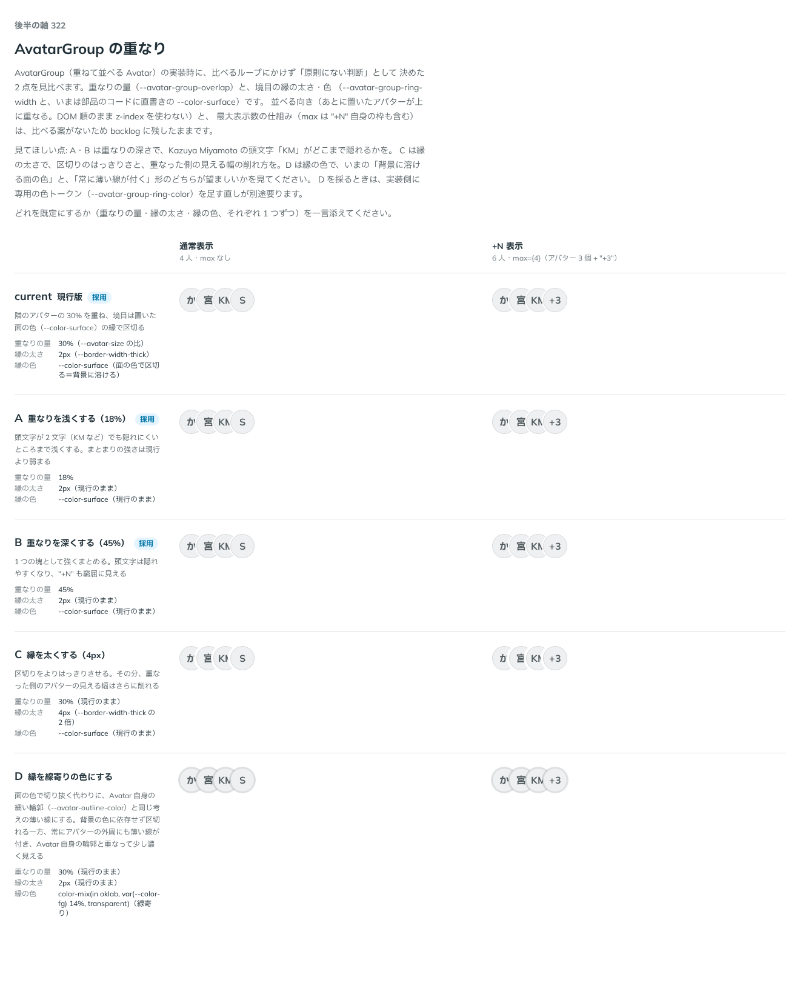

# 0315. AvatarGroup は重なりの量を overlap で選べるようにし、hover で隣を退ける機能を足す

- ステータス: Accepted
- 日付: 2026-09-28
- ラウンド: 後半 軸 315

## 背景

AvatarGroup（Avatar を重ねて並べる部品）を作ったとき、重なりの量と縁の処理は、比べるループにかけず「原則にない判断」として決めていました（現行 30%、縁は置いた面の色 `--color-surface` の box-shadow）。この軸で、重なりの量・縁の太さと色を見比べました。

## 候補

比較は、決めた時点のコミット `70dcc29` の比較のストーリー（`design/stories/axis-0315-avatar-group-overlap.stories.tsx`）です。列は通常表示（4 人・max なし）・+N 表示（6 人・max={4}）です。

| 案                    | 内容                                                                                                                    |
| --------------------- | ----------------------------------------------------------------------------------------------------------------------- |
| current（既定）       | 隣のアバターの 30% を重ね、境目は面の色（`--color-surface`）の縁で区切る                                                |
| A（重なりを浅く）     | 18%。頭文字が 2 文字でも隠れにくい                                                                                      |
| B（重なりを深く）     | 45%。1 つの塊として強くまとまるが、頭文字は隠れやすい                                                                   |
| C（縁を太く）         | 4px（`--border-width-thick` の 2 倍）。区切りははっきりするが、重なった側の見える幅が削れる                             |
| D（縁を線寄りの色に） | `color-mix(in oklab, var(--color-fg) 14%, transparent)`。背景色に依存せず区切れるが、常にアバターの外周にも薄い線が付く |

## 決定

**重なりの量は current（md・30%）を既定にし、A（sm・18%）・B（lg・45%）も `overlap` props で選べるようにします。縁の太さ・色（C・D）は採らず、現行のままにします。加えて、比較のループでは扱っていなかった機能として、マウスを載せたアバターの右側が次のアバターに隠れているとき、次のアバターを退けて見せる `expandOnHover`（既定オフ）を足します。**

## 理由

ユーザーの返事の原文です。

> 現行で、AとBも選べるようにするのと、カーソルを合わせたら幅を広げる、みたいなオプションが欲しいですね

重なりの量は、既定を変えずに `overlap`（`sm`・`md`・`lg`）で選べるようにしました。値の名前は `size` と同じ、Tag・Badge・Chip の大きさの語彙（sm・md・lg）に寄せています（props.md の「語彙にない名前が要るときはいちばん近い語に寄せる」）。縁の太さ・色は、C は重なった側の見える幅をさらに削り、D は常に薄い線が付いて Avatar 自身の細い輪郭と重なって見えるため、どちらも既定を崩すほどの利点がなく見送りました。

`expandOnHover` は、比較のループにはかけていない新しい要望です。重なりの深い `lg` や、頭文字が 2 文字の Avatar では、隣に隠れた部分が確かめづらいという声を受けて足しました。opt-in（既定オフ）にしたのは、AvatarGroup は押すものではなく、常に動くと原則1の「押せないものは浮かせない」落ち着きを乱すためです。仕組みは box-shadow の縁と同じく CSS だけで作り、hover したアバターの右側にある次のアバターの `margin-left` を打ち消して退けます（`[&:hover+[data-avatar-group-item]]:ml-0`、隣接セレクタなので JavaScript の状態を持ちません）。指では hover がないため、この効果は出ません（原則3・11）。Avatar の中身・alt・name はいっさい変えないので、読み上げには影響しません（ストーリーの play で確かめました）。

## 影響

- `src/components/avatar-group/AvatarGroup.tsx`:
  - `overlap`（`AvatarGroupOverlap` = `'sm' | 'md' | 'lg'`、既定 `'md'`）を追加しました。内部の重ねる真偽値は `pull` に改名しました
  - `expandOnHover`（真偽値、既定 `false`）を追加しました。子の Avatar に `data-avatar-group-item` を付け、CSS の隣接セレクタで次のアバターの `margin-left` を打ち消します
- `design/tokens.css`: `--avatar-group-overlap` を `--avatar-group-overlap-sm`・`-md`・`-lg` の 3 段に分けました。`--avatar-group-ring-width` は変更していません（C は採らず）。専用の縁の色トークンは、この案では足していません（D は採らず）
- `src/components/avatar-group/AvatarGroup.stories.tsx`: `overlap`・`expandOnHover` を Controls に足し、`重なりの量`・`hover で広げる`（どちらも `visual`）と、`hover の挙動`（play）のストーリーを足しました
- `design/backlog.md` の AvatarGroup の節を更新しました
- 比較のストーリー `design/stories/axis-0315-avatar-group-overlap.stories.tsx` は消しました

## 原則への反映

反映なし。重なりの量・縁の処理は原則1・6の範囲内の、部品固有の値です。`expandOnHover` は、押すものではない部品にマウスだけの補助的な見やすさの効果を足すもので、原則3（hover は手応え、押すと沈む）・17（押せる範囲は見た目の範囲）が扱う「押すもの」には当たりません。

## 比較画像

決めた時点のコミットは `70dcc29` です。`git checkout 70dcc29 && pnpm storybook` で、比較のストーリー（`Design Review/0315 AvatarGroupの重なり`）を決めたときの部品のまま開けます。
