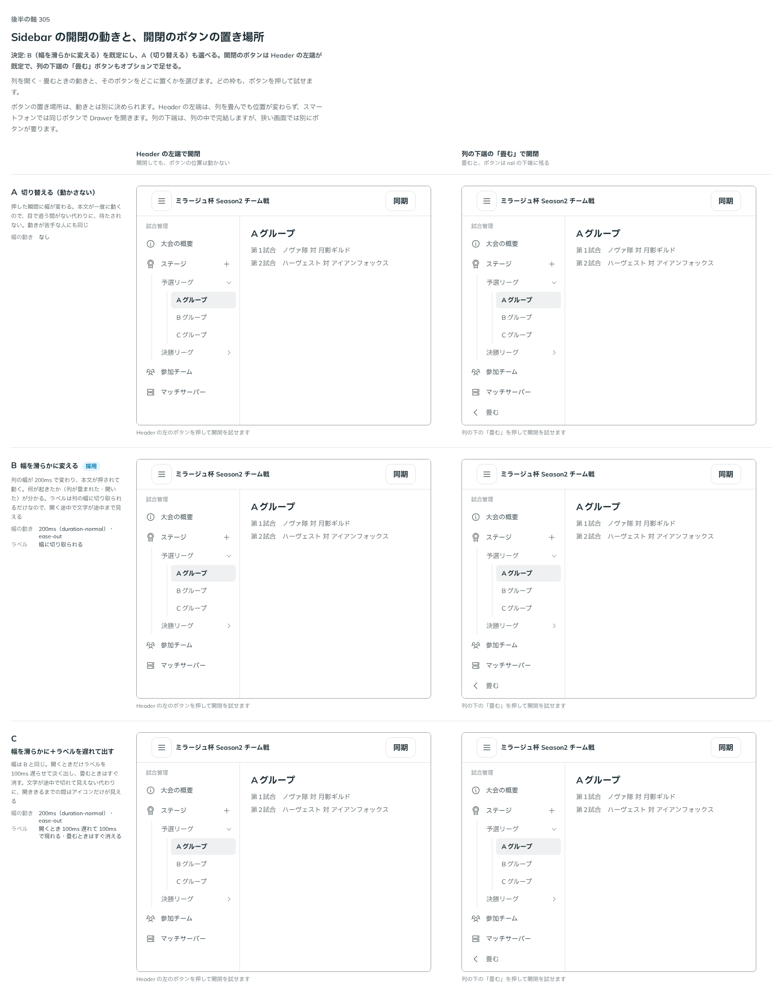

# 0315. Sidebar の開閉は、列の幅を滑らかに変える

- ステータス: Accepted
- 日付: 2026-09-24
- ラウンド: 後半 軸 305

## 背景

列を開閉するときの動きと、開閉のボタンを置く場所を決めました。

## 候補

比較は、決めた時点のコミット `fceaea2` の比較のストーリー（`design/stories/axis-305-sidebar-motion.stories.tsx`）です。Header の左端で開閉する場合と、列の下端の「畳む」で開閉する場合を並べています。

| 案        | 内容                                             |
| --------- | ------------------------------------------------ |
| A         | 動かさず切り替える                               |
| B（既定） | 列の幅を滑らかに変える                           |
| C         | 幅を滑らかに変え、ラベルを遅れて出す（採らない） |

## 決定

**既定は B（列の幅を 200ms〔`--duration-normal`〕で滑らかに変える）です。A（動かさず切り替える）も選べます。C（ラベルを遅れて出す）は採りません。動きを減らす設定のときは切り替えにします。開閉のボタンは Header の左端が既定です。列の下端の「畳む」ボタンも、オプションで付けられます。**

## 理由

ユーザーの返事の原文です。

> 305: Bデフォルト、Aも選べるようにしたいですね。画面下部のボタンもオプションで付けられると嬉しいです。

幅が動くと、開いたか畳んだかが目で追えます。動きを望まない人・場面のために、切り替えも選べます。C は、ラベルの出方が遅れて手応えを損ねるので採りません。

## 影響

- `src/components/sidebar/`: 動き（`SidebarLayout` の `motion`。`smooth` が既定・`none`）と、下端の「畳む」ボタン（`Sidebar` の `collapseButton`）を公開します。帯に置くボタンは `SidebarTrigger` です。動きを減らす設定のときは切り替えになります
- 比較のストーリー `design/stories/axis-305-sidebar-motion.stories.tsx` は消しました

## 原則への反映

反映なし。

## 比較画像

決めた時点のコミットは `fceaea2` です。`git checkout fceaea2 && pnpm storybook` で、比較のストーリー（`Design Review/305 Sidebar の開閉の動き`）を決めたときの部品のまま開けます。
