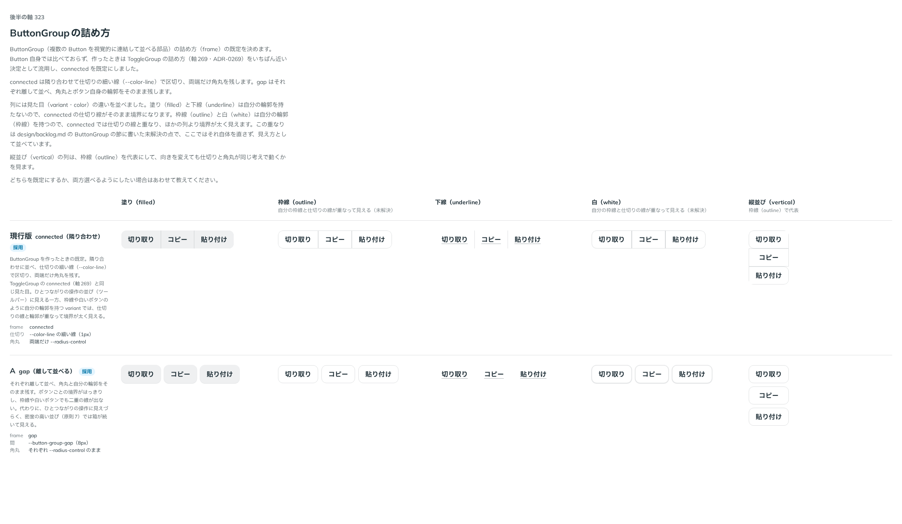

# 0316. ButtonGroup の詰め方は connected が既定（gap も選べる）

- ステータス: Accepted
- 日付: 2026-09-28
- ラウンド: 後半 軸 316

## 背景

ButtonGroup（複数の Button を視覚的に連結して並べる部品）を作ったとき、詰め方（`frame`）は ToggleGroup の詰め方（軸269・[ADR-0263](./0263-toggle-group-frame.md)）をいちばん近い決定として流用し、`connected` を既定にしていました。Button 自身では比べておらず、「原則にない判断」として design/backlog.md に残していたので、改めて比べました。

## 候補

比較は、決めた時点のコミット `f135fa7` の比較のストーリー（`design/stories/axis-0316-button-group-frame.stories.tsx`）です。列は 塗り（filled）・枠線（outline）・下線（underline）・白（white）・縦並び（vertical、outline で代表）。候補は ButtonGroup の `frame` props（`connected`・`gap`）をそのまま行ごとに変えました。

| 案                  | 内容                                                                                                            |
| ------------------- | --------------------------------------------------------------------------------------------------------------- |
| 現行版（connected） | 隣り合わせ、仕切りの細い線（`--color-line`）で区切り、両端だけ角丸を残す。ToggleGroup の connected と同じ仕組み |
| A（gap）            | それぞれ離して並べ、角丸とボタン自身の輪郭をそのまま残す                                                        |

## 決定

**現行版（connected）を既定のままにし、gap も `frame` で引き続き選べるようにします。** ButtonGroup を作ったときにすでにこの 2 値を `ButtonGroupFrame`（`'connected' | 'gap'`、既定 `'connected'`）として実装していたので、部品側の追加の実装はありません。

- 既定は `connected`（変更なし）
- `outline`・`white` のように自分の輪郭（枠線）を持つ variant を `connected` で並べると、仕切りの線とボタン自身の枠線が重なり、境界がほかの列より太く見えます。今回はこの見え方を比較で確かめただけで、抑制する直しはしていません。design/backlog.md に未解決のまま残しています

## 理由

ユーザーの返事の原文です。

> 現行で、Aも選べるようにしたいです

ToggleGroup の詰め方（ADR-0263）と同じ考えで、隣り合わせたほうが 1 つの操作として読み取りやすい一方、gap は ボタン 1 つずつの押せる範囲をはっきりさせたいときに選べます。

## 却下した案と理由

なし（2 案ともそのまま選べるようにしました）。

## 影響

- 実装の変更はありません。`ButtonGroupProps` の `frame`（`ButtonGroupFrame`、既定 `'connected'`）は、すでにこの決定を満たしています
- 比較のストーリー `design/stories/axis-0316-button-group-frame.stories.tsx` は消しました
- design/backlog.md の ButtonGroup の節から、詰め方の既定に関する記載を消しました。`outline`・`white` の境界が重なって見える点は、未解決のまま残しています

## 原則への反映

反映なし。`frame` は選択肢の囲み方で値は部品ごと、という [ADR-0257](./0257-frame.md) の範囲内です（ToggleGroup の [ADR-0263](./0263-toggle-group-frame.md) と同じ扱い）。

## 比較画像

決めた時点のコミットは `f135fa7` です。`git checkout f135fa7 && pnpm storybook` で、比較のストーリー（`Design Review/0316 ButtonGroupの詰め方`）を決めたときの部品のまま開けます。
