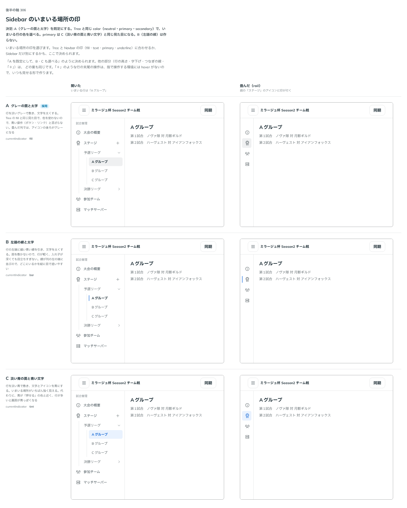

# 0316. Sidebar のいまいる場所は、淡いグレーの面と太字で示す

- ステータス: Accepted
- 日付: 2026-09-24
- ラウンド: 後半 軸 306

## 背景

列のなかで、いまいる行をどう示すかを決めました。

## 候補

比較は、決めた時点のコミット `fceaea2` の比較のストーリー（`design/stories/axis-306-sidebar-current.stories.tsx`）です。開いた列と、畳んだ列（rail）を並べています。

| 案        | 内容                                                   |
| --------- | ------------------------------------------------------ |
| A（既定） | 淡いグレーの面と太字                                   |
| B         | 左端の線と太字（作らない）                             |
| C         | 淡い青の面と青い文字（`color="primary"` と同じ見た目） |

## 決定

**既定は A（淡いグレーの面と太字）です。Tree と同じ `Sidebar` の `color`（`neutral` が既定・`primary`・`secondary`）で選べます。`primary` は C と同じ見た目になります。B は作りません。畳んだ列では入れ子が隠れるので、いまいる行を含む親のアイコンに同じ印を付けます。**

## 理由

ユーザーの返事の原文です。

> 306: 既定はグレーのルールに揃えます。color を設定できると良さそうです。

選んだ行の印は、Tree（[ADR-0163](./0163-tree-current.md)）などほかの部品と同じ規則にそろえます。色は役割で持つので、色を変えたいときは `color` で選びます。

### 原則にない判断

行の末尾の操作（「＋」など）は、はじめは、指の画面に hover がないのでいつも見せる仮定でした。実装を見てもらったあと、行の末尾に操作は置かず、入れ子の末尾の「作成」の行に置くことにしました（[ADR-0318](./0318-sidebar-create-item.md)）。

## 影響

- `src/components/sidebar/`: `Sidebar` の `color`（`'neutral' | 'primary' | 'secondary'`、既定 `'neutral'`）を公開します
- 比較のストーリー `design/stories/axis-306-sidebar-current.stories.tsx` は消しました

## 原則への反映

反映なし。

## 比較画像

決めた時点のコミットは `fceaea2` です。`git checkout fceaea2 && pnpm storybook` で、比較のストーリー（`Design Review/306 Sidebar のいまいる場所の印`）を決めたときの部品のまま開けます。
