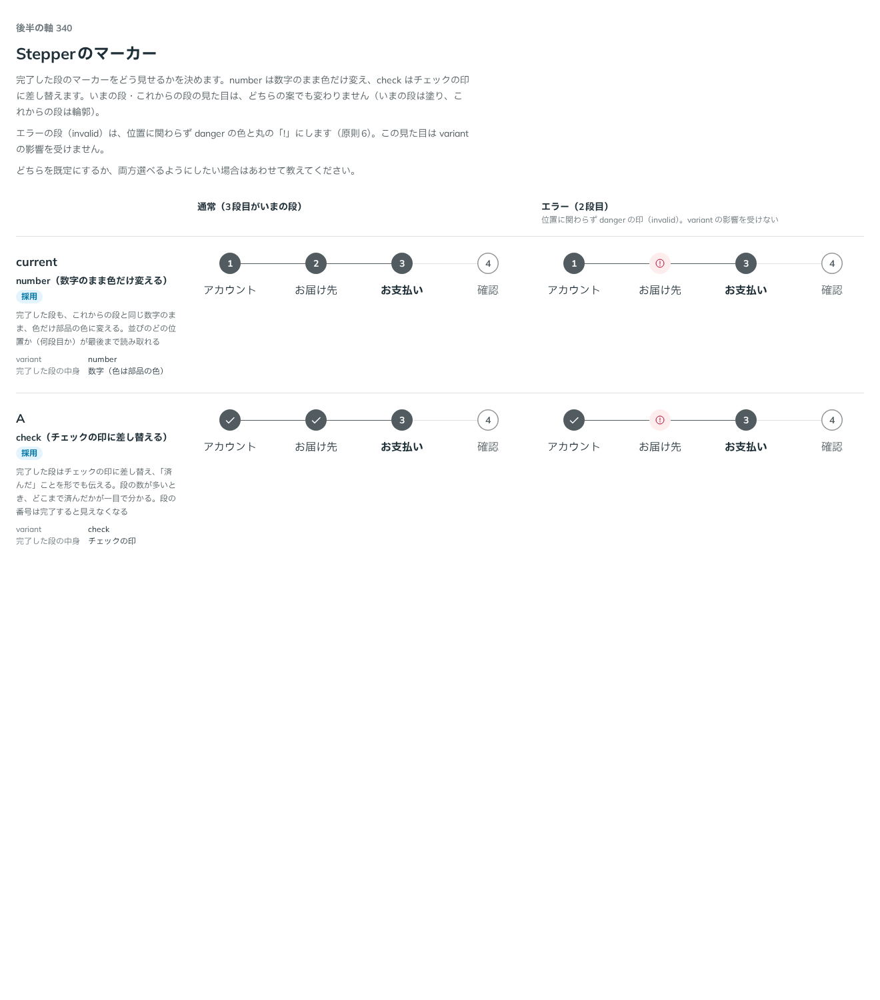

# 0318. Stepper の完了した段のマーカーは check（number も選べる）

- ステータス: Accepted
- 日付: 2026-09-28
- ラウンド: 後半 軸340

## 背景

Stepper（複数の段階の進み具合を示すナビゲーション）を作ったとき、完了した段のマーカーをどう見せるかを「原則にない判断」として `variant` props（`number`・`check`）に仮置きしました。既定は `number` にしていました。

## 候補

比較は Storybook の `Design Review/340 Stepperのマーカー` です。通常（3段目がいまの段）・エラー（2段目、`invalid`）の2列で比べました。

| 案     | 内容                                                                                                                                     |
| ------ | ---------------------------------------------------------------------------------------------------------------------------------------- |
| 現行版 | `variant="number"`。完了した段も、これからの段と同じ数字のまま、色だけ部品の色に変える。並びのどの位置か（何段目か）が最後まで読み取れる |
| A      | `variant="check"`。完了した段はチェックの印に差し替え、「済んだ」ことを形でも伝える。段の数が多いとき、どこまで済んだかが一目で分かる    |

いまの段・これからの段の見た目は、どちらの案でも変わりません（いまの段は塗り、これからの段は輪郭）。エラーの段（`invalid`）は、位置に関わらず danger の色と丸の「!」にし、`variant` の影響を受けません。

## 決定

**A（`check`）を既定にし、現行版（`number`）も選べるようにします。** `variant` で選びます。

## 理由

ユーザーの返事の原文です。

> 基本は A で、現行も選べると良さそうです。

完了した段をチェックの印に差し替えると、段の数が多いウィザードでも「どこまで済んだか」が一目で分かります。並びの位置（何段目か）を最後まで文字で読み取りたい場面もあるため、`number` も選べる形で残しました。

## 却下した案と理由

なし。現行版・A のどちらも選べる形にしました。

## 影響

- `src/components/stepper/Stepper.tsx`: `variant` の既定を `'number'` から `'check'` に変更しました（`Stepper` の引数の既定値と、`StepperProps.variant`・`StepperVariant` の JSDoc の `@default`）。型・実装そのものは変えていません
- `src/components/stepper/Stepper.stories.tsx`: Controls の既定値（`meta.args.variant`）を `'check'` に合わせました
- 比較のストーリー `design/stories/axis-340-stepper-marker-variant.stories.tsx` は消しました

## 原則への反映

反映なし。マーカーの色は原則6（選んでいることを示す印は部品の色）、その場で切り替わることは原則14（その場で現れる印はすぐ切り替える）の範囲内の決定です。

## 比較画像

比較のストーリーは決めた時点のコミット `6e31ddd` にあります。`git checkout 6e31ddd && pnpm storybook` で開けます。

