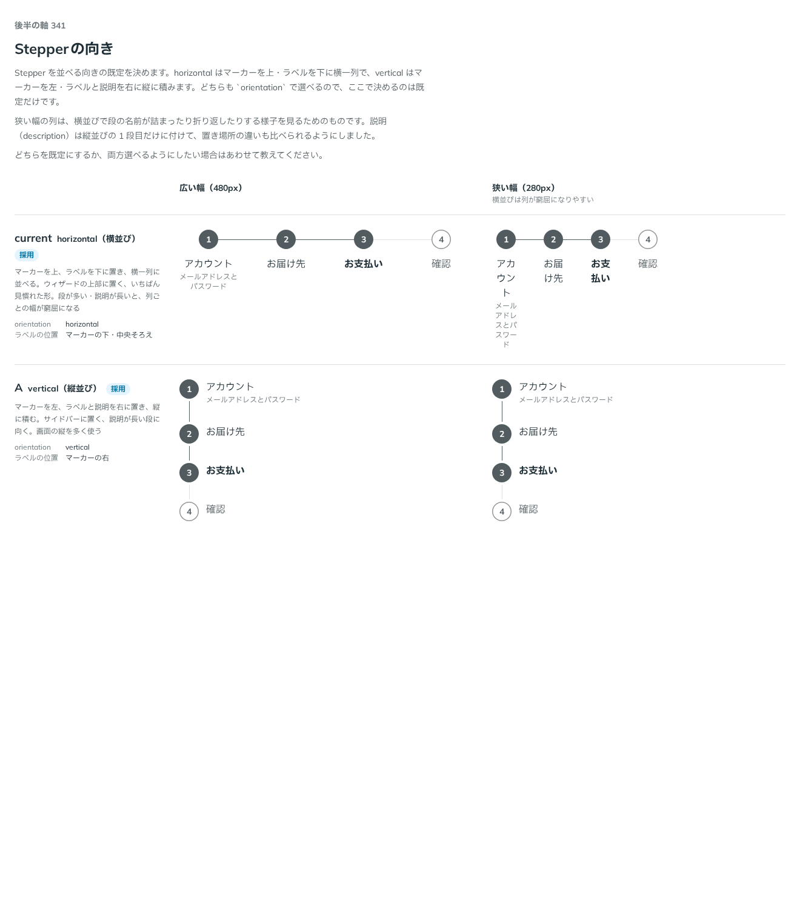

# 0319. Stepper を並べる向きは horizontal が既定（vertical も選べる）

- ステータス: Accepted
- 日付: 2026-09-28
- ラウンド: 後半 軸341

## 背景

Stepper を作ったとき、並べる向き（`orientation`）の既定を「原則にない判断」として `horizontal` に仮置きしました（`vertical` も props で選べる形でした）。

## 候補

比較は Storybook の `Design Review/341 Stepperの向き` です。広い幅（480px）・狭い幅（280px）の2列で比べました。

| 案     | 内容                                                                                                                                                                   |
| ------ | ---------------------------------------------------------------------------------------------------------------------------------------------------------------------- |
| 現行版 | `orientation="horizontal"`。マーカーを上、ラベルを下に置き、横一列に並べる。ウィザードの上部に置く、いちばん見慣れた形。段が多い・説明が長いと、列ごとの幅が窮屈になる |
| A      | `orientation="vertical"`。マーカーを左、ラベルと説明を右に置き、縦に積む。サイドバーに置く、説明が長い段に向く。画面の縦を多く使う                                     |

狭い幅の列は、横並びで段の名前が詰まったり折り返したりする様子を見るためのものです。説明（`description`）は縦並びの1段目だけに付けて、置き場所の違いも比べられるようにしました。

## 決定

**現行版（`horizontal`）を既定のまま、A（`vertical`）も選べる形を保ちます。** コードの変更はありません。

## 理由

ユーザーの返事の原文です。

> 基本は横、縦も選べる、で。

Stepper を作ったときに仮置きしていた形（`horizontal` が既定、`vertical` も `orientation` で選べる）が、そのまま決定になりました。

## 却下した案と理由

なし。現行版・A のどちらも選べる形のままです。

## 影響

- コードの変更はありません。`src/components/stepper/Stepper.tsx` の `orientation` は、すでに `horizontal` が既定で `vertical` も選べる形でした
- 比較のストーリー `design/stories/axis-341-stepper-orientation.stories.tsx` は消しました

## 原則への反映

反映なし。原則にない判断として仮に置いていた既定を、そのまま決定として記録しただけです。

## 比較画像

比較のストーリーは決めた時点のコミット `6e31ddd` にあります。`git checkout 6e31ddd && pnpm storybook` で開けます。

