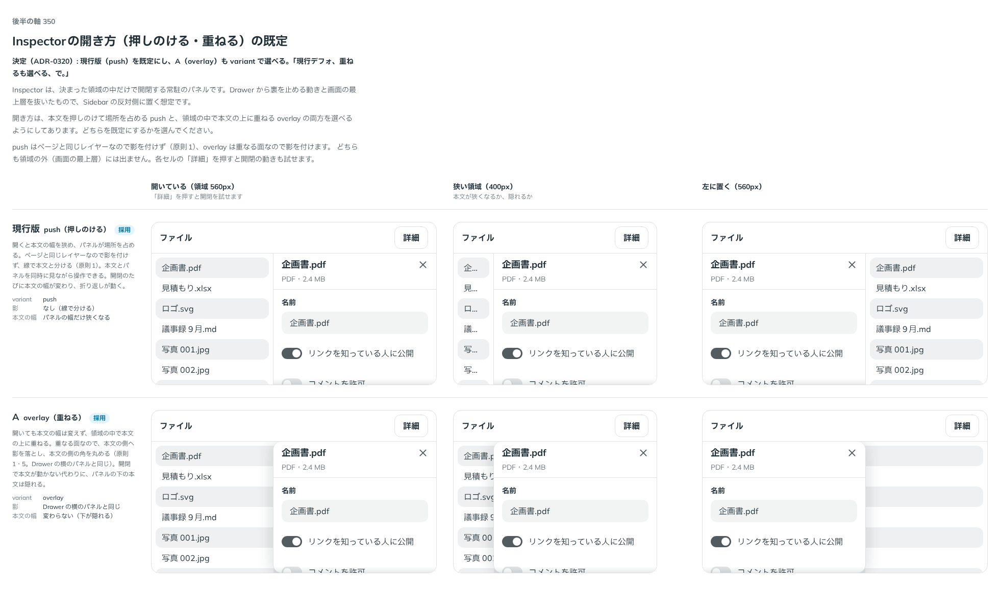

# 0320. Inspector は本文を押しのけて開くのが既定（重ねるも選べる）

- ステータス: Accepted
- 日付: 2026-09-28
- ラウンド: 後半 軸 350

## 背景

Inspector（決まった領域の中だけで開閉する常駐のパネル）を作ったとき、原則から決まらない見た目と振る舞いを 軸 350〜355 の比較のストーリーに並べました。Inspector は Drawer から裏を止める動きと画面の最上層を抜いたもので、Sidebar の反対側に置く想定です。土台は Base UI ではなく、状態を自前で持ち、開閉は CSS の移り変わりで動かします（Base UI の Dialog・Drawer は描く場所を外へ出すことと、外を押したら閉じることが前提で、領域に常駐するパネルに合わないため）。

開いたときに、周りの本文を押しのけて場所を占めるか（push）、領域の中で本文の上に重ねるか（overlay）を比べました。両方を `variant` で選べる形で作り、既定だけを決めます。

## 候補

比較は、決めた時点のコミット `7001e3b` の比較のストーリー（`design/stories/axis-350-inspector-variant.stories.tsx`）です。列は「開いている（領域 560px）」「狭い領域（400px）」「左に置く」。候補は `variant` を行ごとに変えました（props の既定を比べる軸なので、トークンではなく props を変えています）。

| 案             | 内容                                                                                         |
| -------------- | -------------------------------------------------------------------------------------------- |
| 現行版（push） | 本文の幅を狭めてパネルが場所を占める。ページと同じレイヤーなので影を付けず、線で本文と分ける |
| A（overlay）   | 本文の幅は変えず、領域の中で本文の上に重ねる。重なる面なので本文の側へ影を落とす             |

## 決定

**`variant` の既定は `push` のままにし、`overlay` も選べるようにします。** 作ったときにすでにこの形で実装していたので、部品の変更はありません。

- `variant?: InspectorVariant`（`'push' | 'overlay'`、既定 `'push'`）
- どちらの形も `InspectorLayout` の中だけで開閉し、画面の最上層には出ません

## 理由

ユーザーの返事の原文です。

> 現行デフォ、重ねるも選べる、で。

常駐のパネルは、本文を見ながら詳細や設定を触る場面で使います。押しのける形なら本文が隠れず、パネルと本文を同時に操作できます。本文の幅を保ちたい画面（表や地図）では、重ねる形を選べます。

## 却下した案と理由

なし（2 案ともそのまま選べるようにしました）。

## 影響

- 実装の変更はありません
- props 名は、はじめ `presentation` としていましたが、ユーザーの判断で `variant`（部品ごとの見た目の型）に改めました（props.md の語彙）
- 比較のストーリー `design/stories/axis-350-inspector-variant.stories.tsx` は消しました（軸 350〜355 の枠 `design/stories/inspector-frame.tsx` も一緒に消しました）

## 原則への反映

原則1 の文を書き換えました。画面の一部の領域だけで開くパネルは、押しのけて並ぶときはページの一部なので影を付けず線で区切り、重ねるときは重なる面として影と輪郭を付ける、と書きました。

## 比較画像

決めた時点のコミットは `7001e3b` です。`git checkout 7001e3b && pnpm storybook` で、比較のストーリー（`Design Review/350 Inspectorの開き方`）を決めたときの部品のまま開けます。
