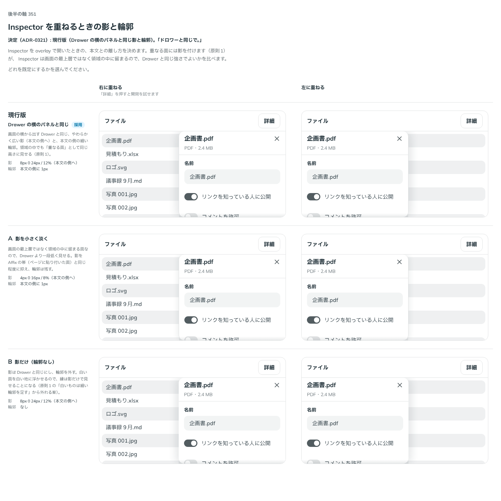

# 0321. Inspector を重ねるときの影と輪郭は Drawer の横のパネルと同じ

- ステータス: Accepted
- 日付: 2026-09-28
- ラウンド: 後半 軸 351

## 背景

Inspector（決まった領域の中だけで開閉する常駐のパネル）を作ったとき、原則から決まらない見た目と振る舞いを 軸 350〜355 の比較のストーリーに並べました。Inspector は Drawer から裏を止める動きと画面の最上層を抜いたもので、Sidebar の反対側に置く想定です。土台は Base UI ではなく、状態を自前で持ち、開閉は CSS の移り変わりで動かします（Base UI の Dialog・Drawer は描く場所を外へ出すことと、外を押したら閉じることが前提で、領域に常駐するパネルに合わないため）。

重ねる形（`variant="overlay"`）のとき、本文との離し方を比べました。Inspector は画面の最上層ではなく領域の中に留まるので、Drawer と同じ強さの影でよいかが分かれ目でした。

## 候補

比較は、決めた時点のコミット `7001e3b` の比較のストーリー（`design/stories/axis-351-inspector-overlay-shadow.stories.tsx`）です。列は「右に重ねる」「左に重ねる」。候補は `--inspector-overlay-shadow-*`・`--inspector-overlay-line-width` の上書きだけで作りました。

| 案                      | 内容                                                    |
| ----------------------- | ------------------------------------------------------- |
| 現行版（Drawer と同じ） | 影 8px 0 24px・12%（本文の側へ）、本文の側に 1px の輪郭 |
| A（影を小さく淡く）     | 影 4px 0 16px・8%、輪郭は残す。Affix の帯と同じ程度     |
| B（影だけ）             | 影は Drawer と同じ、輪郭なし                            |

## 決定

**影と輪郭は、画面の横から出す Drawer と同じにします。** 影は本文の側へ向け、本文の側に細い輪郭を引きます。作ったときの値のままなので、見た目の変更はありません。

- 影は `--inspector-overlay-shadow-left`・`-right`（`--shadow-sheet-left`・`-right` を指す）
- 輪郭は本文の側に `--border-width-thin`・`--color-surface-line`。比べるためだけに置いた `--inspector-overlay-line-width` は消し、部品に畳みました

## 理由

ユーザーの返事の原文です。

> ドロワーと同じで。

重なる面は、領域の中でも画面の横から出す面と同じ高さに見せます。高さを 3 段に保つため（原則1）、領域の中だけのために影の段を増やしません。

## 却下した案と理由

- **A（影を小さく淡く）**: 「ドロワーと同じで。」。領域の中だけのために、重なる面の影の段を 1 つ増やすことになります
- **B（影だけ・輪郭なし）**: 同上。白い面を白い地に浮かせるときは細い輪郭を足す（原則1）から外れます

## 影響

- 部品の見た目の変更はありません
- `design/tokens.css`: 比べるための `--inspector-overlay-line-width` を消しました
- 比較のストーリー `design/stories/axis-351-inspector-overlay-shadow.stories.tsx` は消しました（軸 350〜355 の枠 `design/stories/inspector-frame.tsx` も一緒に消しました）

## 原則への反映

原則1 の文を書き換えました（ADR-0320 と同じ箇条。重ねるときは画面の横から出す面と同じ影と輪郭）。

## 比較画像

決めた時点のコミットは `7001e3b` です。`git checkout 7001e3b && pnpm storybook` で、比較のストーリー（`Design Review/351 Inspectorの重なりの影`）を決めたときの部品のまま開けます。
