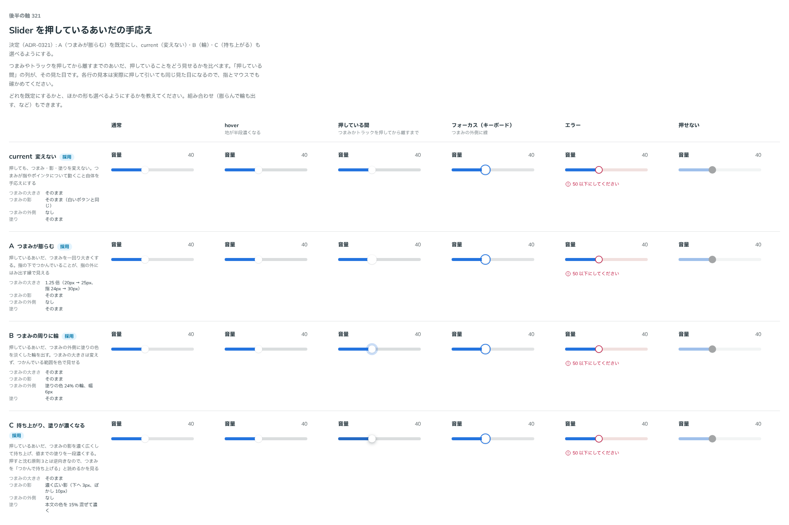

# 0321. Slider を押しているあいだは、つまみを膨らませる（ほかの手応えも選べる）

- ステータス: Accepted
- 日付: 2026-09-28
- ラウンド: 後半 軸 321

## 背景

Slider は、つまみかトラックを押してから離すまで、見た目を何も変えていませんでした。つまみそのものが指やポインタについて動くので、それを手応えとし、原則3の「動きが手応えになるものに沈みを重ねない」に沿って沈ませていませんでした。

軸 321 のはじめは、トラックの太さとつまみの塗りを比べました。これへの返事は「押している間の実感が薄いので、再度検討してください」でした。そこで比較に「押している間」の列を足し、候補を押しているあいだの見た目に絞って作り直しました。

## 候補

比較は、決めた時点のコミット `62bb87c` の比較のストーリー（`design/stories/axis-0321-slider-look.stories.tsx`）です。色は primary で、列は通常・hover・押している間・フォーカス（キーボード）・エラー・押せないです。

| 案                              | 押しているあいだ                                                                       |
| ------------------------------- | -------------------------------------------------------------------------------------- |
| 現行版（変えない）              | 何も変えない。つまみが動くこと自体を手応えにする                                       |
| A（つまみが膨らむ）             | つまみを 1.25 倍にする（20px → 25px、指で 24px → 30px）                                |
| B（つまみの周りに輪）           | つまみの外側に、塗りの色を 24% に淡くした幅 6px の輪を出す。大きさは変えない           |
| C（持ち上がり、塗りが濃くなる） | つまみの影を濃く広くして持ち上げ（下へ 3px・ぼかし 10px）、塗りに本文の色を 15% 混ぜる |

## 決定

**押しているあいだの手応えを `pressEffect` で選べるようにし、既定は `grow`（A: つまみが膨らむ）にします。** ほかに `halo`（B）・`lift`（C）・`none`（現行版）を選べます。

押しているあいだは、Base UI が押してから離すまで付ける `data-dragging` と、トラックの `:active` で見ます。押せないとき・読み取り専用・Form の送信中は変えません。動きは押す動きと同じ長さです。

`lift` はつまみを持ち上げるので、原則3の「押すと沈む」とは逆向きです。つかんで持ち上げる手応えとして、選べる形の 1 つに置きます。

## 理由

ユーザーの返事の原文です。

> 押している間の実感が薄いので、再度検討してください

> Aをデフォルト、他も選べるようにできますか

B は細かく値を合わせるときの見やすさで検討していましたが、細かく合わせる用途にはそもそもスライダーが向かない（NumberField を使う）という話になり、A を既定にしました。つまみが膨らむと、指で押したときも指の外にはみ出す縁でつかんでいることが見え、色や影の意味（原則1・6）を増やしません。

## 影響

- `src/components/slider/Slider.tsx`: `pressEffect`（`'grow' | 'halo' | 'lift' | 'none'`、既定は `'grow'`）と型 `SliderPressEffect` を足しました。比べるために置いた切り替えの変数は、部品の中の値（既定は変えない値、`pressEffect` が差し替える）に畳みました
- `design/tokens.css`: 値ごとのトークン `--slider-press-grow-scale`・`--slider-press-halo-width`・`--slider-press-halo-mix`・`--slider-press-lift-shadow`・`--slider-press-lift-darken` を置き、比較用の `--slider-thumb-press-*`・`--slider-fill-press-darken` を消しました
- `src/components/slider/Slider.stories.tsx`: 4 つの形を並べた「押しているあいだ」（visual）を足しました
- 比較のストーリー `design/stories/axis-0321-slider-look.stories.tsx` は消しました
- 名前の `pressEffect` は、props の語彙（`design/props.md`）にない語です。部位の振る舞いを選ぶ `indicatorMotion`・`captionMotion` に寄せ、押したときの効果を表す名前にしました

## 原則への反映

反映なし。原則3の「動きが手応えになるものに沈みを重ねない」は、既定の `grow` でも保たれます（沈ませず、膨らませる）。

## 比較画像

決めた時点のコミットは `62bb87c` です。`git checkout 62bb87c && pnpm storybook` で、比較のストーリー（`Design Review/0321 Sliderの見た目`）を決めたときの部品のまま開けます。
