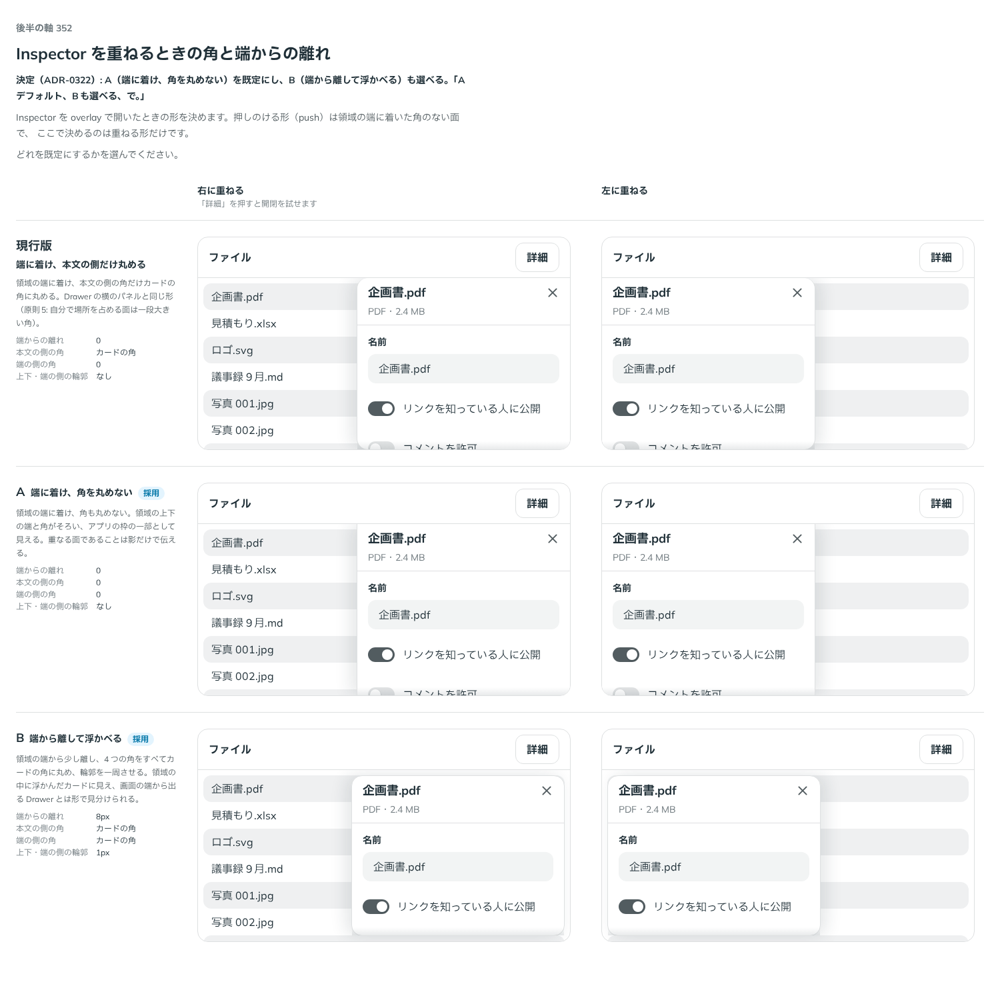

# 0322. Inspector を重ねるときは領域の端に着けて角を丸めない（端から離して浮かべるも選べる）

- ステータス: Accepted
- 日付: 2026-09-28
- ラウンド: 後半 軸 352

## 背景

Inspector（決まった領域の中だけで開閉する常駐のパネル）を作ったとき、原則から決まらない見た目と振る舞いを 軸 350〜355 の比較のストーリーに並べました。Inspector は Drawer から裏を止める動きと画面の最上層を抜いたもので、Sidebar の反対側に置く想定です。土台は Base UI ではなく、状態を自前で持ち、開閉は CSS の移り変わりで動かします（Base UI の Dialog・Drawer は描く場所を外へ出すことと、外を押したら閉じることが前提で、領域に常駐するパネルに合わないため）。

重ねる形のときの、角と領域の端からの離れを比べました。作ったときは Drawer の横のパネルと同じく、領域の端に着け、本文の側の角だけカードの角に丸めていました。

## 候補

比較は、決めた時点のコミット `7001e3b` の比較のストーリー（`design/stories/axis-352-inspector-overlay-shape.stories.tsx`）です。列は「右に重ねる」「左に重ねる」。候補は `--inspector-overlay-inset`・`--inspector-overlay-radius-inner`・`-outer`・`--inspector-overlay-edge-line-width` の上書きだけで作りました。

| 案                          | 内容                                              |
| --------------------------- | ------------------------------------------------- |
| 現行版                      | 端に着け、本文の側の角だけカードの角              |
| A（端に着け、角を丸めない） | 端に着け、角は 0。輪郭は本文の側だけ              |
| B（端から離して浮かべる）   | 端から 8px 離し、4 つの角をカードの角、輪郭を一周 |

## 決定

**A（端に着け、角を丸めない）を既定にし、B（端から離して浮かべる）も選べるようにします。** 新しい props `overlayEdge` で選びます。

- `overlayEdge?: InspectorOverlayEdge`（`'flush' | 'floating'`、既定 `'flush'`）。押しのける形（push）では使いません
- `flush`: 領域の端に着け、角は 0、輪郭は本文の側だけ（A）
- `floating`: 領域の端から `--inspector-floating-inset`（8px）離し、4 つの角を `--inspector-floating-radius`（カードの角）に丸め、輪郭を一周させる（B の値をそのまま昇格）
- 形の値は枠に内部の CSS 変数（`--inspector-inset`・`--inspector-radius`・`--inspector-edge-line`）として置き、パネルはその変数だけを読みます

## 理由

ユーザーの返事の原文です。

> Aデフォルト、Bも選べる、で。

領域の端に着けたパネルは、アプリの枠の一部として見えます。領域の上下の端と角がそろい、本文の側だけが丸いと、枠から浮いた半端な形に見えます。領域の中に浮かんだカードとして見せたい画面では、端から離して浮かべる形を選べます。

## 却下した案と理由

- **現行版（本文の側だけ丸める）**: 「Aデフォルト、Bも選べる、で。」。Drawer の横のパネルは画面の端から出るので本文の側を丸めますが、領域の中では枠の角とそろえるほうを採りました

## 影響

- `src/components/inspector/`: `overlayEdge` と型 `InspectorOverlayEdge` を足しました。重ねる形の既定の角を 0 にしました（見た目の基準画像を撮り直しました）
- `design/tokens.css`: 比べるための `--inspector-overlay-inset`・`--inspector-overlay-radius-inner`・`-outer`・`--inspector-overlay-edge-line-width` を消し、`--inspector-floating-inset`・`--inspector-floating-radius` を足しました
- `src/index.ts`: `InspectorOverlayEdge` を公開しました
- props 名 `overlayEdge` は props.md の語彙にない名前です。重ねる形のときだけ効く端の形なので、`overlay` を頭に付けました
- 比較のストーリー `design/stories/axis-352-inspector-overlay-shape.stories.tsx` は消しました（軸 350〜355 の枠 `design/stories/inspector-frame.tsx` も一緒に消しました）

## 原則への反映

原則5 の文を書き換えました。自分で場所を占める面の一覧に「領域の中に浮かべるパネル」を足し、領域の端に着けて開くパネルは枠の一部として自分では丸めない、と書きました。

## 比較画像

決めた時点のコミットは `7001e3b` です。`git checkout 7001e3b && pnpm storybook` で、比較のストーリー（`Design Review/352 Inspectorの重なりの形`）を決めたときの部品のまま開けます。
