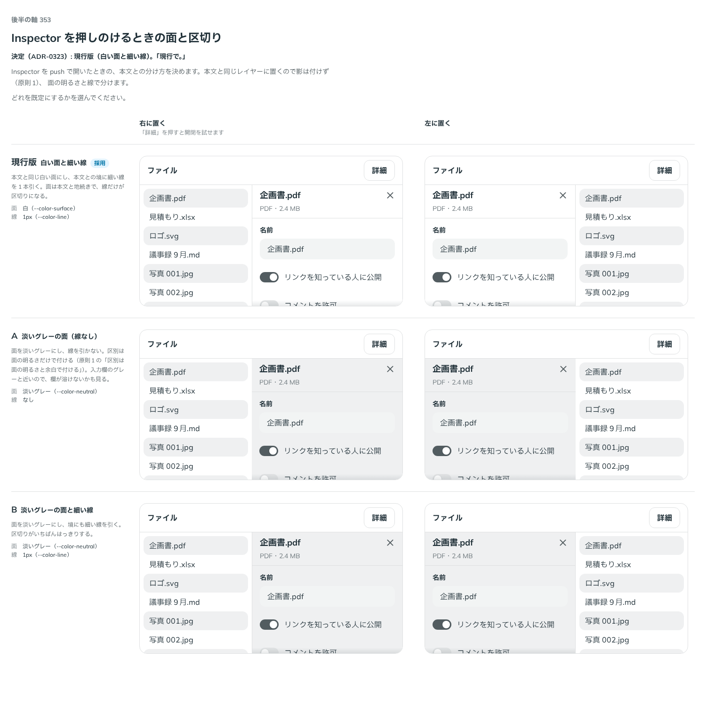

# 0323. Inspector を押しのけるときは白い面と細い線で本文と分ける

- ステータス: Accepted
- 日付: 2026-09-28
- ラウンド: 後半 軸 353

## 背景

Inspector（決まった領域の中だけで開閉する常駐のパネル）を作ったとき、原則から決まらない見た目と振る舞いを 軸 350〜355 の比較のストーリーに並べました。Inspector は Drawer から裏を止める動きと画面の最上層を抜いたもので、Sidebar の反対側に置く想定です。土台は Base UI ではなく、状態を自前で持ち、開閉は CSS の移り変わりで動かします（Base UI の Dialog・Drawer は描く場所を外へ出すことと、外を押したら閉じることが前提で、領域に常駐するパネルに合わないため）。

押しのける形（`variant="push"`）のとき、本文との分け方を比べました。本文と同じレイヤーなので影は付けず（原則1）、面の明るさと線のどちらで分けるかが分かれ目でした。

## 候補

比較は、決めた時点のコミット `7001e3b` の比較のストーリー（`design/stories/axis-353-inspector-push-surface.stories.tsx`）です。列は「右に置く」「左に置く」。候補は `--inspector-push-bg`・`--inspector-push-line`・`--inspector-push-line-width` の上書きだけで作りました。

| 案                          | 内容                                              |
| --------------------------- | ------------------------------------------------- |
| 現行版（白い面と細い線）    | 本文と同じ白い面、境に 1px の線（`--color-line`） |
| A（淡いグレーの面）         | 面を `--color-neutral`、線なし                    |
| B（淡いグレーの面と細い線） | 面を `--color-neutral`、境に 1px の線             |

## 決定

**本文と同じ白い面にし、境に細い線を 1 本引きます。** 作ったときの値のままなので、見た目の変更はありません。

- 面は `--color-surface`、線は `--border-width-thin`・`--color-line`。比べるためだけに置いた `--inspector-push-bg`・`--inspector-push-line`・`--inspector-push-line-width` は消し、部品に畳みました

## 理由

ユーザーの返事の原文です。

> 現行で。

押しのけて並ぶパネルは本文と地続きのページの一部です。面の色を変えずに線だけで区切ると、軽く見えます（判断の基準の「軽い」）。

## 却下した案と理由

- **A（淡いグレーの面）**: 「現行で。」。入力欄のグレーと近く、パネルの中の欄が面に溶けます
- **B（淡いグレーの面と細い線）**: 同上。区切りは強くなりますが、ページの一部としては重く見えます

## 影響

- 部品の見た目の変更はありません
- `design/tokens.css`: 比べるための `--inspector-push-*` を消しました
- 比較のストーリー `design/stories/axis-353-inspector-push-surface.stories.tsx` は消しました（軸 350〜355 の枠 `design/stories/inspector-frame.tsx` も一緒に消しました）

## 原則への反映

原則1 の文を書き換えました（ADR-0320 と同じ箇条。押しのけて並ぶときは影を付けず細い線で区切る）。

## 比較画像

決めた時点のコミットは `7001e3b` です。`git checkout 7001e3b && pnpm storybook` で、比較のストーリー（`Design Review/353 Inspectorを押しのけるときの面`）を決めたときの部品のまま開けます。
