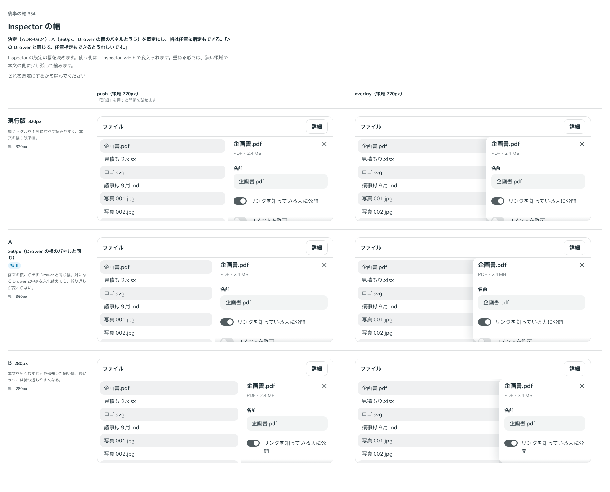

# 0324. Inspector の幅は Drawer の横のパネルと同じ（任意の幅も渡せる）

- ステータス: Accepted
- 日付: 2026-09-28
- ラウンド: 後半 軸 354

## 背景

Inspector（決まった領域の中だけで開閉する常駐のパネル）を作ったとき、原則から決まらない見た目と振る舞いを 軸 350〜355 の比較のストーリーに並べました。Inspector は Drawer から裏を止める動きと画面の最上層を抜いたもので、Sidebar の反対側に置く想定です。土台は Base UI ではなく、状態を自前で持ち、開閉は CSS の移り変わりで動かします（Base UI の Dialog・Drawer は描く場所を外へ出すことと、外を押したら閉じることが前提で、領域に常駐するパネルに合わないため）。

パネルの既定の幅を比べました。作ったときは 320px でした。

## 候補

比較は、決めた時点のコミット `7001e3b` の比較のストーリー（`design/stories/axis-354-inspector-width.stories.tsx`）です。列は「push（領域 720px）」「overlay（領域 720px）」。候補は `--inspector-width` の上書きだけで作りました。

| 案     | 内容                               |
| ------ | ---------------------------------- |
| 現行版 | 320px                              |
| A      | 360px（Drawer の横のパネルと同じ） |
| B      | 280px                              |

## 決定

**既定の幅を Drawer の横のパネルと同じ 360px にし、任意の幅も渡せるようにします。** 新しい props `width` で渡します。

- `--inspector-width` を `calc(var(--spacing) * 90)`（360px）にしました
- `width?: number | string`。数値は px、文字列は CSS の長さ（`'24rem'`・`'30%'` など）。渡すと枠に `--inspector-width` を書き、渡さないときはトークンの値です
- 重ねる形では、狭い領域で本文の側に `--inspector-overlay-gap` を残して縮みます（変更なし）

## 理由

ユーザーの返事の原文です。

> A の Drawer と同じで。任意指定もできるとうれしいです。

対になる Drawer の横のパネルと同じ幅にすると、中身を入れ替えても折り返しが変わりません。中身によって要る幅は違うので、使う側が幅を渡せるようにしました（原則20）。

## 却下した案と理由

- **現行版（320px）・B（280px）**: 「A の Drawer と同じで。」

## 影響

- `src/components/inspector/`: `width` を足しました。既定の幅が変わったので、見た目の基準画像を撮り直しました
- `design/tokens.css`: `--inspector-width` を 360px にしました
- `--sheet-side-width`（Drawer）は画面の幅（`100vw`）でも縮めていますが、Inspector は領域の中で縮めるので、値は同じでもトークンは分けたままにしました
- 比較のストーリー `design/stories/axis-354-inspector-width.stories.tsx` は消しました（軸 350〜355 の枠 `design/stories/inspector-frame.tsx` も一緒に消しました）

## 原則への反映

反映なし。幅の値は原則に書きません。

## 比較画像

決めた時点のコミットは `7001e3b` です。`git checkout 7001e3b && pnpm storybook` で、比較のストーリー（`Design Review/354 Inspectorの幅`）を決めたときの部品のまま開けます。
