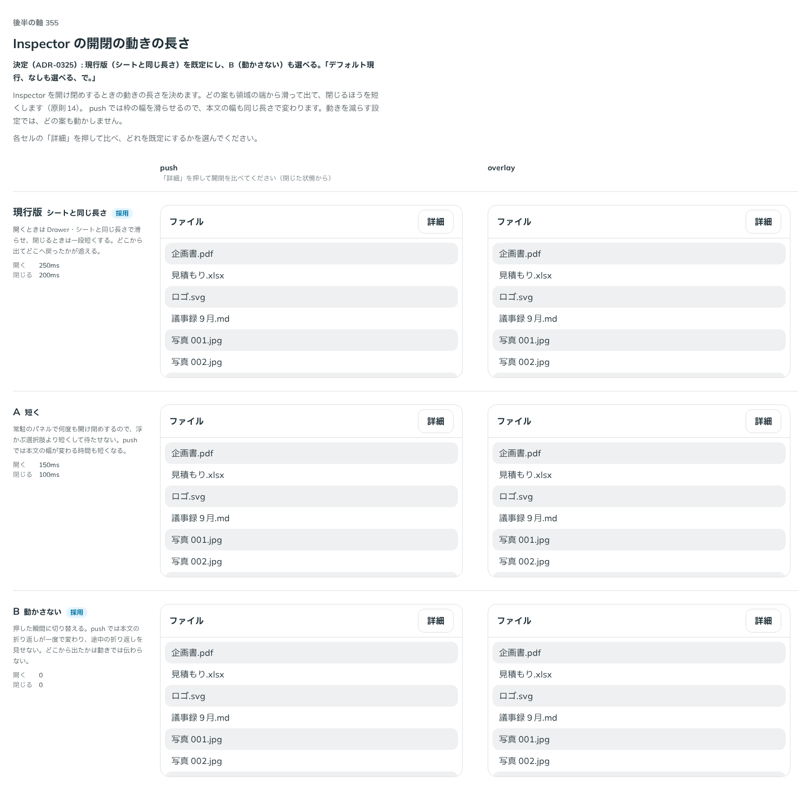

# 0325. Inspector の開閉はシートと同じ長さで滑らせる（動かさないも選べる）

- ステータス: Accepted
- 日付: 2026-09-28
- ラウンド: 後半 軸 355

## 背景

Inspector（決まった領域の中だけで開閉する常駐のパネル）を作ったとき、原則から決まらない見た目と振る舞いを 軸 350〜355 の比較のストーリーに並べました。Inspector は Drawer から裏を止める動きと画面の最上層を抜いたもので、Sidebar の反対側に置く想定です。土台は Base UI ではなく、状態を自前で持ち、開閉は CSS の移り変わりで動かします（Base UI の Dialog・Drawer は描く場所を外へ出すことと、外を押したら閉じることが前提で、領域に常駐するパネルに合わないため）。

開閉の動きの長さを比べました。どの案も、出てくる元の側（領域の端）から滑らせ、閉じるほうを短くします（原則14）。押しのける形では枠の幅を滑らせるので、本文の幅も同じ長さで変わります。候補は、提示する前に一時的なストーリーで動きの途中の位置を測り、目で見て違いが分かることを確かめました。

## 候補

比較は、決めた時点のコミット `7001e3b` の比較のストーリー（`design/stories/axis-355-inspector-motion.stories.tsx`）です。列は「push」「overlay」。どのセルも閉じた状態から「詳細」を押して比べます。候補は `--inspector-duration-in`・`--inspector-duration-out` の上書きだけで作りました。

| 案                         | 内容                     |
| -------------------------- | ------------------------ |
| 現行版（シートと同じ長さ） | 開く 250ms・閉じる 200ms |
| A（短く）                  | 開く 150ms・閉じる 100ms |
| B（動かさない）            | 開く 0・閉じる 0         |

## 決定

**既定は現行版（シートと同じ長さ）のままにし、動かさない形も選べるようにします。** 新しい props `motion` で選びます。

- `motion?: InspectorMotion`（`'slide' | 'none'`、既定 `'slide'`）。値の綴りは Tabs の `indicatorMotion`（[ADR-0147](./0147-tabs-motion.md)）と同じです
- `slide`: 開く `--inspector-duration-in`（`--duration-sheet`、250ms）、閉じる `--inspector-duration-out`（`--duration-normal`、200ms）、緩急は `--ease-sheet`
- `none`: 移り変わりを外し、すぐに切り替えます。動きを減らす設定では、`slide` でも動かしません（変更なし）

## 理由

ユーザーの返事の原文です。

> デフォルト現行、なしも選べる、で。

滑らせると、パネルがどこから出てどこへ戻ったかが追えます（原則14）。何度も開け閉めする画面や、押しのける形で本文の折り返しが動くのを避けたい画面では、動かさない形を選べます。

## 却下した案と理由

- **A（短く）**: 「デフォルト現行、なしも選べる、で。」

## 影響

- `src/components/inspector/`: `motion` と型 `InspectorMotion` を足しました
- `src/index.ts`: `InspectorMotion` を公開しました
- `design/tokens.css`: 値の変更はありません
- 比較のストーリー `design/stories/axis-355-inspector-motion.stories.tsx` は消しました（軸 350〜355 の枠 `design/stories/inspector-frame.tsx` も一緒に消しました）

## 原則への反映

反映なし。動きを選べることは原則14・20 の範囲内です。

## 比較画像

決めた時点のコミットは `7001e3b` です。`git checkout 7001e3b && pnpm storybook` で、比較のストーリー（`Design Review/355 Inspectorの開閉の動き`）を決めたときの部品のまま開けます。
