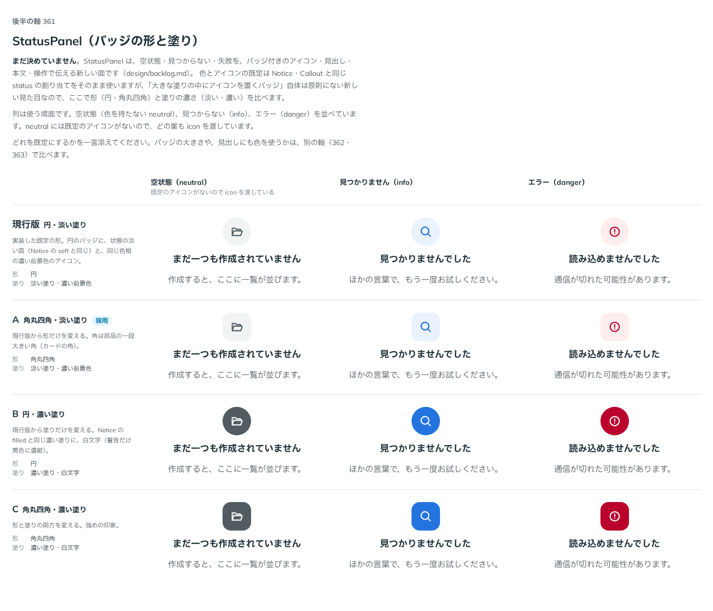

# 0326. StatusPanel のバッジは角丸四角・淡い塗りが既定（形・塗りの両方を選べる）

- ステータス: Accepted
- 日付: 2026-09-28
- ラウンド: 後半 軸 361

## 背景

StatusPanel（空状態・見つからない・失敗を伝える面）の、バッジ（大きな塗りの中にアイコンを置く形）は、Notice の行内アイコンにはない、原則にない新しい見た目でした。形（円・角丸四角）と塗りの濃さ（淡い塗りに濃い前景色・濃い塗りに白文字）を、軸 361 で比べました。

## 候補

比較は、決めた時点のコミット `e7aa322` の比較のストーリー（`design/stories/axis-361-status-panel-badge.stories.tsx`）です。列は空状態（neutral）・見つからない（info）・エラー（danger）です。

| 案                      | 形       | 塗り                 |
| ----------------------- | -------- | -------------------- |
| 現行版（円・淡い塗り）  | 円       | 淡い塗り・濃い前景色 |
| A（角丸四角・淡い塗り） | 角丸四角 | 淡い塗り・濃い前景色 |
| B（円・濃い塗り）       | 円       | 濃い塗り・白文字     |
| C（角丸四角・濃い塗り） | 角丸四角 | 濃い塗り・白文字     |

## 決定

**バッジの形は `shape`（`circle`・`square`）で選べるようにし、既定は `square`（角丸四角）にします。塗りの濃さは、バッジ単独の軸ではなく、Notice と同じ `variant`（`soft`・`filled`・`outline`・`muted`）にまとめます（既定は `soft`＝淡い塗り）。** 塗りの計算は StatusPanel 自身が持たず、Notice・Callout・Toast と共有する `internal/notice-surface` の `noticeSurface` をそのまま使います（詳しい配分は [ADR-0327](./0327-status-panel-notice-variant.md)）。

角は、部品の角（`--radius-control`）より一段大きい面の角（`--radius-card`）にします。バッジは自分で場所を占める小さな面なので、原則5「自分で場所を占める大きな面は一段大きい角」に沿います。

## 理由

ユーザーの返事の原文です。

> A がデフォルト、色は Notice と同じように、形も選択できるようにしたいです。

塗りの濃さは軸 361 では単独の真偽値として比べましたが、返事の「色は Notice と同じように」を受けて、Notice の 4 つの見た目（`soft`・`filled`・`outline`・`muted`）とまとめて 1 本の `variant` にしました。軸 361 の A（角丸四角・淡い塗り）は、この `variant="soft"`（既定）・`shape="square"`（既定）の組み合わせと同じ見た目です。B・C の濃い塗りは `variant="filled"` として選べます。

## 影響

- `src/components/status-panel/StatusPanel.tsx`: `shape`（`'circle' | 'square'`、既定 `'square'`）と型 `StatusPanelShape` を足しました。バッジの塗り・アイコンの色は `noticeSurface` の出力を使います（ADR-0327）
- `design/tokens.css`: 比べるために置いた `--status-panel-badge-bg-*`・`-fg-*`・`-radius` は消しました（Notice のトークンをそのまま使うため）
- 比較のストーリー `design/stories/axis-361-status-panel-badge.stories.tsx` は消しました

## 原則への反映

反映なし。原則5「自分で場所を占める大きな面は一段大きい角」の通りの角を選んでいます。

## 比較画像

決めた時点のコミットは `e7aa322` です。`git checkout e7aa322 && pnpm storybook` で、比較のストーリー（`Design Review/361 StatusPanel（バッジの形と塗り）`）を決めたときの部品のまま開けます。
