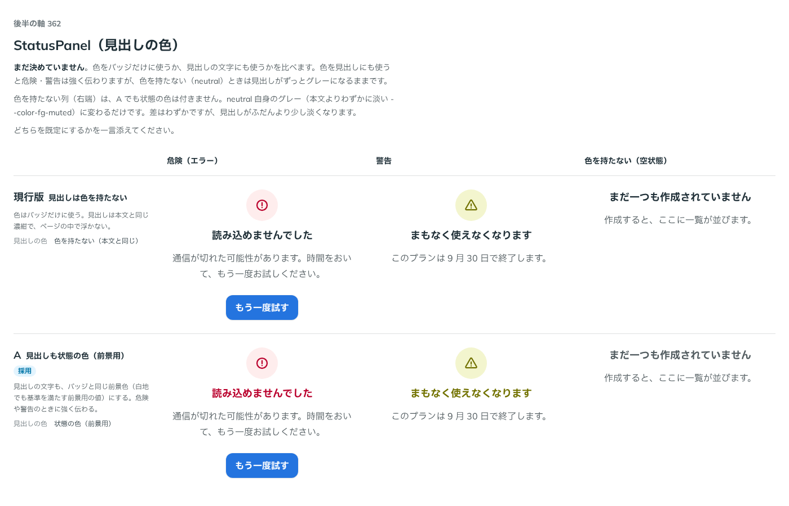

# 0327. StatusPanel は Notice の別の形。色は variant で Notice と同じ挙動にする（見出しにも状態の色）

- ステータス: Accepted
- 日付: 2026-09-28
- ラウンド: 後半 軸 362

## 背景

StatusPanel の色を、バッジ（アイコンの背景）だけに使うか、見出しの文字にも使うかを、軸 362 で比べました。実装は、状態ごとに `--status-panel-badge-bg-info` のような固定の色のトークンを持っていました。

## 候補

比較は、決めた時点のコミット `e7aa322` の比較のストーリー（`design/stories/axis-362-status-panel-title-color.stories.tsx`）です。列は危険（エラー）・警告・色を持たない（空状態）です。

| 案                             | 見出しの色                     |
| ------------------------------ | ------------------------------ |
| 現行版（見出しは色を持たない） | 本文と同じ濃紺（`--color-fg`） |
| A（見出しも状態の色）          | バッジと同じ前景色             |

## 決定

**A（見出しも状態の色）を既定にします。実装は、StatusPanel 独自の色のトークンをやめ、`internal/notice-surface` の `noticeSurface`（Notice・Callout・Toast と共有）をそのまま使い、`variant`（`soft`・`filled`・`outline`・`muted`、既定 `soft`）で Notice と同じ色の配分にします。**

- `soft`（既定）: 淡い塗りのバッジに、状態の色の濃い前景色のアイコンと見出し（軸 362 の A と同じ）
- `filled`: 濃い塗りのバッジ（警告だけ黄色に濃紺）。ただし見出しは白ではなく、状態のインク色にします（下の「例外」）
- `outline`: 白いバッジに状態の色の枠線とアイコン。見出しは色を持ちません（Notice の outline と同じ）
- `muted`: グレーのバッジに、状態の色の小さめのアイコンと見出し

色を持たない（`status` を書かない、neutral）ときは、どの `variant` でも Notice の neutral と同じグレーです。

### 例外: filled の見出しは、Notice の `--notice-title-color` を使わない

Notice の `filled` は、お知らせの面そのものが塗りなので、見出しは塗りの上で読める色（白、警告だけ濃紺）です。StatusPanel は、塗りを持つのがバッジだけで、見出しはページの白い地に置かれたままなので、Notice と同じ色をそのまま使うと白地に白文字で消えます。ここだけ、バッジの前景色と同じ「状態のインク色」（白地でも読める前景用の値）を使います。

## 理由

ユーザーの返事の原文です。

> A で。Notice の別の形なので、挙動を揃えます。

「Notice の別の形」という言葉を受けて、A（見出しも状態の色）を採用するだけでなく、色の計算そのものを Notice と共有する形に実装を変えました。StatusPanel 独自に状態ごとの色を持つと、Notice の色の決まりが変わったときに StatusPanel だけ古いままになる／2 か所を直す手間が生まれるためです。

## 影響

- `src/components/status-panel/StatusPanel.tsx`: `variant`（`NoticeVariant` をそのまま使う。`'soft' | 'filled' | 'outline' | 'muted'`、既定 `'soft'`）を足しました。バッジ・見出しの色は `noticeSurface({ variant, status, size: 'control' })` の出力（`--notice-bg`・`--notice-icon-color`・`--notice-title-color`・`--notice-ink` など）を、root で受け取って使います。root 自体は面を持たない（原則1）ので、`noticeSurface` が持ち込む余白・並び・塗り・枠線は打ち消します
- `design/tokens.css`: 比べるために置いた `--status-panel-badge-bg-*`・`-fg-*`・`-title-color-*` は消しました（Notice のトークンをそのまま使うため）
- `src/components/status-panel/StatusPanel.stories.tsx`: 見た目（`variant`）の一覧を足しました
- 比較のストーリー `design/stories/axis-362-status-panel-title-color.stories.tsx` は消しました

## 原則への反映

反映なし。原則6「色は役割で持つ」の通りです。

## 比較画像

決めた時点のコミットは `e7aa322` です。`git checkout e7aa322 && pnpm storybook` で、比較のストーリー（`Design Review/362 StatusPanel（見出しの色）`）を決めたときの部品のまま開けます。
