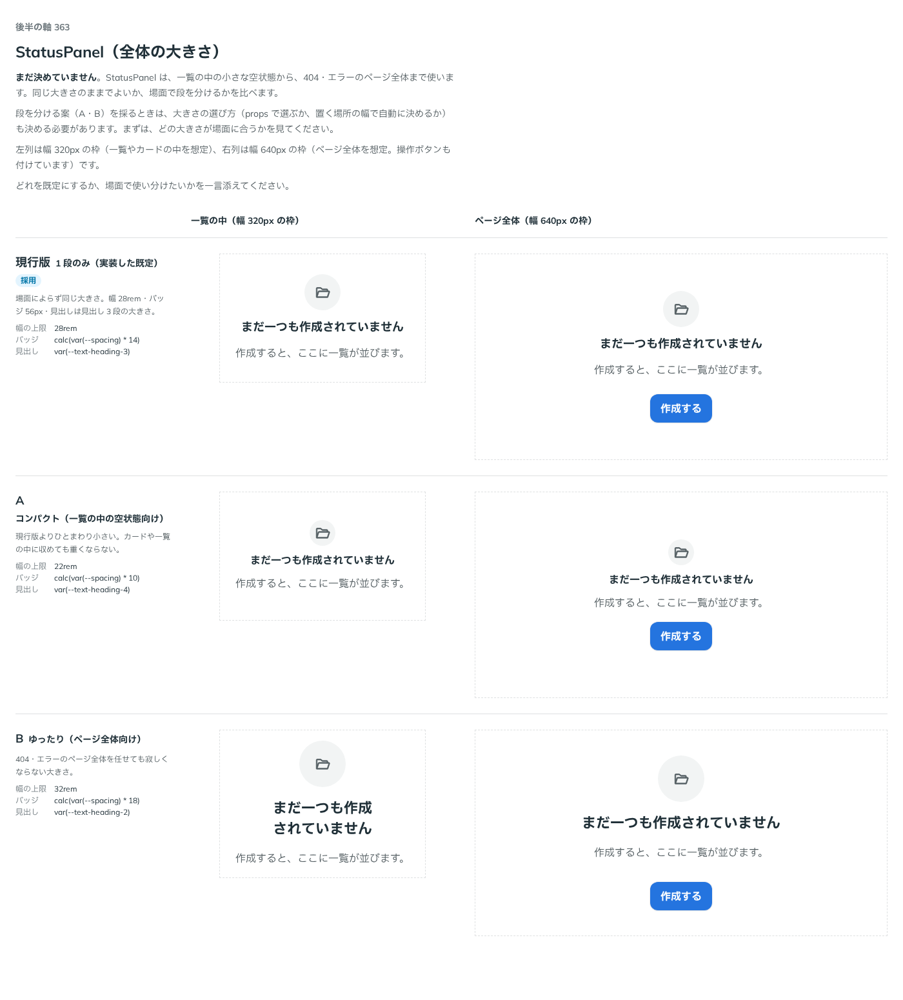

# 0328. StatusPanel の大きさは size（sm・md・lg）で選べる。既定は現行の大きさ（md）

- ステータス: Accepted
- 日付: 2026-09-28
- ラウンド: 後半 軸 363

## 背景

StatusPanel は、一覧の中の小さな空状態から、404・エラーのページ全体まで使います。実装した既定は、場面によらず同じ大きさ（幅 28rem・バッジ 56px・見出し見出し 3 段）でした。同じ大きさのままでよいか、場面で段を分けるかを、軸 363 で比べました。

## 候補

比較は、決めた時点のコミット `e7aa322` の比較のストーリー（`design/stories/axis-363-status-panel-size.stories.tsx`）です。列は幅 320px の枠（一覧・カードの中を想定）と幅 640px の枠（ページ全体を想定）です。

| 案                 | 幅の上限 | バッジ                              | 見出し      |
| ------------------ | -------- | ----------------------------------- | ----------- |
| 現行版（1 段のみ） | 28rem    | `calc(var(--spacing) * 14)`（56px） | 見出し 3 段 |
| A（コンパクト）    | 22rem    | `calc(var(--spacing) * 10)`（40px） | 見出し 4 段 |
| B（ゆったり）      | 32rem    | `calc(var(--spacing) * 18)`（72px） | 見出し 2 段 |

## 決定

**大きさは `size`（`'sm' | 'md' | 'lg'`）で選べるようにし、既定は `'md'`（実装した現行の大きさ、軸 363 の現行版）にします。** `sm` は軸 363 の A（コンパクト）、`lg` は軸 363 の B（ゆったり）と同じ大きさです。

大きさの選び方は props（`size`）にし、置いた場所の幅から自動で決める仕組みは持ちません（[原則 20](../principles.md#20-部品は知らないことを決めない) — 部品は自分が置かれる場所の幅を知らないので、使う側が場面に合わせて選びます）。

`sm`・`lg` でも、アイコンの大きさは `--icon-size-md`（20px）・`--icon-size-lg`（24px）どまりにし、バッジが大きくなっても際限なく大きくしません（軸 363 の B のアイコンも lg と同じ 24px でした）。

## 理由

ユーザーの返事の原文です。

> 現行で、サイズ（スケール？）は指定可能にすると良さそうですね。

既定は現行のままでよく、段を選べるようにする、という指示でした。軸 363 の説明で挙げていた「大きさの選び方（props で選ぶか、置く場所の幅で自動に決めるか）」は、props で選ぶ形に決まりました。

## 影響

- `src/components/status-panel/StatusPanel.tsx`: `size`（`'sm' | 'md' | 'lg'`、既定 `'md'`）と型 `StatusPanelSize` を足しました。幅の上限・間隔・バッジとアイコンの大きさは `size` の tv variant が持ち、見出しの大きさは `text-heading-2`〜`text-heading-4` をそのまま使います（StatusPanel 独自の `--status-panel-title-size` は持ちません）
- `design/tokens.css`: `--status-panel-width-{sm,md,lg}`・`--status-panel-gap-{sm,md,lg}`・`--status-panel-badge-size-{sm,md,lg}`・`--status-panel-icon-size-{sm,md,lg}` を足しました。比べるために置いた 1 段だけの `--status-panel-width` などは消しました
- `src/components/status-panel/StatusPanel.stories.tsx`: 大きさ（`size`）の一覧を足しました
- 比較のストーリー `design/stories/axis-363-status-panel-size.stories.tsx` は消しました

## 原則への反映

反映なし。原則20「部品は知らないことを決めない」の通り、既定を 1 つ決め、ほかの形（`sm`・`lg`）を選べるようにしています。

## 比較画像

決めた時点のコミットは `e7aa322` です。`git checkout e7aa322 && pnpm storybook` で、比較のストーリー（`Design Review/363 StatusPanel（全体の大きさ）`）を決めたときの部品のまま開けます。
