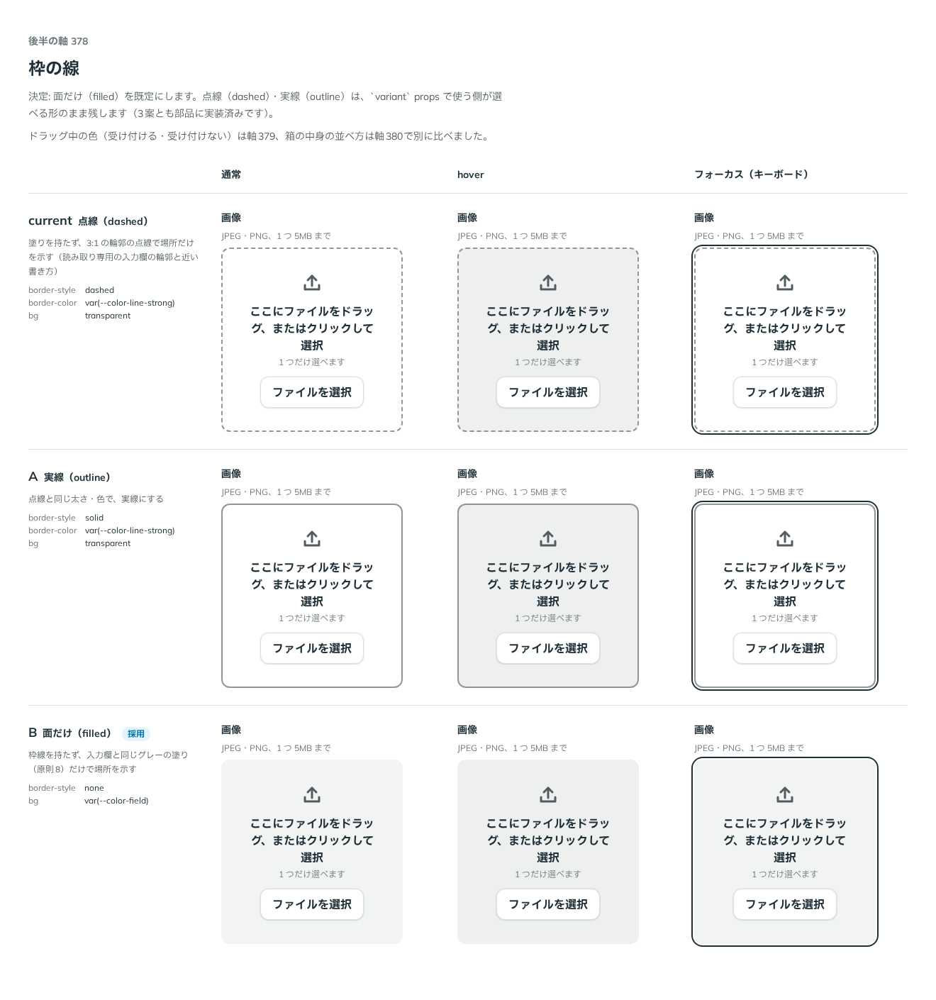

# 0330. Dropzone の枠は面だけ（filled）が既定。点線・実線も選べる

- ステータス: Accepted
- 日付: 2026-09-28
- ラウンド: 後半 軸 378

## 背景

Dropzone（[ADR-0329](./0329-dropzone-self-built.md)）は、原則8「入力欄の様式は『編集できるか』で決まる」の仲間として、枠の見せ方（塗りか枠線か）を決める必要がありました。実装した最初の形は、読み取り専用の入力欄の輪郭（[ADR-0170](./0170-readonly-field.md)）に近い点線（dashed、塗りなし）でした。軸378で、点線のまま・実線にする・枠線なしの面だけ（filled、入力欄と同じグレーの塗り）の3案を比べました。

## 候補

比較は、決めた時点のコミット `3a1ff10` の比較のストーリー（`design/stories/axis-378-dropzone-border.stories.tsx`）です。列は通常・hover・フォーカス（キーボード）です。

| 案                        | 内容                                                                                     |
| ------------------------- | ---------------------------------------------------------------------------------------- |
| 現行版（点線・dashed）    | 塗りを持たず、3:1 の輪郭の点線で場所だけを示す（読み取り専用の入力欄の輪郭と近い書き方） |
| A（実線・outline）        | 点線と同じ太さ・色で、実線にする                                                         |
| B（面だけ・filled、採用） | 枠線を持たず、入力欄と同じグレーの塗り（原則8）だけで場所を示す                          |

## 決定

**枠の見せ方は `variant`（`filled`・`outline`・`dashed`）で選べるようにし、既定は `filled`（枠線なし、入力欄と同じグレーの面）にします。** 点線（`dashed`、決定前の既定）・実線（`outline`）は、`variant` props で使う側が選べる形のまま残します（3案とも部品に実装済みです）。

## 理由

ユーザーの返事の原文です。

> 378 デフォルトはB の面（ボタンの色は変えたい）、現行とAも選べるようにしたいです

B（面だけ、filled）は、原則8「編集できる欄はグレーの塗りです」の言い方にそのまま沿う見た目で、入力欄の仲間らしく見えます。現行版（点線）は読み取り専用の入力欄の輪郭（ADR-0170）に近い書き方だったため、書き換えられる欄であることを塗りで示す B のほうが原則に合っていました。「ボタンの色は変えたい」は、面（filled）の上で中の「ファイルを選択」ボタンが埋もれて見えることを指しており、軸382（[ADR-0334](./0334-dropzone-button-color.md)）で別に決めました。

## 影響

- `src/components/dropzone/Dropzone.tsx`: `variant`（`'filled' | 'outline' | 'dashed'`、既定 `'filled'`）と型 `DropzoneVariant` を持ちます。枠の色・塗りは variant ごとに部品のコード（`dropzoneBox` の tv variants）で持ちます（比べる案ではなくなったため、トークンにはしていません）
- `design/tokens.css`: `--dropzone-border-width`・`--dropzone-content-gap`・`--dropzone-icon-size`・`--dropzone-padding`・`--dropzone-min-height`（variant によらない共通の値）を持ちます
- 比較のストーリー `design/stories/axis-378-dropzone-border.stories.tsx` は消します

## 原則への反映

反映なし。原則8「編集できる欄はグレーの塗りです」の通りの見た目を既定にしています。

## 比較画像

決めた時点のコミットは `3a1ff10` です。`git checkout 3a1ff10 && pnpm storybook` で、比較のストーリー（`Design Review/378 枠の線`）を決めたときの部品のまま開けます。
