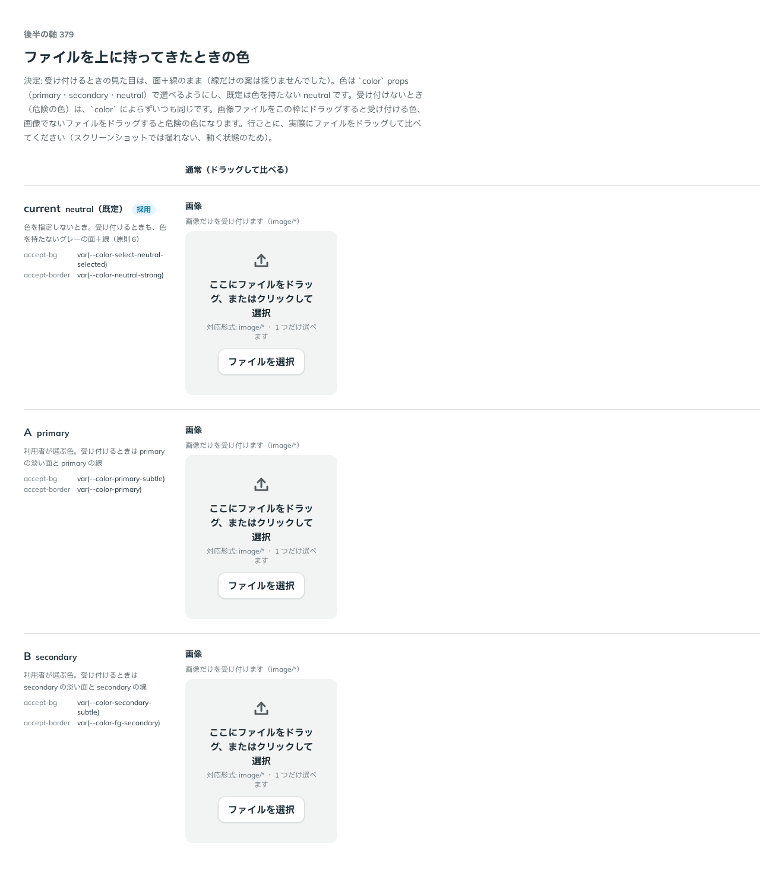

# 0331. Dropzone のドラッグ中の色は color props で選べる。既定は neutral

- ステータス: Accepted
- 日付: 2026-09-28
- ラウンド: 後半 軸 379

## 背景

Dropzone にファイルを持ってきたとき（dragenter）、受け付けるかどうかを色で示します。軸378（[ADR-0330](./0330-dropzone-variant.md)）で枠を面＋線にすることが決まったあと、面＋線のままの色を neutral・primary・secondary のどれにするかを軸379で比べました。

## 候補

比較は、決めた時点のコミット `3a1ff10` の比較のストーリー（`design/stories/axis-379-dropzone-drag-color.stories.tsx`）です。列は「通常（ドラッグして比べる）」で、実際にファイルをドラッグして確かめる動く状態です。

| 案                      | 内容                                                                      |
| ----------------------- | ------------------------------------------------------------------------- |
| 現行版（neutral、採用） | 色を指定しないとき。受け付けるときも、色を持たないグレーの面＋線（原則6） |
| A（primary）            | 利用者が選ぶ色。受け付けるときは primary の淡い面と primary の線          |
| B（secondary）          | 利用者が選ぶ色。受け付けるときは secondary の淡い面と secondary の線      |

## 決定

**受け付けるときの見た目は面＋線のまま。色は `color` props（`primary`・`secondary`・`neutral`、`ChoiceColor`）で選べるようにし、既定は色を持たない `neutral` にします。受け付けないとき（危険の色）は、`color` によらずいつも同じ危険の色です。**

## 理由

ユーザーの返事の原文です。

> 379 現行でお願いします。色は color がベースなので、デフォルトはグレーにしたいですね。

現行版（neutral）は、原則6「色を指定しないとき、色を持つ部品はすべてグレーです」に沿う既定です。`color` props を用意し、使う側が primary・secondary を選んだときは、受け付ける色もその色にそろいます。受け付けないときは、原則6「危険は、取り消せない操作の色として…選べます」の通り、常に危険の色にしています。

## 影響

- `src/components/dropzone/Dropzone.tsx`: `color`（`ChoiceColor`。`primary`・`secondary`・`neutral`、既定 `neutral`）props を持ち、`data-drag="accept"|"reject"` で面・線の色を切り替えます
- ドラッグ中の色そのものは、比べる案ではなくなったため部品のコード（`dropzoneBox` の tv variants）で持ち、`design/tokens.css` には置いていません
- 比較のストーリー `design/stories/axis-379-dropzone-drag-color.stories.tsx` は消します

## 原則への反映

反映なし。原則6「色は役割で持つ」の通りです。

## 比較画像

決めた時点のコミットは `3a1ff10` です。`git checkout 3a1ff10 && pnpm storybook` で、比較のストーリー（`Design Review/379 ドラッグ中の色`）を決めたときの部品のまま開けます。
