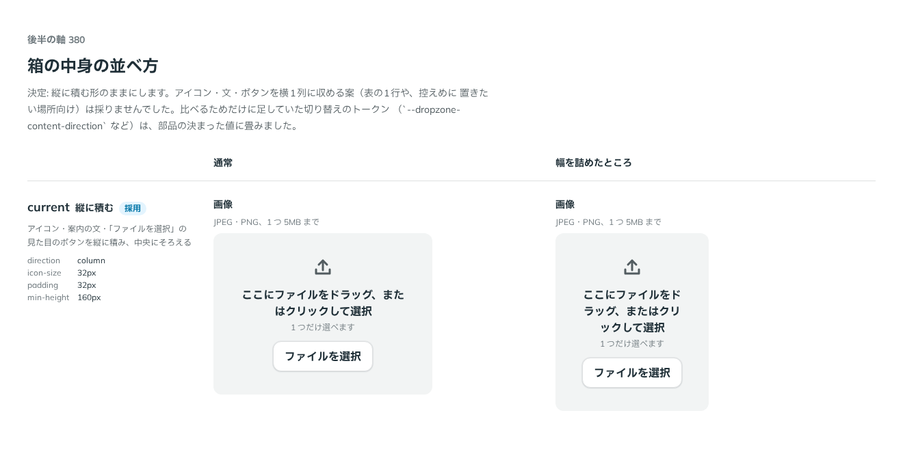

# 0332. Dropzone の中身は縦に積む

- ステータス: Accepted
- 日付: 2026-09-28
- ラウンド: 後半 軸 380

## 背景

Dropzone の箱の中身（アイコン・案内の文・「ファイルを選択」の見た目のボタン）を、どう並べるかを決める必要がありました。実装した形は縦に積んで中央にそろえるものでしたが、表の1行や控えめに置きたい場所向けに、横1列に収める案もありえました。軸380で、幅を詰めたときも崩れないかとあわせて確かめました。

## 候補

比較は、決めた時点のコミット `3a1ff10` の比較のストーリー（`design/stories/axis-380-dropzone-layout.stories.tsx`）です。列は通常・幅を詰めたところです。

| 案                       | 内容                                                                                                                                                               |
| ------------------------ | ------------------------------------------------------------------------------------------------------------------------------------------------------------------ |
| 現行版（縦に積む、採用） | アイコン・案内の文・「ファイルを選択」の見た目のボタンを縦に積み、中央にそろえる                                                                                   |
| 横1列                    | 表の1行や、控えめに置きたい場所向けに、アイコン・文・ボタンを横1列に収める案。比べるためだけの切り替えのトークンを一時的に持っていたが、この軸で採らないと決まった |

## 決定

**中身の並べ方は縦に積む形のままにします。** 横1列に収める案は採用せず、比べるために一時的に持っていた切り替えのトークン（`--dropzone-content-direction` など）は、部品の決まった値（縦積み）に畳んで消しました。

## 理由

ユーザーの返事の原文です。

> 380 現行でお願いします。

現行の縦積みのまま変えない、という指示でした。Dropzone は原則4「部品は『ラベル / 本体 / キャプション』の 3 層」の本体にあたる、まとまった案内を伴う入力欄なので、アイコン・文・ボタンを中央に積む縦の形が合っています。

## 影響

- `src/components/dropzone/Dropzone.tsx`: `dropzoneContent` の tv はいつも `flex-col items-center justify-center` です。横1列へ切り替える variant は持ちません
- `design/tokens.css`: 比べるために置いていた切り替えのトークンは、部品の決まった値（`--dropzone-content-gap` など、variant によらない共通の値）に畳んで消しました
- 比較のストーリー `design/stories/axis-380-dropzone-layout.stories.tsx` は消します

## 原則への反映

反映なし。

## 比較画像

決めた時点のコミットは `3a1ff10` です。`git checkout 3a1ff10 && pnpm storybook` で、比較のストーリー（`Design Review/380 中身の並べ方`）を決めたときの部品のまま開けます。
