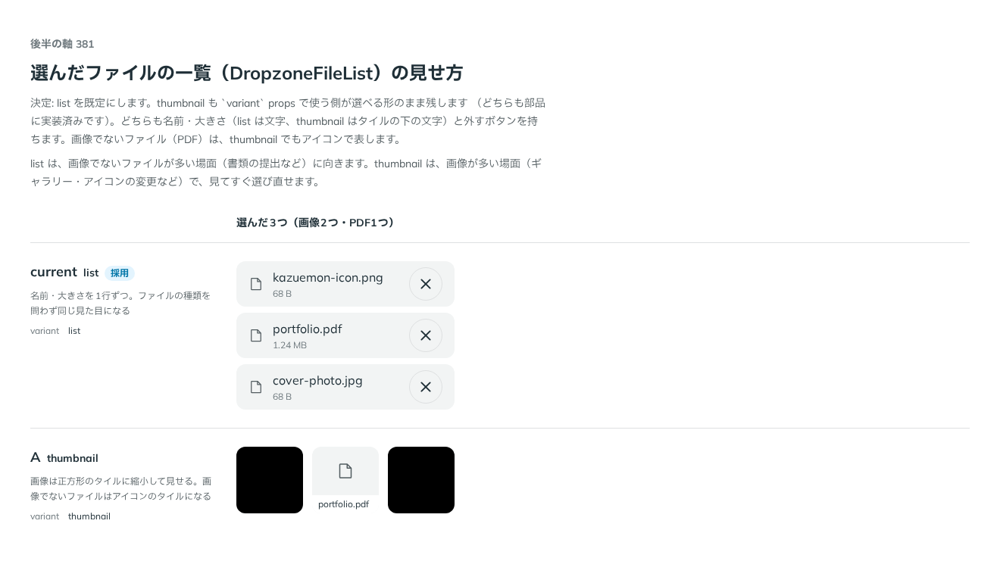

# 0333. DropzoneFileList は list（一行）が既定。thumbnail も選べる

- ステータス: Accepted
- 日付: 2026-09-28
- ラウンド: 後半 軸 381

## 背景

`DropzoneFileList`（Dropzone で選んだファイルの一覧。[ADR-0329](./0329-dropzone-self-built.md) で Dropzone とは別の部品にしました）の見せ方を決める必要がありました。list（名前・大きさを1行ずつ）と thumbnail（画像を正方形のタイルに並べる）を軸381で比べました。

## 候補

比較は、決めた時点のコミット `3a1ff10` の比較のストーリー（`design/stories/axis-381-dropzone-file-list.stories.tsx`）です。列は「選んだ3つ（画像2つ・PDF1つ）」です。

| 案                   | 内容                                                                             |
| -------------------- | -------------------------------------------------------------------------------- |
| 現行版（list、採用） | 名前・大きさを1行ずつ。ファイルの種類を問わず同じ見た目になる                    |
| A（thumbnail）       | 画像は正方形のタイルに縮小して見せる。画像でないファイルはアイコンのタイルになる |

## 決定

**見せ方は `variant`（`list`・`thumbnail`）で選べるようにし、既定は `list` にします。** thumbnail も使う側が選べる形のまま残します（どちらも部品に実装済みです）。

## 理由

ユーザーの返事の原文です。

> 381 現行がデフォルトで、A も選べるようにしたいです

list（既定）は、画像でないファイルが多い場面（書類の提出など）に向き、thumbnail は画像が多い場面（ギャラリー・アイコンの変更など）で見てすぐ選び直せます。どちらも名前・大きさ（list は文字、thumbnail はタイルの下の文字）と外すボタンを持ち、画像でないファイル（PDF）は thumbnail でもアイコンで表します。

## 影響

- `src/components/dropzone/DropzoneFileList.tsx`: `variant`（`'list' | 'thumbnail'`、既定 `'list'`）と型 `DropzoneFileListVariant` を持ちます
- thumbnail のタイルの画像は、ブラウザの中だけの URL（`URL.createObjectURL`）を file が変わるたびに作り直し、外れるときに片付けます（`Thumbnail` コンポーネント）
- 比較のストーリー `design/stories/axis-381-dropzone-file-list.stories.tsx` は消します
- backlog に、サムネイル（thumbnail）の EXIF の向きの情報を考慮しているかを確かめていないことを足しました（記録の提案は `dropzone-shared.md`）

## 原則への反映

反映なし。原則20「部品は知らないことを決めない」の通り、既定を1つ決め、ほかの形（thumbnail）を選べるようにしています。

## 比較画像

決めた時点のコミットは `3a1ff10` です。`git checkout 3a1ff10 && pnpm storybook` で、比較のストーリー（`Design Review/381 選んだファイルの一覧の見せ方`）を決めたときの部品のまま開けます。
