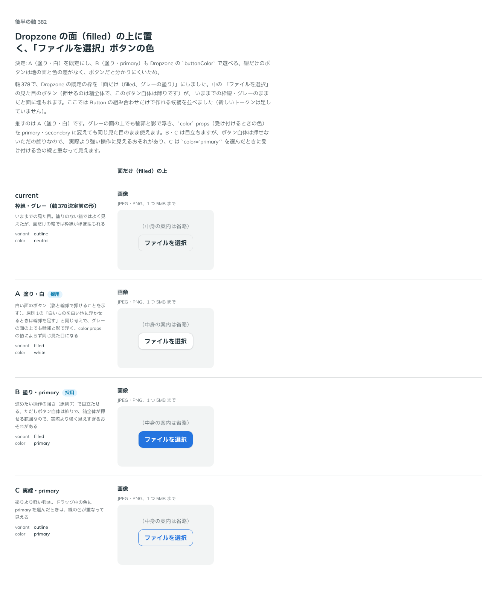

# 0334. Dropzone の面の上の「ファイルを選択」ボタンは塗り・白が既定。塗り・primary も選べる

- ステータス: Accepted
- 日付: 2026-09-28
- ラウンド: 後半 軸 382

## 背景

軸378（[ADR-0330](./0330-dropzone-variant.md)）で、Dropzone の既定の枠を「面だけ（filled、グレーの塗り）」にしました。箱の中の「ファイルを選択」の見た目のボタン（押せるのは箱全体で、このボタン自体は飾り）が、決定前の枠線・グレーのままだと面に埋もれます。軸382で、既存の `Button` の `variant`・`color` の組み合わせだけで作れる4案を比べました。

## 候補

比較は、決めた時点のコミット `3a1ff10` の比較のストーリー（`design/stories/axis-382-dropzone-button-color.stories.tsx`）です。列は「面だけ（filled）の上」です。

| 案                       | 内容                                                                                                                                                                                                             |
| ------------------------ | ---------------------------------------------------------------------------------------------------------------------------------------------------------------------------------------------------------------- |
| 現行版（枠線・グレー）   | 決定前の見た目。塗りのない箱ではよく見えたが、面だけの箱では枠線がほぼ埋もれる                                                                                                                                   |
| A（塗り・白、採用）      | 白い面のボタン（輪郭と影で押せることを示す）。原則1「白いものを白い地に浮かせるときは輪郭を足す」と同じ考えで、グレーの面の上でも輪郭と影で浮く。`color` props（受け付けるときの色）の値によらず同じ見た目になる |
| B（塗り・primary、採用） | 進めたい操作の強さ（原則7）で目立たせる。ただしボタン自体は飾りで、箱全体が押せる範囲なので、実際より強く見えすぎるおそれがある                                                                                  |
| C（実線・primary）       | 塗りより軽い強さ。ドラッグ中の色に primary を選んだときは、線の色が重なって見える                                                                                                                                |

## 決定

**中の「ファイルを選択」ボタンの色は `buttonColor`（`'white' | 'primary'`）で選べるようにし、既定は `white`（塗り・白）にします。** `primary`（塗り・primary）も選べます。実線・グレー（決定前の形）と実線・primary（C）は採りません。

## 理由

ユーザーの返事の原文です。

> 382 はデフォルトを A として、B も選べるようにしておきたいですね。背景色に差が無い outline だと、ボタンであることが認知しづらそうなのでこの2つを選択しました。

A（塗り・白）は、原則1「白いものを白い地に浮かせるときは輪郭を足す」と同じ考えで、グレーの面の上でも輪郭と影で浮きます。`color` props（受け付けるときの色）を primary・secondary に変えても同じ見た目のまま使えます。B（塗り・primary）は、原則7の強さの段階でいちばん強く見えますが、ボタン自体は押せない飾りなので、実際より強い操作に見えるおそれを承知のうえで、使う側が選べる形として残しました。線だけのボタン（現行・C）は、背景色との差がなく、ボタンであることが認知しづらいため採りません。C はさらに、`color="primary"` を選んだときに受け付ける色の線と重なって見える問題もありました。

## 影響

- `src/components/dropzone/Dropzone.tsx`: `buttonColor`（`DropzoneButtonColor`。`'white' | 'primary'`、既定 `'white'`）props を持ち、既定の中身（アイコン・案内・ボタン）を出すときの `Button` の `color` に渡します。`variant="filled"` は固定です
- 比較のストーリー `design/stories/axis-382-dropzone-button-color.stories.tsx` は消します

## 原則への反映

反映なし。原則1「白いものを白い地に浮かせるときは輪郭を足す」の通りの見た目を既定にしています。

## 比較画像

決めた時点のコミットは `3a1ff10` です。`git checkout 3a1ff10 && pnpm storybook` で、比較のストーリー（`Design Review/382 面の上のボタンの色`）を決めたときの部品のまま開けます。
